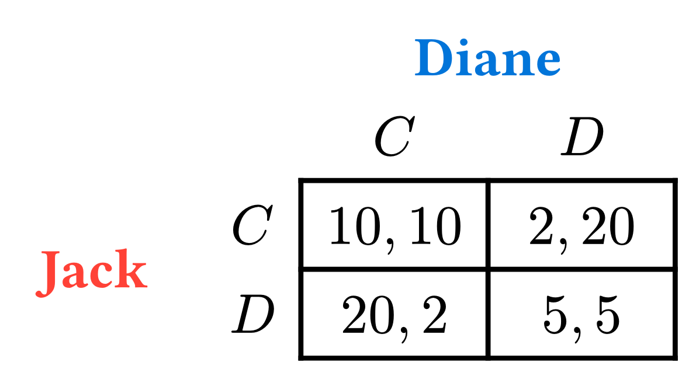
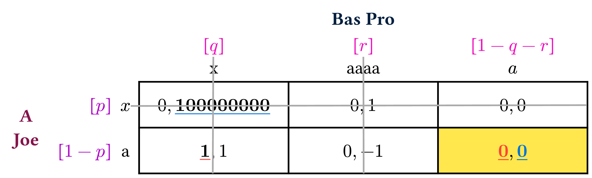
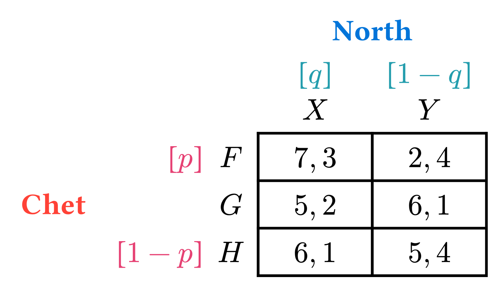
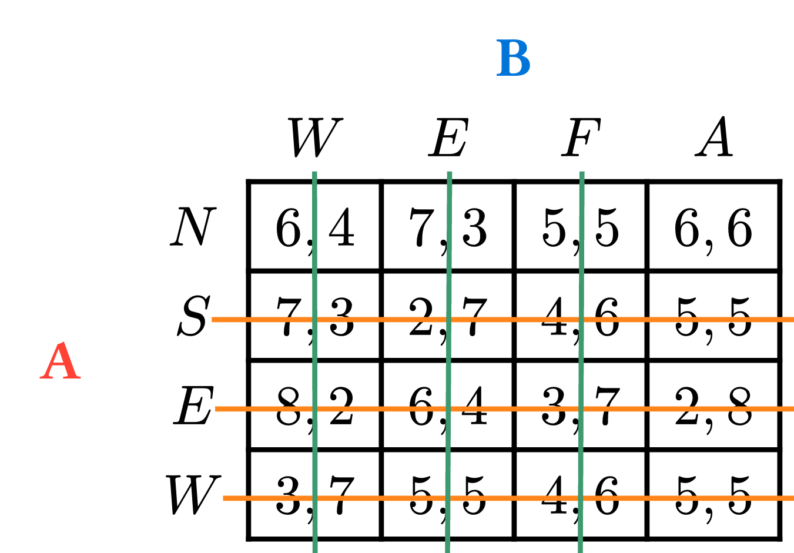

# Game-Theoryst

A package for typesetting games in Typst. 

Full manual available [here](./doc/gtheoryst-manual.pdf)

Work in progress -- _coming soon!_

## Overview

#### Simple Example
The main function to make strategic (or **normal**) form games is `nfg`. For a basic 2x2 game, you can do 
```typ
#nfg(
  players: ("Jack", "Diane"),
  s1: ($C$, $D$),
  s2: ($C$, $D$),
  [$10, 10$], [$2, 20$], 
  [$20, 2$], [$5, 5$],
)
```




### Importing

Simply insert the following into your Typst code:

```typ
#import "@preview/game-theoryst:0.1.0": *
```

This imports the `nfg()` function as well as the underlining methods. 
If you want to tweak the helper functions for generating an `nfg`, import them explicitly through the `utils/` directory. 

#### Full Example

```typ
#nfg(
  players: ([A\ Joe], [Bas Pro]),
  s1: ([$x$], [a]),
  s2: ("x", "aaaa", [$a$]),
  pad: ("x": 12pt, "y": 10pt),
  eliminations: ("s11", "s21", "s22"),
  ejust: (
    s11: (x: (0pt, 36pt), y: (-3pt, -3.5pt)),
    s22: (x: (-10pt, -12pt), y: (-10pt, 10pt)),
    s21: (x: (-3pt, -9pt), y: (-10pt, 10pt)),
  ),
  mixings: (hmix: ($p$, $1-p$), vmix: ($q$, $r$, $1-q-r$)),
  custom-fills: (hp: maroon, vp: navy, hm: purple, vm: fuchsia, he: gray, ve: gray),
  [$0,vul(100000000)$], [$0,1$], [$0,0$],
  [$hul(1),1$], [$0, -1$], table.cell(fill: yellow.lighten(30%), [$hful(0),vful(0)$])
)
```




### Color

By default, player names, mixed-strategy parameters (called _mixings_), and elimination lines are shown in color. These colors can be turned off at the method-level by passing `bw: true`, or at the document level by running the state helper-function `#colorless()`.

`nfg` accepts custom colors for all of the aforementioned parameters by passing a `dictionary` of colors to the `custom-fills` arg. The keys for this dictionary are as follows (`<defaults>`):
- `hp` -- "horizontal player" (red)
- `vp` -- "vertical player" (blue)
- `hm` -- "hor. mixing" (#e64173)
- `vm` -- "ver. mixing" (eastern)
- `he` -- "hor. elimination" line (orange)
- `ve` -- "ver. elimination" line (olive)

## Cell Customization
Since the payoffs are implemented as argument sinks (`..args`) which are passed directly to Typst's `#table()`, underlining of non-math can be accomplished via the standard `#underline()` command. Similarly, any of the payoff cells can be customized by using `table.cell()` directly. For instance, `table.cell(fill: yellow.lighten(30%), [$1, 1$])` can be used to highlight a specific cell. 

### Padding
There are edge cases where the default padding may be off. These can be mended by passing the optional `pad` argument to `nfg()`. This should represent how much **_additional_** padding you want.  The `pad` arg. is interpreted as follows: 
- If a `length` is provided, it assumes you want that much length added to all cell walls
- If an array of the form `(L1, L2)` is provided, it assumes you want padding a horizontal (`x`) padding of `L1` and a vertical padding (`y`) of `L2`
- If a `dictionary` is provided, it operates identically to that of the array, but you must specify the `x`/`y` keys yourself 


### AUtomatic Cell Sizing
Cell are automatically sized to equal heights/widths according to the longest/tallest content. If you want to avoid this behavior, pass `lazy-cells: true` to `nfg`. This behavior can be combined with the custom `padding` argument. 

## Semantic Game Theory Features

### Underlining
The package imports a small set of underlining utility functions.

The primary functions for underlining are 
- `hul()` -- _Horizontal Underline_
- `vul()` -- _Vertical Underline_
- `bul()` -- _Black Underline_
These can be wrapped around values in math-mode (`$..$`) within the payoff matrix. The underlines for `hul` and `vul` are colored by default according to the default colors for names, but they accept an optional `col` parameter for changing the color of the underline. `bul()` produces a black underline. 
```typ
#nfg(
  players: ("Jack", "Diane"),
  s2: ($x$, $y$, $z$),
  s1: ($a$, $b$),
  [$hul(0),vul(0)$], [$1,1$], [$2,2$],
  [$3,3$], [$4,4$], [$5,5$],
)
```
By default, these commands leave the numbers themselves black, but boldfaces them. _Full Color_ versions of `hul` and `vul`, which color the numbers and under-lines identically, are available via `hful()` and `vful()`. Like their counterparts, they accept an optional `col` command for the color. 

Both of the colors can be modified individually via the general `cul()` command, which takes in content (`cont`), an underline color (`ucol`), and the color for the text value (`tcol`). For instance, 
```typ
#let new-ul(cont, col: olive, tcol: fuchsia) = { cul(cont, col, tcol) }
```
will define a new command which underlines in olive and sets the text (math) color to fuchsia. 


### Mixed Strategies
You can optionally mark mixed strategies that a player will in a `nfg` using the `mixing` argument. This can be a `dictionary` with `hmix` and `vmix` keys, or an `array`, interpreted as a dictionary with the aforementioned keys in the `(hmix, vmix)` order. The values/entries here should be arrays which mimic `s1` and `s2` in size, with some parameter denoting the proportion of time the relevant player uses that strategy. If you would like to omit a strategy from this markup, pass `[]` in it's place. 

For example:
```typ
#nfg(
  players: ("Chet", "North"),
  s1: ([$F$], [$G$], [$H$]),
  s2: ([$X$], [$Y$]),
  mixings: (
    hmix: ($p$, $1-p$), 
    vmix: ($q$, [], $1-q$)),
  [$7,3$], [$2,4$], 
  [$5,2$], [$6,1$], 
  [$6,1$], [$5,4$]
)
```



### Iterated Deletion (Elimination) of Dominated Strategies
You can use the `pinit` package to cross out lines, semantically eliminating strategies. `pinit` comes pre-imported with `game-theoryst` by default.

You can tell `nfg` which strategies to eliminate with the `eliminations` argument and the corresponding `ejust` helper-argument. The `eliminations` argument is simply an `array` of `strings` of the form `"s<i><j>"`, where `<i>` is the player -- 1 or 2 -- and `<j>` is player `i`'s `<j>`th strategy, in left-to-right / top-to-bottom order _starting at 1_. These strategy strings represent the rows/columns which you want to eliminate. For instance, `("s12", "s21")` denotes an elimination of player 1's second strategy as well as player 2's first strategy. 

Due to `context` dependence, the lines typically need manual adjustments, which can be done via the `ejust` arg. `ejust` needs to be a dictionary with keys of matching those strings present in `eliminations` (`s11`, `s21`, etc.). The values of one of these dictionary entries is itself a dictionary: one with `x` and `y` keys. Each of these keys needs an array consisting of 2 lengths, corresponding to the starting/ending `dx/dy` adjustments from `pinit-line`. 

For example, one such `ejust` argument could be `("s12": (x: (5pt, -5pt), y: (-10pt, 3pt)))`. This says to adjust the "s12" elimination line by `5pt` in the x direction and `-10pt` in the y direction for the starting (strategy-) side of the line, and adjust by `-5pt` in x and `3pt` in y on the ending (payoff-) side of the line. 

```typ
#let just-arr = (
    "s12": (x: (0pt, 10pt), y: (-3pt, -3pt)),
    "s13": (x: (0pt, 10pt), y: (-3pt, -3pt)),
    "s14": (x: (0pt, 10pt), y: (-3pt, -3pt)),
    "s21": (x: (-6pt, -8pt), y: (3pt, 8pt)),
    "s22": (x: (-4pt, -8pt), y: (3pt, 8pt)),
    "s23": (x: (-4pt, -8pt), y: (3pt, 8pt)),
)

#nfg(
  players: ("A", "B"),
  s1: ([$N$], [$S$], [$E$], [$W$] ),
  s2: ([$W$], [$E$], [$F$], [$A$]),
  eliminations: ("s12", "s13", "s14", "s21", "s22", "s23"),
  ejust: just-arr,
  [$6,4$], [$7,3$], [$5,5$], [$6,6$],
  [$7,3$], [$2,7$], [$4,6$], [$5,5$],
  [$8,2$], [$6,4$], [$3,7$], [$2,8$],
  [$3,7$], [$5,5$], [$4,6$], [$5,5$],
)
```


### Debugging

If you want to see all of the lines for the table, including the ones for a players, strategies, and mixings, set the following at the top of your document.  
```typ 
#set table.cell(stroke: (thickness: auto))
```

Note that cells are always present for mixings, they just have 0 width/height when no mixings of a specific variety are provided. 

## License
game-theoryst
Copyright © 2024 Connor T. Wiegand

This program is free software: you can redistribute it and/or modify
it under the terms of the GNU Affero General Public License as published by
the Free Software Foundation, either version 3 of the License, or
(at your option) any later version.

This program is distributed in the hope that it will be useful,
but WITHOUT ANY WARRANTY; without even the implied warranty of
MERCHANTABILITY or FITNESS FOR A PARTICULAR PURPOSE.  See the
GNU Affero General Public License for more details.

You should have received a copy of the GNU Affero General Public License
along with this program.  If not, see <http:www.gnu.org/licenses/>.
