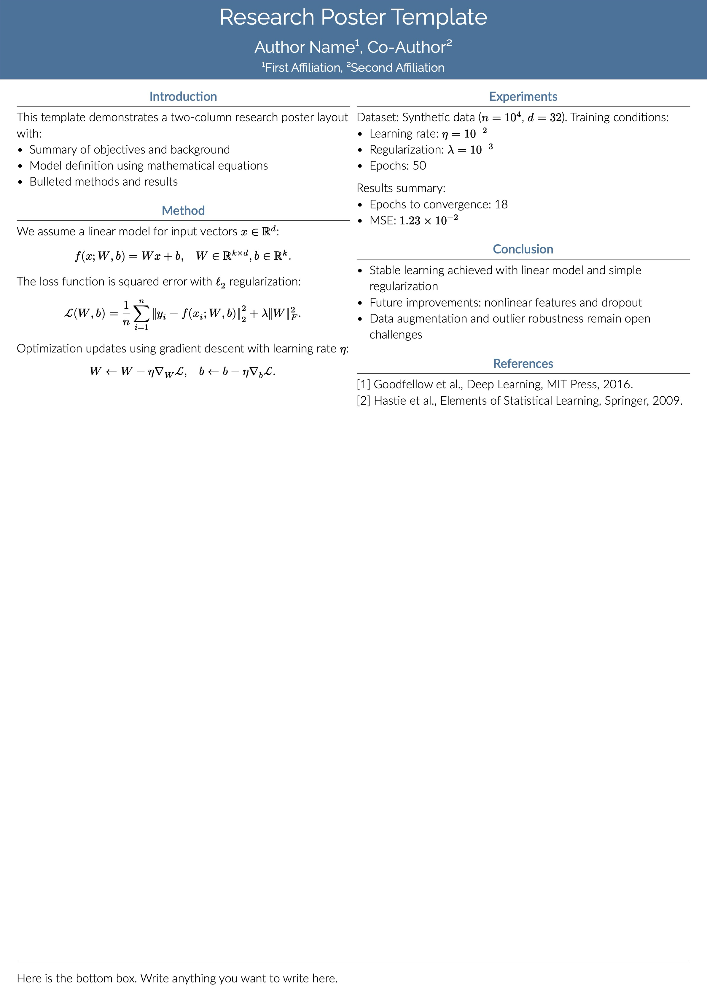
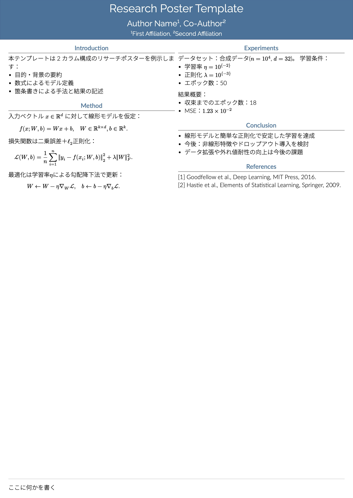

# Gemini-like Poster Template for Typst

A clean academic poster template for [Typst](https://typst.app), inspired by the LaTeX Gemini beamerposter theme. The template is based on [peace-of-posters](https://github.com/jonaspleyer/peace-of-posters) (MIT License) and styled after [Gemini](https://github.com/anishathalye/gemini) (MIT License).

## Features
- Simple, minimal and clean design
- Two-column a0 poster layout
- Customizable theme and layout
- Japanese and English mixed text support (日本語と英語の混在したテキストをサポート)

## Gallery
|  |  |
|---|---|
|  |  |

## Font Settings for Japanese and English mixed text
This template uses the following fonts by default:

- Lato and Raleway for English text
- Noto Sans CJK JP for Japanese text

As of Typst 0.14 (the latest release), the system does not yet support dynamic font loading.
To ensure proper rendering of bold text, especially for Noto Sans CJK JP, please remove any dynamically loaded versions of the font and reinstall the static version instead.

You may also use alternative fonts by modifying the font entries in the style files.

## License
MIT License

This Typst template is adapted from [peace-of-posters](https://github.com/jonaspleyer/peace-of-posters) by Jonas Pleyer and inspired by [Gemini](https://github.com/anishathalye/gemini) by Anish Athalye. See LICENSE for full details.

## References
- [peace-of-posters (MIT License)](https://github.com/jonaspleyer/peace-of-posters)
- [Gemini beamerposter theme (MIT License)](https://github.com/anishathalye/gemini)
