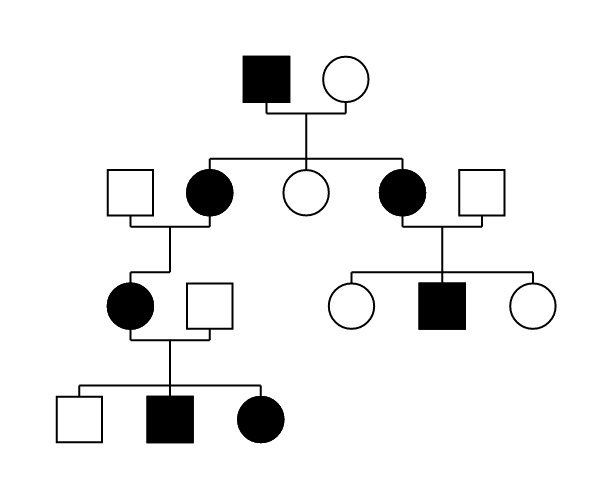

# Presentation

Genealotree is a typst package to draw genealogical trees.
It is developped at https://codeberg.org/drloiseau/genealogy. This is the place you can get the developpement version and send issues and pull requests.



This package is based on [CeTZ]("https://typst.app/universe/package/cetz/") and it provides functions to draw genealogical trees. It is oriented towards medical genealogy to study genetic disorders inheritance, but you might be able to use it to draw your family tree.

**Features :**
- Draw an unlimited number of independant genealogical trees
- Supports consanguinity and unions between different trees (see limitations)
- Auto adjusts position of children to optimize spacing
- Customize all lengths
- Draw as much phenotypes as needed by coloring individuals
- Print genotype and/or phenotype labels under individuals

**Limitations :**
- Must manually adjust individual position in the tree when drawing consanguinity and unions between trees to prevent overlapping of individuals.
- No remarriages (might be added in a future version)
- No union between individuals at different generations (might be added in a future version)

**To be implemented :**
- Allow to pass CeTZ arguments to every elements to cutomize their appearance
- Draw optional legends for tree symbols and for phenotypes

# Usage

See example.typ for a simple usage example, and the manual for precise references at [manual.pdf](https://codeberg.org/attachments/cfdad2b7-52ae-4e18-8d7b-453fadc45532)

The steps to produce a tree are :

- Import the package and CeTZ
```typ
#import "@preview/genealotree:0.1.0": *
#import "@preview/cetz:0.2.2": canvas
```

- Create a genealogy object
```typ
let my-geneal = genealogy-init()
```

- Add persons to the object : pass a dictionary mapping a persons name with a dictionary describing its characteristics. See the manual for a full reference.
```typ
let my-geneal = add-persons(
  my-geneal,
  (
    "I1": (sex: "m"),
    "I2": (sex: "f"),
    "II1": (sex: "f"),
  )
)
```

- Set unions between persons : give the parents names as an array of 2 strings, and the children names as an array of strings.
```typ
let my-geneal = add-unions(
  my-geneal,
  (("I1", "I2"), ("II1",))
)
```

- Open up a CeTZ canva and draw the tree
```typ
#canvas(length: 0.4cm, {
    draw-tree(my-geneal)
})
```

