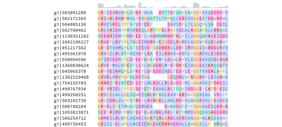

# genotypst

`genotypst` is a bioinformatics Typst package for biological sequence analysis and visualization. It provides functionality for reading FASTA files and generating common visualizations, such as multiple sequence alignments and sequence logos, for use in publications and presentations.

## Documentation

Refer to the [manual](./docs/manual.pdf) for a comprehensive guide containing examples illustrating how to use `genotypst`.

## Quickstart

A minimal example illustrating the use of `genotypst` is shown below. To reproduce it, download the example multiple sequence alignment file [`msa.afa`](./docs/data/msa.afa).

In a Typst document, import the package and read the alignment data:

```typst
#import "@preview/genotypst:0.1.0": *

// Load sequences
#let sequences = parse-fasta-file("msa.afa")

// Display the `sequences` variable
#repr(sequences)
```

```
(
  "gi|503891280": "MIQRSLRDKQIIKVLTGVRRCGKSTILQMFINFEDLAYEKYDYYELYQYL…",
  "gi|502172365": "TRPRVLRRVMGAVLIDGPKAVGKTQTTTRVLRLDVDVARAALVPEQLFE-…",
  "gi|504805136": "IYPRMDILPNFALVVSGIRRSGKSTLLTQFLNFDTPQLFNFEDFALLDEI…",
  "gi|502700462": "----MLETDLPALLIVGPRASGKTTTAARTVRLDVPAQAAAFDPDAALRN…",
  …
)
```

A region of the multiple sequence alignment can be rendered with `render-msa`:

```typst
// Render a multiple sequence alignment between positions 100 and 145
#render-msa(sequences, start: 100, end: 145, colors: true, conservation: true)
```



The same region of the alignment can also be visualized as a sequence logo using `render-sequence-logo`:

```typst
// Render a sequence logo between positions 100 and 145
#render-sequence-logo(sequences, start: 100, end: 145)
```


