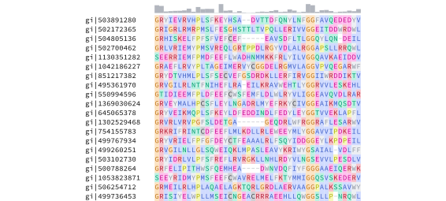

# genotypst

`genotypst` is a bioinformatics package for Typst that enables analysis and visualization of biological data. It provides functionality for parsing FASTA and Newick files and generating publication-ready visualizations, including multiple sequence alignments, sequence logos, genome maps, and phylogenetic trees.

## Documentation

Refer to the [manual](./docs/manual.pdf) for a comprehensive guide containing examples illustrating how to use `genotypst`.

## Quickstart

A minimal example illustrating the use of `genotypst` is shown below. To reproduce it, download the example multiple sequence alignment file [`msa.afa`](./docs/data/msa.afa).

In a Typst document, import the `genotypst` package:

```typst
#import "@preview/genotypst:0.3.0": *
```

You can perform a simple pairwise alignments and visualize both the alignment and its dynamic programming matrix:

```typst
// Perform a local alignment of two DNA sequences
#let dna_alignment = align-seq-pair(
  "AAT",
  "AACTTG",
  match-score: 3,
  mismatch-score: -1,
  gap-penalty: -1,
  mode: "local",
)

// Render the alignment
#render-pair-alignment(
  dna_alignment.seq-1,
  dna_alignment.seq-2,
  dna_alignment.traceback-paths.at(0),
)
```


```typst
// Render the dynamic programming matrix
#render-dp-matrix(
  dna_alignment.seq-1,
  dna_alignment.seq-2,
  dna_alignment.dp-matrix.values,
  path: dna_alignment.traceback-paths.at(0),
  arrows: dna_alignment.dp-matrix.arrows,
)
```


Read a FASTA file containing a multiple sequence alignment:

```typst
// Load sequences
#let sequences = parse-fasta(read("msa.afa"))

// Display the `sequences` variable
#repr(sequences)
```

```
(
  "gi|503891280": "MIQRSLRDKQIIKVLTGVRRCGKSTILQMFINFEDLAYEKYDYYELYQYL…",
  "gi|502172365": "TRPRVLRRVMGAVLIDGPKAVGKTQTTTRVLRLDVDVARAALVPEQLFE-…",
  "gi|504805136": "IYPRMDILPNFALVVSGIRRSGKSTLLTQFLNFDTPQLFNFEDFALLDEI…",
  "gi|502700462": "----MLETDLPALLIVGPRASGKTTTAARTVRLDVPAQAAAFDPDAALRN…",
  …
)
```

A region of the multiple sequence alignment can be rendered with `render-msa`:

```typst
// Render a multiple sequence alignment between positions 100 and 145
#render-msa(sequences, start: 100, end: 145, colors: true, conservation: true)
```



The same region of the alignment can also be visualized as a sequence logo using `render-sequence-logo`:

```typst
// Render a sequence logo between positions 100 and 145
#render-sequence-logo(sequences, start: 100, end: 145)
```


To render a genomic locus, you can pass an array of genomic features to the `render-genome-map` function:

```typst
// Render a genome map containing five features
#let locus = (
  (start: 400, end: 1260, strand: 1, label: [A], color: rgb("#56B4E9")),
  (start: 1300, end: 2200, strand: 1, label: [B]),
  (start: 2250, end: 3460, strand: -1, label: [C], color: rgb("#E69F00")),
  (start: 3500, end: 3800, label: [D]),
  (start: 3850, end: 5400, strand: 1, label: [E]),
)

#render-genome-map(
  locus,
  coordinate-axis: true,
  width: 80%,
)
```


You can also use `genotypst` to parse Newick data and visualize phylogenetic trees:

```typst
// Parse Newick data
#let tree = parse-newick(
  "(('Leaf A':0.2,'Leaf B':0.1)'Internal node':0.3,'Leaf C':0.6)Root;"
)
// Render the phylogenetic tree
#render-tree(tree)
```


