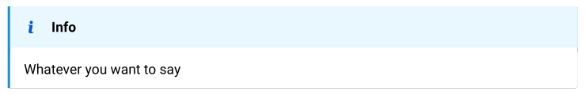

# gentle-clues 

Simple admonitions for typst. Add predefined or define your own. 

Inspired from [mdbook-admonish](https://tommilligan.github.io/mdbook-admonish/).


## Usage

`#import " @preview/gentle-clues:0.3.0: info, success, warning, error`

Writing this,

```typst
  #info[Whatever you want to say]
```
turns into this.



### Change header title language 

You can change the default language for the header titles by 

```typst
  #gc_header-title-lang.update("de")
```
At the moment valid options are: "de" and "en"

### Available Clues

The follwing clues/admonitions (+ some aliases) are available at the moment. `abstract`, `info`, `question`, `memo`, `task`, `idea`, `tip`, `quote`, `success`, `warning`, `error`, `example`.

[See here for more Information](https://github.com/jomaway/typst-admonish/blob/main/docs.pdf)

### Define your own

But it is very easy to define your own. 

```typst 
//Define it
#let ghost-admon(..args) = clue(
  title: "Buuuuh", 
  _color: teal,
  icon: emoji.ghost, 
  ..args
)
// Use it
#ghost-admon[Huuuuuh.]
```

The icon can be an `emoji`, `symbol` or `.svg`-file. 

The following color profiles are available to use in your own admonish. 
In a future version this probably will changed. 

```typst
// color profiles
#let colors = (
  gray:   (border: luma(70),          bg: luma(230)),
  blue:   (border: rgb(29, 144, 208), bg: rgb(232, 246, 253)),
  green:  (border: rgb(102, 174, 62), bg: rgb(235, 244, 222)),
  red:    (border: rgb(237, 32, 84),  bg: rgb(255, 231, 236)),
  yellow: (border: rgb(255, 201, 23), bg: rgb(252, 243, 207)),
  purple: (border: rgb(158, 84, 159), bg: rgb(241, 230, 241)),
  teal:   (border: rgb(0, 191, 165),  bg: rgb(229, 248, 246)),
  orange: (border: rgb(255, 145, 0),  bg: rgb(255, 244, 229)),
  redish: (border: rgb(255, 82, 82),  bg: rgb(253, 228, 224)),
  blueish:(border: rgb(0, 184, 212),  bg: rgb(229, 248, 251)),
  grayish:(border: rgb(158, 158, 158),bg: rgb(245, 245, 245)),
  greenish:(border: rgb(0, 143, 115),bg: rgb(221, 243, 231)),
  purpleish: (border: rgb(124, 77, 255), bg: rgb(242, 237, 255)),
)
```


### Reference 

Here the full reference to the admonish function.

```typst
clue(
  body,
  title: none, // Default: none, or string
  icon: "assets/flag.svg", // can be a file or an symbol|emoji
  _color: "gray",  // `_` due to naming conflicts with the type color.
  width: auto,
  radius: 2pt, // radius of the right side. For no radius set to 0pt.
  inset: 1em, // inset of the content, header-inset not yet supported
  header-inset: 0.5em, // define header inset.
)
```

## License 

MIT

# Changelog

## v0.3.0

- renamed entry files and base template
- default `header-inset` is `0.5em` now.
- added `gc_header-title-lang` state, which defines the language of the title.
  - Update with `#gc_header-title-lang.update("en")`
  - Accepts `"de"` or `"en"` at the moment.
- Using new `type` checks which requires typst version `0.8.0`
- renamed Parameter `color` to `_color` due to naming conflicts with the color type.

## v0.2.0

- set header inset. `#admonish(header-inset: 0.5em)`
- custom color: `#admonish(color: (stroke: luma(150), bg: teal))`
- new example admonition: `#example[Testing]`
  #example(header-inset: 0.8em)[Testing]

