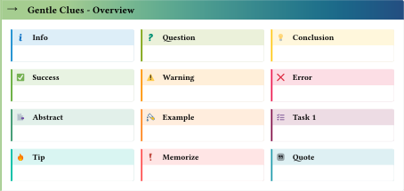

# gentle-clues 

Simple admonitions for typst. Add predefined or define your own. 

Inspired from [mdbook-admonish](https://tommilligan.github.io/mdbook-admonish/).


## Usage

`#import "@preview/gentle-clues:0.5.0": *`

Overview of the predefined clues:



To use the *info* one, it is as easy as writing 
```typst 
    #info[ This is the info clue ... ] 
```


### Change header title language 

You can change the default language for the header titles by 

```typst
  #gc_header-title-lang.update("de")
```
At the moment valid options are: "en","de" and "fr"

### Available Clues

The follwing clues/admonitions (+ some aliases) are available at the moment. `abstract`, `info`, `question`, `memo`, `task`, `idea`, `tip`, `quote`, `success`, `warning`, `error`, `example`.

[See here for more Information](https://github.com/jomaway/typst-admonish/blob/main/docs.pdf)

### Define your own

But it is very easy to define your own. 

```typst 
//When you import the package, include clue
#import "@preview/gentle-clues:0.5.0": clue

//Define it
#let ghost-admon(..args) = clue(
  title: "Buuuuh", 
  _color: gray,
  icon: emoji.ghost, 
  ..args
)
// Use it
#ghost-admon[Huuuuuh.]
```

The icon can be an `emoji`, `symbol` or `.svg`-file. 

### Reference 

Here the full reference to the admonish function.

```typst
clue(
  body,
  title: none, // Default: none, or string
  icon: "assets/flag.svg", // can be a file or an symbol|emoji
  _color: "gray",  // `_` due to naming conflicts with the type color.
  width: auto,
  radius: 2pt, // radius of the right side. For no radius set to 0pt.
  inset: 1em, // inset of the content, header-inset not yet supported
  header-inset: 0.5em, // define header inset.
)
```

## License 

MIT

# Changelog

## v0.5.0 (latest)

- Added option `breakable: true` to make clues breakable .
- Added spanish header titles. Use with `#gc_header-title-lang.update("es")`
- Removed aliases (breaking)

## v0.4.0 

- Added french header titles. Use with `#gc_header-title-lang.update("fr")`
- Fixed minor border issues
- Added an task-counter (disable with `gc_enable-task-counter.update(false)`)

*Colors:*

- Changed default color to `navy`
- Changed border-color
  - Fixed bug that it was sometimes no longer visible after `typst 0.9.0` update.
  - Default is now the same as `bg-color`
  - Set via color-dict `border` field.
- Added support for gradients: `#clue(_color: gradient.linear(..color.map.crest))`
- *Breaking:* Removed string color_profiles. 
- Changed some predefined colors.

## v0.3.0

- renamed entry files and base template
- default `header-inset` is `0.5em` now.
- added `gc_header-title-lang` state, which defines the language of the title.
  - Update with `#gc_header-title-lang.update("en")`
  - Accepts `"de"` or `"en"` at the moment.
- Using new `type` checks which requires typst version `0.8.0`
- renamed Parameter `color` to `_color` due to naming conflicts with the color type.

## v0.2.0

- set header inset. `#admonish(header-inset: 0.5em)`
- custom color: `#admonish(color: (stroke: luma(150), bg: teal))`
- new example admonition: `#example[Testing]`
  #example(header-inset: 0.8em)[Testing]

