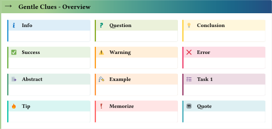

# gentle-clues 

Simple admonitions for typst. Add predefined or define your own. 

Inspired from [mdbook-admonish](https://tommilligan.github.io/mdbook-admonish/).

## Usage

Import the package
```typst
#import "@preview/gentle-clues:0.8.0": *
```
if needed you can change the default settings.
[See the docs.pdf for all options](https://github.com/jomaway/typst-admonish/blob/main/docs.pdf)

### Use predefined clues

```typst
// info clue
#info[ This is the info clue ... ] 

// or a tip
#tip(title: "Best tip ever")[Check out this cool package]
```

Overview of the predefined clues:



`abstract`, `info`, `question`, `memo`, `task`, `idea`, `tip`, `quote`, `success`, `warning`, `error`, `example`.

#### Language support

This package does use [linguify](https://github.com/jomaway/typst-linguify) to support multiple languages.

**Header titles:**
The language of the header titles is detected automatically from the `context text.lang`.
Currently the following languages are supported: "en", "de", "es", "fr", "zh". 

If an unsupported language is set it will fallback to english as default.
Feel free to open a PR with your language added to the `lang.toml` file.

### Define your own clue

Just need a clue once the fastest way is to use `clue` directly:
The following example will create an orange Test clue.
```typst
#clue(title: "Test", icon: none, accent-color: orange)[We should run more tests!]
```

But it is also very easy to define a clue, which you can reuse.

```typst 
// Define a clue called ghost
#let ghost(title: "Buuuuuuh", icon: emoji.ghost , ..args) = clue(
  accent-color: silver,
  title: title,
  icon: icon,
  ..args
)

// Use it
#ghost[Huuuuuuh.]
```

The icon can be an `emoji`, `symbol` or a path to an image.

## License 

[MIT License](LICENSE)

## Changelog

[See CHANGELOG.md](CHANGELOG.md)
