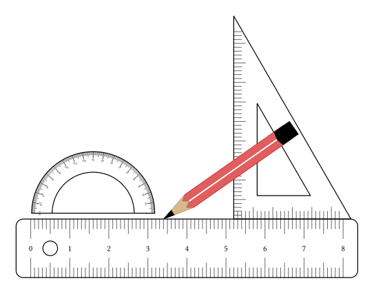
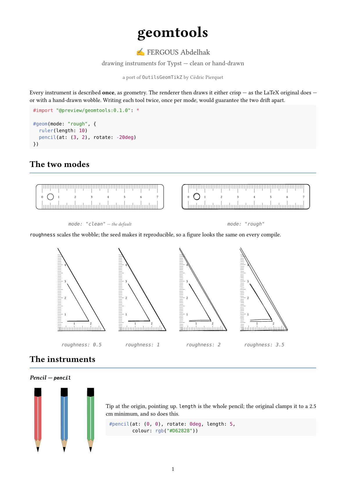

# geomtools

Draw rulers, set squares, protractors and compasses on a figure — crisp or
hand-drawn.

A port of Cédric Pierquet's
[`OutilsGeomTikZ`](https://ctan.org/pkg/outilsgeomtikz) (LPPL 1.3c).





```typ
#import "@preview/geomtools:0.1.0": *

#geom(mode: "rough", {
  ruler(length: 10)
  pencil(at: (3, 2), rotate: -20deg)
})
```

No CeTZ, no plugin — the instruments are plain Typst `curve`s. Requires
Typst 0.13 or later.

## One description, two modes

Every instrument is described **once**, as geometry: a list of polygons,
circles, arcs and labels. The renderer then draws that list either crisp — as
the LaTeX original does — or with a hand-drawn wobble.

```typ
#geom(ruler(length: 7))                              // clean, the default
#geom(ruler(length: 7), mode: "rough")               // hand-drawn
#geom(ruler(length: 7), mode: "rough", roughness: 3) // heavier
#geom-rough(ruler(length: 7))                        // shorthand
```

The wobble is deterministic: same `seed`, same figure, every compile.

## The instruments

| function | original | notes |
|---|---|---|
| `pencil` | `\tkzCrayon` | tip at the origin, pointing up |
| `pencil-tip` | — | tip at `to`, pointing along `from → to` |
| `ruler` | `\tkzRegle` | zero at the origin, running right |
| `ruler-square` | `\tkzRequerre` | rectangular, two graduated edges |
| `set-square` | `\tkzEquerre` | 30-60-90, right angle at the origin |
| `mini-square` | `\tkzMiniEquerre` | small, plain, for marking perpendiculars |
| `mini-ruler` | `\tkzMiniRegle` | small, plain |
| `protractor` | `\tkzRapporteur` | half or full, degrees and radians |
| `percent-dial` | `\tkzPourcenteur` | the disc graduated 0–100 |
| `protractor-square` | `\tkzRappEquerre` | half-disc on a graduated edge |
| `compass` | `\tkzCompas` | opens to span two given points |
| `right-angle` | — | open square; notation, not a tool |

Common arguments: `at`, `rotate`, `scale`, `colour`, `fill`, and — where the
original has them — `length`, `width`, `ticks`, `values`, `value-size`.

French keys map to English: `Longueur` → `length`, `Largeur` → `width`,
`Couleur` → `colour`, `Origine` → `at`, `Rotation` → `rotate`,
`Echelle` → `scale`, `AfficheTraits` → `ticks`, `AfficheValeurs` → `values`.

## A construction

The primitive constructors are exported, so a tool is just data you can add
to. A construction arc is drawn **dashed** (the textbook convention: solid
is the figure, dash is the instrument's trace). Put a pencil at the end of
a stroke with `pencil-tip`.

```typ
#geom({
  p-line((0, 0), (8, 0), stroke: luma(120), role: "edge")
  p-arc((0, 0), 4.5, 12deg, 78deg, stroke: blue, dash: "dashed")
  compass((0, 0), (3.2, 3.2))
  ruler(at: (0, -0.55), length: 8, values: false)
  pencil-tip((0, 0), (8, 0))
})
```

Measure an angle with the protractor, centred on the vertex, base along a
side:

```typ
#geom({
  protractor(at: (0, 0), scale: 0.6, radians: false)
  pencil-tip((0, 0), (2.2, 4.8), colour: rgb("#2B6CB0"), lead: rgb("#2B6CB0"))
})
```

`p-poly` `p-line` `p-circle` `p-arc` `p-label`, plus `arc-pts`,
`circle-pts`, `rect-pts`, `dist`, `vangle`.

## Details

- **Ruler** — three graduation depths at 0.25 / 0.375 / 0.5 cm. `corner`
  (default `0.12`) is a rounded corner, not a capsule; `corner: 0` is
  square. `width` floors at 1.5 cm unless `clamp: false`.
- **Set square** — `width = length · tan 30°`, so the angles stay right.
  `flip: true` turns it over on the table (not the same as `rotate:
  180deg`). `length` floors at 4.5 cm unless `clamp: false`.
- **Protractor** — outer rim 3.75, inner 2.5. `full: true` for 360°.
- **Compasses** — legs open to `asin(|from − to| / (2 · leg))`. The needle
  sits on `from`. Colour the lead with `pencil-lead:`.
- **Right-angle mark** — an *open* square. Do not use `mini-square` here:
  that tool has a hypotenuse.

Labels are never wobbled. Short ticks take about a third of the edge wobble.

## Layout

```
lib.typ          public API and the `geom` surface
src/canvas.typ   primitives and the two-mode renderer
src/tools.typ    the instruments, as geometry
examples/        gallery (excluded from the download)
```

``

## User guide

 


 


## Licence

MIT — see [`LICENSE`](LICENSE) for how this port relates to the
LPPL-licensed original.

Ported from [`OutilsGeomTikZ`](https://ctan.org/pkg/outilsgeomtikz) by Cédric
Pierquet (LPPL 1.3c). He neither maintains nor endorses this port; please do
not send him bug reports about it.

The gallery is [`examples/showcase.typ`](examples/showcase.typ).
