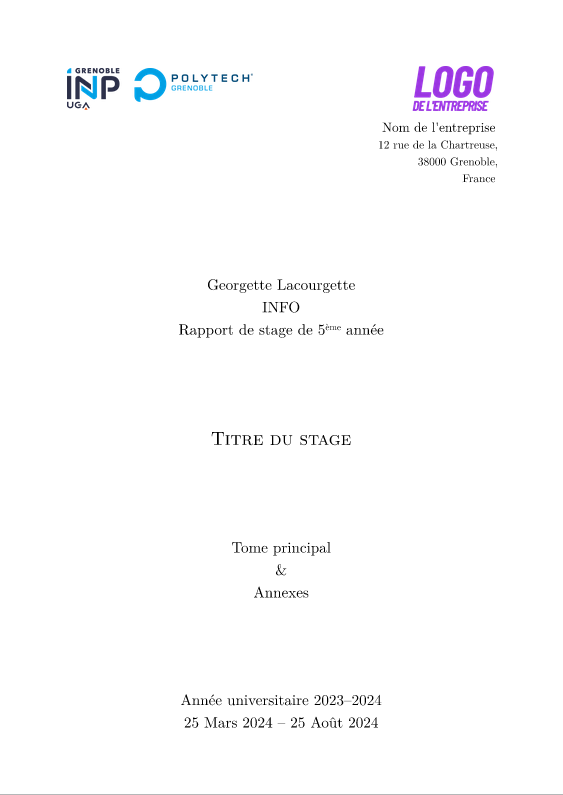

# Georges Yétyp

[French version](README.fr.md)

Typst template for Polytech (Grenoble) internship reports.

[](thumbnail.png)

## Usage

Either use this template [in the Typst web app](https://typst.app/?template=georges-yetyp&version=0.1.0), or use the command line to initialize a new project based on this template:

```bash
typst init @preview/georges-yetyp
```

Then, replace `logo.png` with the logo of the company you worked for, fill in all the details in the `rapport` parameters, and start writing below.

## Other schools

Adding support for other schools of the Polytech network would be fairly easy if you want to re-use this template. All that is needed is a copy of their logo (with the authorization to use it). Submissions are welcome.