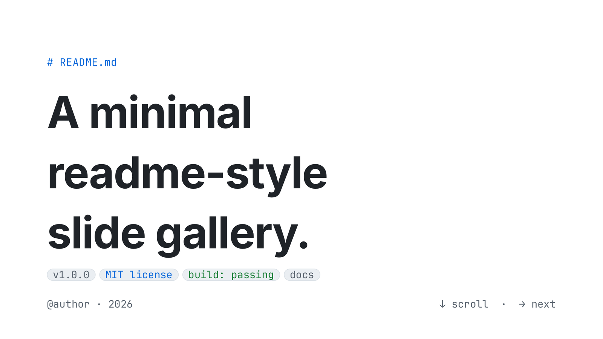
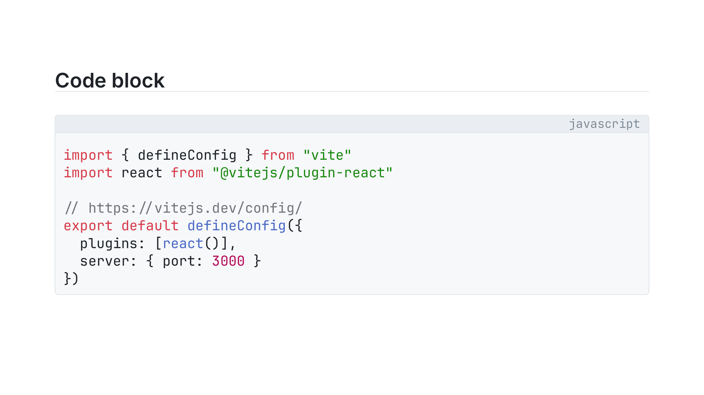
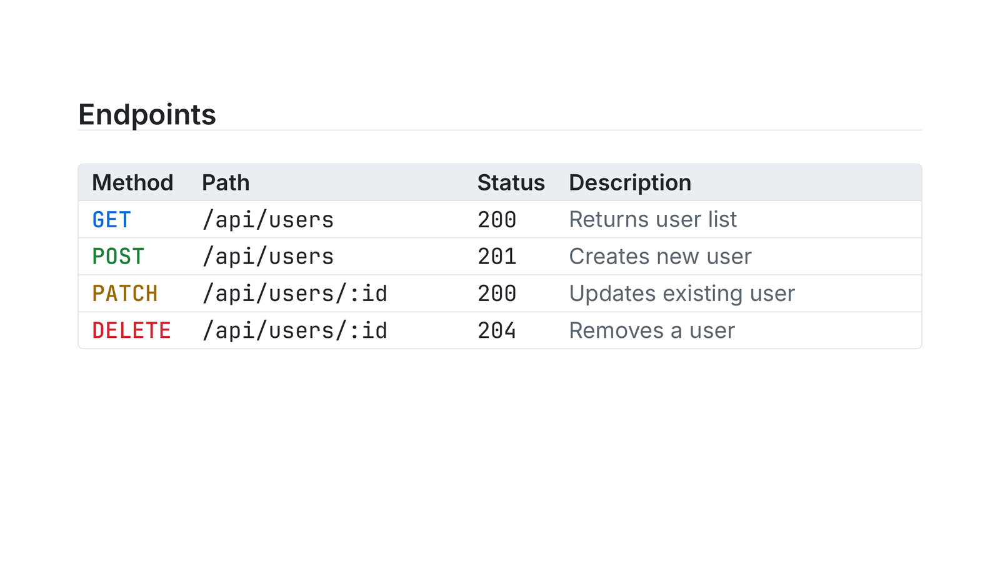
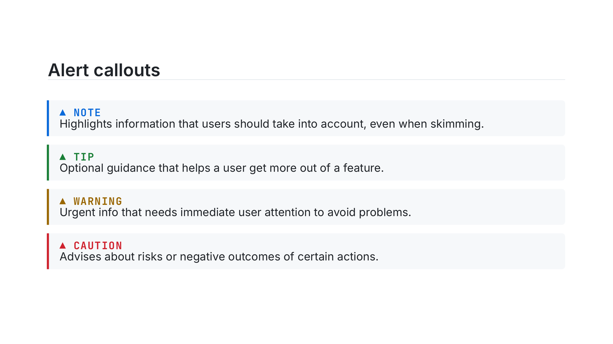

# gh-minimal-slides — GitHub-readme-style slides for Typst

A reusable [Touying](https://github.com/touying-typ/touying) component
library for slides that look like a rendered GitHub README. Light and
dark themes, six accent colors, two density presets — all switched at
register-time. Single-file, no extra dependencies beyond `@preview/touying`.

<table>
  <tr>
    <td width="50%"></td>
    <td width="50%"></td>
  </tr>
  <tr>
    <td width="50%"></td>
    <td width="50%"></td>
  </tr>
</table>

<sub>Light theme, blue accent, comfy density. The full 13-slide deck is in <a href="example.pdf"><code>example.pdf</code></a> (source: <a href="example.typ"><code>example.typ</code></a>).</sub>

## Install

From Typst Universe:

```typst
#import "@preview/touying:0.7.3": *
#import "@preview/gh-minimal-slides:0.1.0" as gh
```

Or scaffold a starter deck:

```bash
typst init @preview/gh-minimal-slides:0.1.0 my-deck
cd my-deck
typst compile main.typ
```

## Quick start

```typst
#import "@preview/touying:0.7.3": *
#import "@preview/gh-minimal-slides:0.1.0" as gh

#show: gh.register.with(
  theme:   "light",   // "light" | "dark"
  accent:  "blue",    // "blue" | "green" | "purple" | "pink" | "orange" | "mono"
  density: "comfy",   // "comfy" | "compact"
)

#gh.cover-slide(
  title: [A minimal\ readme-style\ slide gallery.],
  badges: ("v1.0.0", ("MIT license", "accent"), ("build: passing", "success"), "docs"),
)

#gh.content-slide(title: [Unordered list])[
- Mix freely with prose, like `npm install`.
- Links inherit the accent color — #gh.gh-link[see reference →]
]

#gh.content-slide(title: [Numbered list])[
+ Use Typst's native enum syntax.
+ Keep slide helpers for layout, not for basic Markdown-like markup.
]
```

See [`example.typ`](example.typ) for a complete 13-slide deck showing the
common components. The compiled [`example.pdf`](example.pdf) shows the full
preview.

## API

### Slide functions

| Function | Required args | Notes |
|---|---|---|
| `cover-slide` | `title:` | Optional `kicker:`, `badges:`, `footer-left:`, `footer-right:`. Badges accept strings or `(text, kind)` tuples where kind is `"default"` / `"accent"` / `"success"`. |
| `section-slide` | `number:`, `title:` | Optional `kicker:` (default `"Chapter"`). |
| `content-slide` | `title:`, body block | Preferred text slide. Use normal Typst markup, including `-` bullets, `+` numbered lists, and fenced code blocks. Accepts `animation: true` for top-level bullet reveals, or `repeat:` plus a callback body for custom Touying animations. |
| `bullet-slide` | `title:`, `items:` | Deprecated legacy helper. Use `content-slide` with callback-style animation instead. |
| `ordered-slide` | `title:`, `items:` | Legacy helper for accent-numbered tuple items or incremental reveals. Prefer `content-slide` with `+` lists for ordinary numbered content. |
| `quote-slide` | `body:` | Optional `title:`, `attribution:`. |
| `code-slide` | `lines:` | Deprecated legacy helper. Prefer fenced code blocks inside `content-slide`. |
| `table-slide` | `headers:`, `rows:` | Optional `title:`, `columns:`, `value-colors:`, `animation:`. `method-colors:` is a deprecated alias for `value-colors:`. |
| `two-col-slide` | `left:`, `right:` | Each side is `(kicker, color, stat, body)`. `color` is `"success"`, `"warning"`, `"danger"`, `"accent"`, or any `rgb(...)`. |
| `image-slide` | `body:` *or* `placeholder-text:` | Pass `body: image("path.png")` or rely on the placeholder block. Caption supports `gh-link`. |
| `stats-slide` | `stats:` | Each stat is `(value, label, delta)`. Renders as a 2-column grid. |
| `task-slide` | `tasks:` | Each task is `(done, label, meta)`. Done tasks get a strike-through and green checkbox. |
| `alert-slide` | `alerts:` | Each alert is `(kind, color, body)`. `kind` like `"NOTE"`, `"TIP"`, `"WARNING"`, `"CAUTION"`. |
| `closing-slide` | `title:` | Optional `kicker:`, `links:`. |

Every chromed slide function also accepts `n:` and `total:` for the
counter, but they default to Touying's inferred slide numbers. Do not pass
them in normal decks.

### Animations

Use `animation: true` in `content-slide` for ordinary top-level bullet reveals:

```typst
#gh.content-slide(title: [Example], animation: true)[
  - First point
  - Second point
  - Third point
]
```

Use Touying's callback-style animation when a slide needs custom timing:

```typst
#gh.content-slide(title: [Example], repeat: 2, self => [
  #let (uncover, only, alternatives) = utils.methods(self)

  - First point
  #uncover("2-")[- Second point]
])
```

Prefer this over `#pause` inside `content-slide`; the theme uses Typst
`context` blocks for live styling, and raw pause markers are not supported
inside that context.

`table-slide(animation: true)` reveals table rows one at a time while keeping
the header visible:

```typst
#gh.table-slide(
  title: [Example],
  headers: ("Name", "Role"),
  rows: (
    ("Claude", "coding agent"),
    ("Codex", "coding agent"),
  ),
  animation: true,
)
```

### Building blocks (call directly inside slide bodies or anywhere)

| Function | Use |
|---|---|
| `` `code` `` | Preferred inline code syntax. Backticks are styled as pill-shaped inline code. |
| fenced code blocks | Preferred code block syntax. Triple-backtick blocks render with terminal chrome and Typst's native syntax highlighting. |
| `code-inline(body)` | Direct helper behind the backtick styling; kept for custom composition. |
| `terminal-block(title:, lang:, prompt:, lines:, body:)` | Lower-level compact terminal block. Use fenced blocks for code; use `terminal-block` for prompts/output like `/context`, or when you need a custom title. Line numbers are opt-in with `line-numbers: true`. |
| `code-block(filename:, lang:, lines:)` | Deprecated compatibility wrapper around `terminal-block`. |
| `gh-link(body)` | Accent-colored span. No underline. |
| `c-keyword`, `c-string`, `c-number`, `c-comment` | Syntax-color helpers for use inside `terminal-block` lines. |

### Tokens (read directly if you want to compose your own widgets)

- `gh-light`, `gh-dark` — palette dictionaries: `bg-canvas`,
  `bg-canvas-subtle`, `bg-neutral-muted`, `fg-default`, `fg-muted`,
  `fg-subtle`, `border-default`, `border-muted`, `success`, `warning`,
  `danger`.
- `gh-accents` — six entries (`blue`, `green`, `purple`, `pink`,
  `orange`, `mono`), each with `(light, dark)` variants.

## Design rules

These are encoded in code as well, but worth knowing when authoring
decks:

- **One accent per deck.** Picked at register-time. Slide functions
  read it — they don't take an `accent:` arg. (If you want per-section
  accents, see `terminal-fancy/` instead.)
- **Light vs dark are full re-skins**, also chosen at register-time.
  Dark mode swaps every palette token; the same source compiles in both.
- **Status colors** (`success` / `warning` / `danger`) are reserved for
  semantics — HTTP method colors, alert kinds, deltas. They are not
  configurable.
- **Slide numbers are inferred.** Only override `n:` / `total:` for unusual
  appendix or export cases.

## Customizing

Three patterns, in order of effort:

1. **Switch theme/accent/density.** Change the `register.with(...)`
   call. Every slide re-skins.
2. **Use the building blocks outside a slide.** `code-inline`,
   `terminal-block`, `gh-link`, and `c-*` syntax helpers are all callable
   from any context — useful for inline content inside other components
   (e.g. linking from a caption, embedding code in a quote attribution).
3. **Write a custom slide.** Wrap your body in `touying-slide-wrapper(self =>
   touying-slide(self: self, context { let ctx = gh._gh-state.get(); ... }))`
   and use `ctx.palette` / `ctx.accent` / `ctx.ts` / `ctx.sp` to honor
   the active theme. The internal helpers (`_h1`, `_h2`, `_breadcrumb`,
   `_pill`, `_frame`) are available too.

## Fonts

- **Inter** — sans (body, headings).
- **JetBrains Mono** — mono (code, breadcrumbs, badges, metadata).

The CSS source uses `-apple-system, BlinkMacSystemFont, ...` for sans
and `ui-monospace, "SF Mono", ...` for mono — neither installable as a
font file. Inter + JetBrains Mono are the closest cross-platform
substitutes and are already used by the sibling `terminal-fancy` theme.

If you don't have them locally:

```bash
brew install --cask font-inter font-jetbrains-mono
```

Fallbacks (`Helvetica Neue`, `SF Mono`, `Menlo`, `Consolas`) keep the
warning noise down on machines without those fonts.

## License

Adapted from a GitHub-readme-style React reference deck. Free to use and modify.
