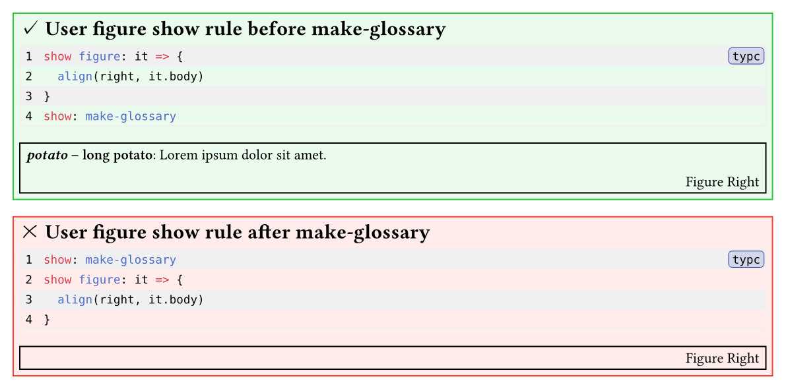

# Typst glossary

> [!TIP]
> Glossarium is based in great part of the work of [Sébastien d'Herbais de Thun](https://github.com/Dherse) from his master thesis available at: <https://github.com/Dherse/masterproef>.
> His glossary is available under the MIT license [here](https://github.com/Dherse/masterproef/blob/23d41711030ce1e4f49dfed0d7d6f53fee581942/elems/acronyms.typ).

Glossarium is a simple, easily customizable typst glossary inspired by [LaTeX
glossaries package](https://www.ctan.org/pkg/glossaries) . You can see various
examples showcasing the different features in the `examples` folder.


# Fast start

```typ
#import "@preview/glossarium:0.5.7": make-glossary, register-glossary, print-glossary, gls, glspl
#show: make-glossary
#let entry-list = (
  (
    key: "kuleuven",
    short: "KU Leuven",
    long: "Katholieke Universiteit Leuven",
    description: "A university in Belgium.",
  ),
  // Add more terms
)
#register-glossary(entry-list)
// Your document body
#print-glossary(
 entry-list
)
```

# I don't like it!

**Issues, PRs, and comments are welcome!** If you are unsure where to post, create an issue and I will triage it.

Take a look at:
- [`acrostiche`](https://typst.app/universe/package/acrostiche)
- [`glossy`](https://typst.app/universe/package/glossy)

and [many](https://typst.app/universe/search?q=acro) [others](https://typst.app/universe/search?q=glo)

# Detailed guide

## Import and setup

Import the package from the typst preview repository:

```typ
#import "@preview/glossarium:0.5.7": make-glossary, register-glossary, print-glossary, gls, glspl
```

To use **glossarium** as a vendored module, download the package files into your project folder and import `glossarium.typ`:

```typ
#import "glossarium.typ": make-glossary, register-glossary, print-glossary, gls, glspl
```

To use **glossarium** locally, create a new package namespace on your system:
- follows the instructions at [typst/packages](https://github.com/typst/packages?tab=readme-ov-file#local-packages)
- import glossarium (if your namespace is named `local`):
  ```typ
  #import "@local/glossarium:0.5.7": make-glossary, register-glossary, print-glossary, gls, glspl
  ```

## Making the glossary

After importing the package and before making any calls to `gls`, ` print-glossary` or `glspl`, please ***MAKE SURE*** you add this line
```typ
#show: make-glossary
```

> [!NOTE]
> <h3 align="center">*WHY DO WE NEED THAT?*</h3>
>
> In order to be able to create references to the terms in your glossary using typst [reference syntax](https://typst.app/docs/reference/model/ref/) `@key` glossarium needs to setup some [show rules](https://typst.app/docs/tutorial/advanced-styling/) before any references exist.

> [!CAUTION]
> <h3 align="center">*SHOW RULES CONFLICTS*</h3>
>
> Prefer to use the [selector](https://typst.app/docs/reference/foundations/function/#definitions-where) `figure.where(kind: "image")` or other kinds to avoid conflicts with `glossarium_entry`.
> `make-glossary` can conflict with _global_ figure show rules. Write the user figure show rule before `make-glossary` to avoid any conflicts.
> 

## Registering the glossary

A term is a [dictionary](https://typst.app/docs/reference/types/dictionary/).

| Key           | Type              | Required/Optional | Description                                                                                                             |
| :------------ | :---------------- | :---------------- | :---------------------------------------------------------------------------------------------------------------------- |
| `key`         | string            | required          | Case-sensitive, unique identifier used to reference the term.                                                           |
| `short`       | string or content | semi-optional     | The short form of the term replacing the term citation.                                                                 |
| `long`        | string or content | semi-optional     | The long form of the term, displayed in the glossary and on the first citation of the term.                             |
| `description` | string or content | optional          | The description of the term.                                                                                            |
| `plural`      | string or content | optional          | The pluralized short form of the term.                                                                                  |
| `longplural`  | string or content | optional          | The pluralized long form of the term.                                                                                   |
| `group`       | string            | optional          | Case-sensitive group the term belongs to. The terms are displayed by groups in the glossary.                            |
| `custom`      | any               | optional          | Custom content for usage in "user functions", e.g. `user-print-glossary` (see [advanced docs](./advanced-docs/main.pdf))|


```typ
#register-glossary(entry-list)
```

```typ
#let entry-list = (
  // Use key as short by default
  (
    key: "kuleuven",
  ),
  // Add SHORT
  (
    key: "kuleuven",
    short: "KU Leuven"
  ),
  // Add LONG
  (
    key: "unamur",
    short: "UNamur",
    long: "Namur University",
  ),
  // Add a DESCRIPTION
  (
    key: "oidc",
    short: "OIDC",
    long: "OpenID Connect",
    description: [
      OpenID is an open standard and decentralized authentication protocol promoted by the non-profit
      #link("https://en.wikipedia.org/wiki/OpenID#OpenID_Foundation")[OpenID Foundation].
    ],
  ),
  // Add a PLURAL form
  (
    key: "potato",
    short: "potato",
    // "plural" will be used when "short" should be pluralized
    plural: "potatoes",
  ),
  // Add a LONGPLURAL form
  (
    key: "dm",
    short: "DM",
    long: "diagonal matrix",
    // "longplural" will be used when "long" should be pluralized
    longplural: "diagonal matrices",
    description: "Probably some math stuff idk",
  ),
  // Add a GROUP
  (
    key: "kuleuven",
    short: "KU Leuven",
    // The terms are displayed by groups in the glossary
    group: "Universities",
  ),
  // Add a CUSTOM entry
  (
    key: "c",
    short: $c$,
    description: "Speed of light in vacuum",
    // The custom key will be ignored by the default print-glossary function
    custom: (unit: $op("m s")^(-1)$),
  ),
)
```

## Printing the glossary

Now, you can display the glossary using the `print-glossary` function.

```typ
#print-glossary(entry-list)
```

By default, the terms that are not referenced in the document are not shown in the glossary, you can force their appearance by setting the `show-all` argument to true.

You can also disable the back-references by setting the parameter `disable-back-references` to `true`.

By default, group breaks use `linebreaks`. This behaviour can be changed by setting the `user-group-break` parameter to `pagebreak()`, or `colbreak()`, or any other function that returns the `content` you want.

You can call this function from anywhere in your document.

## Referencing terms.

Referencing terms is done using the key of the terms using the `gls` function or the reference syntax.

```typ
// referencing the OIDC term using gls
#gls("oidc")
// displaying the long form forcibly
#gls("oidc", long: true)

// referencing the OIDC term using the reference syntax
@oidc
```

## Handling plurals

You can use the `glspl` function and the references supplements to pluralize terms.
The `plural` key will be used when `short` should be pluralized and `longplural` will be used when `long` should be pluralized. If the `plural` key is missing then glossarium will add an 's' at the end of the short form as a fallback.

```typ
#glspl("potato")
```

Alternatively, you can reference the automatically generated label:

```typ
@potato:pl
```

Please look at the examples regarding plurals.

## Handling capitalization

If you use a term at the beginning of a sentence, you might want to capitalize it.
You can use the `capitalize` argument of `#gls` and `#glspl` to do so,
or, shorter, call `#Gls` and `#Glspl`.

```typ
#Gls("ref")
```

You can also reference the automatically generated labels:

```typ
@Ref
@Ref:pl
```

Please note that these are only generated if the `key` does not start with an uppercase letter.

## Overriding the text shown

You can also override the text displayed by setting the `display` argument.

```typ
#gls("oidc", display: "whatever you want")
```

## Styling references links

I recommend setting a show rule for the links to that your readers understand that they can click on the references to go to the term in the glossary.

```typ
#show link: set text(fill: blue.darken(60%))
// links are now blue !
```

It is also possible to apply styling specifically to the glossarium references with a `show ref` rule. Make sure this rule comes **after** `make-glossary`.

This approach only styles references that use `@ref` and `@ref:pl` instead of `gls("ref")` and `glspl("ref)`.

```typ
#show: make-glossary

#show ref: it => {
  let el = it.element
  if el != none and el.func() == figure and el.kind == "glossarium_entry" {
    // Make the glossarium entry references dark blue
    text(fill: blue.darken(60%), it)
  } else {
    // Other references as usual.
    it
  }
}
```
(Credits go to flokl for the [solution](https://forum.typst.app/t/how-do-you-apply-a-style-to-glossarium-references-that-is-different-to-other-reference-types/2089/2?u=ogre) on the Typst forums).

By adding `else if` clauses for different functions and kinds, each type of reference can be given a different style.

Note that when using the `show ref` rule approach together with a **global** `show link` rule the styling in the `show ref` rule gets overwritten. To avoid this change the `show link` rule to only style specific types, e.g., `str` links (like website or mailto links).

```typ
#show link: it => {
  if type(it.dest) == str {
    // Style links to strings red
    text(fill: red, it)
  } else {
    // Return other links as usual
    it
  }
}
```

## Customization

Further customization is possible. Here is a short list of alternative functions you can pass to `print-glossary` to modify the layout.

- `user-print-glossary`: print the entire glossary
- `user-print-group-heading`: print the group heading 
- `user-group-break`: display a break between groups
- `user-print-gloss`: print one entry
- `user-print-title`: print the entry's title
- `user-print-description`: print the entry's description
- `user-print-back-references`: print the entry's backreferences.

Read more about customizing glossarium in the [advanced documentation](advanced-docs/main.pdf).
