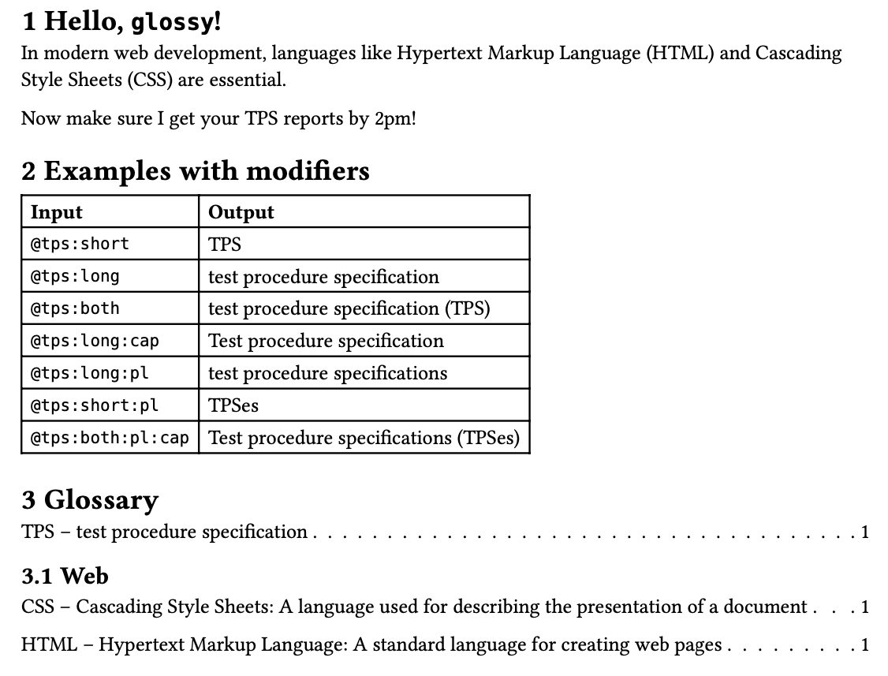

# Glossy

This package provides utilities to manage and render glossaries within
documents. It includes functions to define and use glossary terms, track their
usage, and generate a glossary list with references to where terms are used in
the document.



## Motivation

Glossy is heavily inspired by
[glossarium](https://typst.app/universe/package/glossarium), with a few key
different goals:

1. Provide a simple interface which allows for complete control over glossary
   display. To do this, `glossy`'s `#glossary()` function accepts a theme
   parameter. The goal here is to separate presentation and logic.
1. Simplify the user interface as much as possible. Glossy has exactly two
   exports, `init-glossary` and `glossary`.
1. Double-down on `glossy`'s excellent `@term` reference approach, completely
   eliminating the need to make any calls to `gls()` and friends.
1. Mimic established patterns and best practices. For example, `glossy`'s
   `#glossary()` function is intentionally similar (in naming and parameters) to
   `typst`'s built-int `#bibliography`, to the degree possible.
1. Simplify the implementation. The `glossy` code is significantly shorter and
   easier to understand.

## Features

- Define glossary terms with short and long forms, descriptions, and grouping.
- Automatically tracks term usage in the document, making references simple
  through @labels.
- Supports modifiers to adjust how terms are displayed (capitalize, pluralize,
  etc.).
- Generates a formatted glossary section with backlinks to term occurrences in
  the document.
- Easily customizable themes for rendering glossary sections, groups, and
  entries.

## Usage

### Import the package

```typst
#import "@preview/glossy:0.1.1": *

```

### Defining Glossary Terms

Use the `init-glossary` function to initialize glossary entries and process
document content:

```typst
#let myGlossary = (
    (
      key: "html",
      short: "HTML",
      long: "Hypertext Markup Language",
      description: "A standard language for creating web pages",
      group: "Web"
    ),
    (
      key: "css",
      short: "CSS",
      long: "Cascading Style Sheets",
      description: "A stylesheet language used for describing the presentation of a document",
      group: "Web"
    ),
    (
      key: "tps",
      short: "TPS",
      long: "test procedure specification"
    ),
    // Add more entries as needed
)

#show: init-glossary.with(myGlossary)

// Your document content here, where glossary terms are used.
```

Note that you could also load glossary entries from a data file using
[#yaml()](https://typst.app/docs/reference/data-loading/yaml/),
[#json()](https://typst.app/docs/reference/data-loading/json/), or
[similar](https://typst.app/docs/reference/data-loading/).

### Using Glossary Terms in Your Document

Use glossary terms within your text using the `@reference` functionality in
typst.

For example, `@html` and `@css` are used in the following text:

```typst
In modern web development, languages like @html and @css are essential.

Now make sure I get your @tps:short reports by 2pm!
```

... which should output:

```text
In modern web development, languages like Hypertext Markup Language (HTML) and
Cascading Style Sheets (CSS) are essential.

Now make sure I get your TPS reports by 2pm!
```

You can control how each term is displayed using the following modifiers:

- **cap**: Capitalizes the term.
- **pl**: Uses the plural form of the term.
- **both**: Displays both the long and short forms (e.g., "Long Form (Short Form)").
- **short**: Displays only the short form.
- **long**: Displays only the long form.

Each modifier is separated by a colon (':') character. Examples:

| **Input**               | **Output**                                   |
| ----------------------- | -------------------------------------------- |
| `@tps` (first use)      | "technical procedure specification (TPS)"    |
| `@tps` (subsequent use) | "TPS"                                        |
| `@tps:short`            | "TPS"                                        |
| `@tps:long`             | "technical procedure specification (TPS)"    |
| `@tps:both`             | "technical procedure specification (TPS)"    |
| `@tps:long:cap`         | "Technical procedure specification"          |
| `@tps:long:pl`          | "technical procedure specifications"         |
| `@tps:short:pl`         | "TPSes"                                      |
| `@tps:both:pl:cap`      | "Technical procedure specifications (TPSes)" |

Combine modifiers in any way you like. But know that if you combine any of
`short`, `long`, and/or `both`, only one will be used.

### Generating the Glossary

To display the glossary in your document, use the `glossary` function. Customize
the title and specify a theme if desired:

```typst
#glossary(title: "Web Development Glossary", theme: my-theme, groups: ("Web"))
```

### Themes

Customize the appearance of the glossary using themes. Each theme defines how
sections, groups, and entries are displayed.

- **section**: This is a main glossary section. It contains multiple glossary groups.
- **group**: A group within the main glossary section. Contains multiple
  entries. Can be an empty string for terms with no group (`""`).
- **entry**: A single entry within a group. This is the actual term, and can
  include any of the fields in entry. Contains the following fields:
  - `key`: The term key. (always present and unique)
  - `short`: The short form of the term. (always present)
  - `long`: The long form. (can be `none`)
  - `description`: The description or definition. (can be `none`)
  - `pages`: Pages with links to term usage in doc. (always present)

Example of a minimal theme:

```typst
#let my-theme = (
  section: (title, body) => {
    heading(level: 1, title)
    body
  },
  group: (name, i, n, body) => {
    // i is the group's index, n is total number of groups
    if name != "" and n > 1 {
      heading(level: 2, name)
    }
    body
  },
  entry: (entry, i, n) => {
    // i is the entry's index, n is total number of entries
    let output = [#entry.short]
    if entry.long != none {
      output = [#output -- #entry.long]
    }
    if entry.description != none {
      output = [#output: #entry.description]
    }
    block(
      grid(
        columns: (auto, 1fr, auto),
        output,
        repeat([#h(0.25em) . #h(0.25em)]),
        entry.pages,
      )
    )
  }
)
```

## License

This project is licensed under the MIT License.
