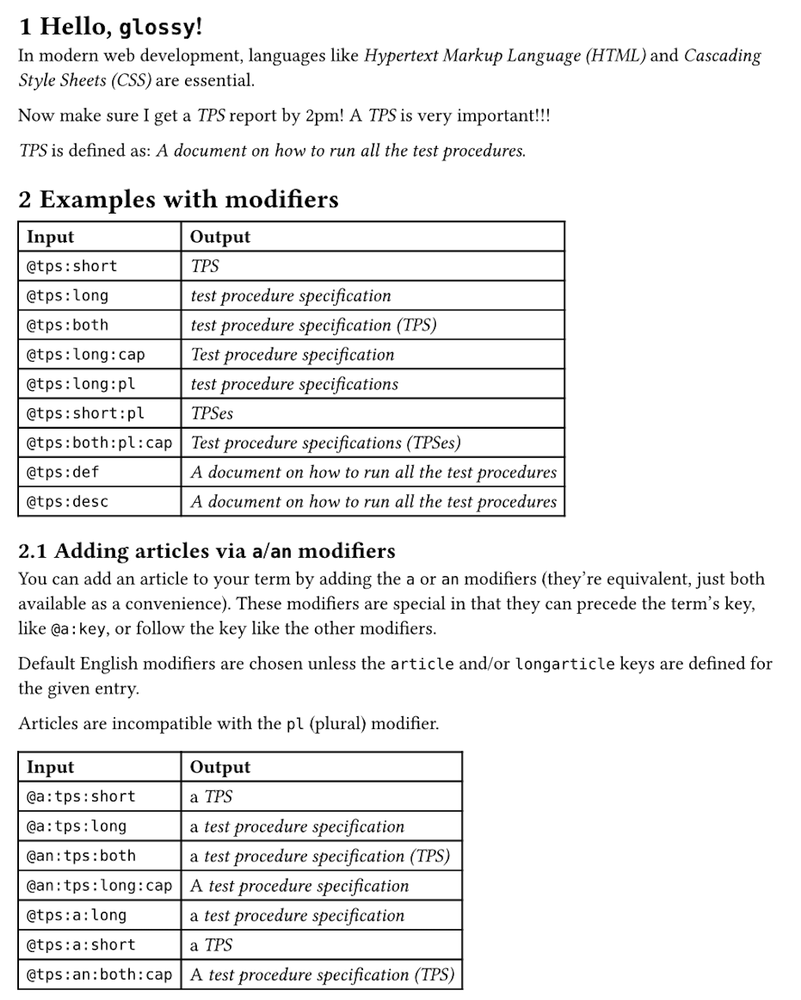
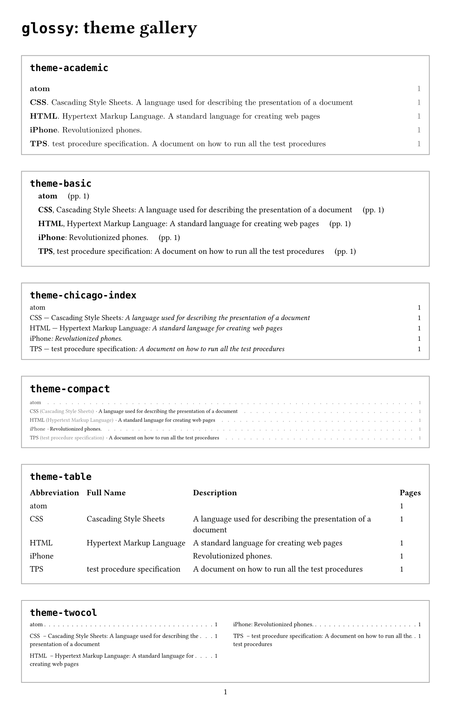

# Glossy

This package provides utilities to manage and render glossaries within
documents. It includes functions to define and use glossary terms, track their
usage, and generate a glossary list with references to where terms are used in
the document.



## Motivation

Glossy is heavily inspired by
[glossarium](https://typst.app/universe/package/glossarium), with a few key
different goals:

1. Provide a simple interface which allows for complete control over glossary
   display. To do this, `glossy`'s `#glossary()` function accepts a theme
   parameter. The goal here is to separate presentation and logic.
2. Simplify the user interface as much as possible. Glossy has exactly two
   exports, `init-glossary` and `glossary`.
3. Double-down on `glossy`'s excellent `@term` reference approach, completely
   eliminating the need to make any calls to `gls()` and friends.
4. Mimic established patterns and best practices. For example, `glossy`'s
   `#glossary()` function is intentionally similar (in naming and parameters) to
   `typst`'s built-in `#bibliography`, to the degree possible.
5. Simplify the implementation. The `glossy` code is significantly shorter and
   easier to understand.

## Features

- Define glossary terms with short and long forms, descriptions, and grouping
- Automatically tracks term usage in the document through `@labels`
- Supports modifiers to adjust how terms are displayed (capitalize, pluralize, etc.)
- Generates a formatted glossary section with backlinks to term occurrences
- Customizable themes for rendering glossary sections, groups, and entries
- Automatic pluralization of terms with custom override options
- Page number references back to term usage locations

## Usage

### Import the package

```typst
#import "@preview/glossy:0.4.1": *
```

### Defining Glossary Terms

Use the `init-glossary` function to initialize glossary entries:

```typst
#let myGlossary = (
    html: (
      short: "HTML",
      long: "Hypertext Markup Language",
      description: "A standard language for creating web pages",
      group: "Web"
    ),
    css: (
      short: "CSS",
      long: "Cascading Style Sheets",
      description: "A stylesheet language used for describing the presentation of a document",
      group: "Web"
    ),
    tps: (
      short: "TPS",
      long: "test procedure specification",
      description: "A formal document describing test steps and expected results",
      // Optional: Override automatic pluralization
      plural: "TPSes",
      longplural: "test procedure specifications"
    ),
    WWW: "World Wide Web", // concise entry with only short: long
)

#show: init-glossary.with(myGlossary)
```

Each glossary entry supports the following fields:

- `short` (required): Short form of the term
- `article` (optional): Article for use with the short form (i.e. "a", "an")
- `long` (optional): Long form of the term
- `longarticle` (optional): Article for use with the long form (i.e. "a", "an")
- `description` (optional): Term description (often a definition)
- `group` (optional): Category grouping
- `plural` (optional): Override automatic pluralization of short form
- `longplural` (optional): Override automatic pluralization of long form

Note that if you just want an entry with `short` and `long`, you can use the
abbreviated syntax. In this case, they `key` is used as the short form, and its
value is used as the long form. See `WWW` as an example below.

You can also load glossary entries from a data file using #yaml(), #json(), or similar.

For example, the above glossary could be in this YAML file:

```yaml
html:
  short: HTML
  article: an
  long: Hypertext Markup Language
  longarticle: a
  description: A standard language for creating web pages
  group: Web

css:
  short: CSS
  long: Cascading Style Sheets
  description: A stylesheet language used for describing the presentation of a document
  group: Web

tps:
  short: TPS
  long: test procedure specification
  description: A formal document describing test steps and expected results
  plural: TPSes
  longplural: test procedure specifications

WWW: World Wide Web
```

And then loaded during initialization as follows:

```typst
#show: init-glossary.with(yaml("glossary.yaml"))
```

### Using Glossary Terms

Reference glossary terms using Typst's `@reference` syntax:

```typst
In modern web development, languages like @html and @css are essential.
The @tps:pl need to be submitted by Friday.
```

Available modifiers:

- **cap**: Capitalizes the term
- **pl**: Uses the plural form
- **both**: Shows "Long Form (Short Form)"
- **short**: Shows only short form
- **long**: Shows only long form
- **def** or **desc**: Shows the description
- **a** or **an**: Include the article (`an` is just an alias of `a`, they're
  equivalent)

Modifiers can be combined with colons:

| **Input**           | **Output**                                                     |
| ------------------- | -------------------------------------------------------------- |
| `@tps` (first use)  | "test procedure specification (TPS)"                           |
| `@tps` (subsequent) | "TPS"                                                          |
| `@tps:short`        | "TPS"                                                          |
| `@tps:long`         | "test procedure specification"                                 |
| `@tps:both`         | "test procedure specification (TPS)"                           |
| `@tps:long:cap`     | "Test procedure specification"                                 |
| `@tps:long:pl`      | "test procedure specifications"                                |
| `@tps:short:pl`     | "TPSes"                                                        |
| `@tps:both:pl:cap`  | "Technical procedure specifications (TPSes)"                   |
| `@tps:def`          | "A formal document describing test steps and expected results" |

The `a`/`an` modifier is special because it can either precede or follow the
term's key.

For the English language, you don't need to define `article` and `longarticle`
in most cases. Glossy makes a decent attempt at computing those automatically.

For example:

| **Input**             | **Output**                                     |
| --------------------- | ---------------------------------------------- |
| `@a:tps`(first use)   | "a test procedure specification (TPS)"         |
| `@tps:an`(subsequent) | "a TPS"                                        |
| `@an:tps:long:cap`    | "A test procedure specification"               |
| `@tps:long:an`        | "a test procedure specifications"              |
| `@tps:a:both:cap`     | "A technical procedure specifications (TPSes)" |

Note that the `a`/`an` (article) modifier cannot be combined with the `pl`
(plural) modifier.

### Generating the Glossary

Display the glossary using the `glossary()` function:

```typst
#glossary(
  title: "Web Development Glossary", // Optional: defaults to Glossary
  theme: my-theme, // Optionaal: defaults to theme-twocol
  ignore-case: false, // Optional: ignore case when sorting terms
  groups: ("Web")  // Optional: Filter to specific groups
)
```

Note that if you want to display terms without a group, you specify that with an
empty string. For example, to show the empty group and then the _Web_ group:

```typst
#glossary(groups: ("", "Web"))
```

Or to just show the empty group (i.e. terms without a group):

```typst
#glossary(groups: (""))
```

### Customizing Term Display

Control how terms appear in the document by providing a custom `show-term` function:

```typst
#let emph-term(term-body) = { emph(term-body) }

#show: init-glossary.with(
  myGlossary,
  show-term: emph-term
)
```

### Glossary Themes

#### Included Themes

Glossy comes with several built-in themes that can be used directly or serve as
examples for custom themes:



#### Custom Themes

Customize glossary appearance by defining a theme with three functions:

```typst
#let my-theme = (
  // Main glossary section
  section: (title, body) => {
    heading(level: 1, title)
    body
  },

  // Group of related terms
  group: (name, index, total, body) => {
    // index = group index, total = total groups
    if name != "" and total > 1 {
      heading(level: 2, name)
    }
    body
  },

  // Individual glossary entry
  entry: (entry, index, total) => {
    // index = entry index, total = total entries in group
    let output = [#entry.short]
    if entry.long != none {
      output = [#output -- #entry.long]
    }
    if entry.description != none {
      output = [#output: #entry.description]
    }
    block(
      grid(
        columns: (auto, 1fr, auto),
        output,
        repeat([#h(0.25em) . #h(0.25em)]),
        entry.pages,
      )
    )
  }
)
```

Entry fields available to themes:

- `short`: Short form (always present)
- `long`: Long form (can be `none`)
- `description`: Term description (can be `none`)
- `label`: Term's dictionary label
- `pages`: Linked page numbers where term appears

## License

This project is licensed under the MIT License.
