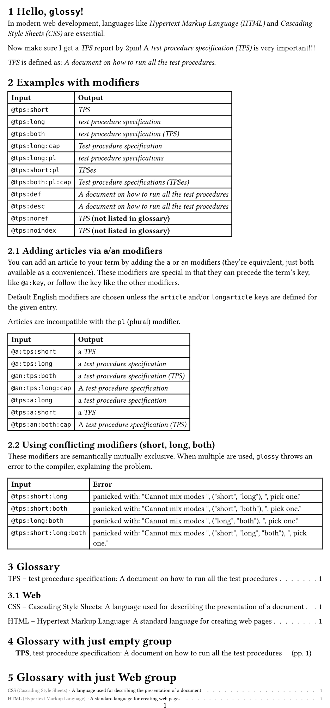
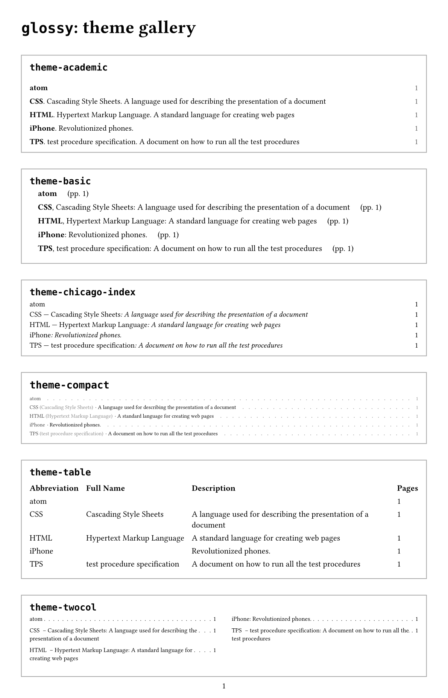

# Glossy

This package provides utilities to manage and render glossaries within
documents. It includes functions to define and use glossary terms, track their
usage, and generate a glossary list with references to where terms are used in
the document.



## Motivation

Glossy is heavily inspired by
[glossarium](https://typst.app/universe/package/glossarium), with a few key
different goals:

1. Provide a simple interface which allows for complete control over glossary
   display. To do this, `glossy`'s `#glossary()` function accepts a theme
   parameter. The goal here is to separate presentation and logic.
2. Simplify the user interface as much as possible. Glossy has exactly two
   exports, `init-glossary` and `glossary`.
3. Double-down on `glossy`'s excellent `@term` reference approach, completely
   eliminating the need to make any calls to `gls()` and friends.
4. Mimic established patterns and best practices. For example, `glossy`'s
   `#glossary()` function is intentionally similar (in naming and parameters) to
   `typst`'s built-in `#bibliography`, to the degree possible.
5. Simplify the implementation. The `glossy` code is significantly shorter and
   easier to understand.

## Features

- Define glossary terms with short and long forms, descriptions, and grouping
- Automatically tracks term usage in the document through `@labels`
- Supports modifiers to adjust how terms are displayed (capitalize, pluralize, etc.)
- Generates a formatted glossary section with backlinks to term occurrences
- Customizable themes for rendering glossary sections, groups, and entries
- Automatic pluralization of terms with custom override options
- Page number references back to term usage locations

## Usage

### Import the package

```typst
#import "@preview/glossy:0.9.0": *
```

### Defining Glossary Terms

Use the `init-glossary` function to initialize glossary entries:

```typst
#let myGlossary = (
    html: (
      short: "HTML",
      long: "Hypertext Markup Language",
      description: "A standard language for creating web pages",
      group: "Web"
    ),
    css: (
      short: "CSS",
      long: "Cascading Style Sheets",
      description: "A stylesheet language used for describing the presentation of a document",
      group: "Web"
    ),
    tps: (
      short: "TPS",
      long: "test procedure specification",
      description: "A formal document describing test steps and expected results",
      // Optional: Override automatic pluralization
      plural: "TPSes",
      longplural: "test procedure specifications"
    ),
    WWW: "World Wide Web", // concise entry with only short: long
)

#show: init-glossary.with(myGlossary)
```

Each glossary entry supports the following fields:

- `short` (required): Short form of the term
- `article` (optional): Article for use with the short form (i.e. "a", "an")
- `long` (optional): Long form of the term
- `longarticle` (optional): Article for use with the long form (i.e. "a", "an")
- `description` (optional): Term description (often a definition)
- `group` (optional): Category grouping
- `plural` (optional): Override automatic pluralization of short form
- `longplural` (optional): Override automatic pluralization of long form

Note that if you just want an entry with `short` and `long`, you can use the
abbreviated syntax. In this case, they `key` is used as the short form, and its
value is used as the long form. See `WWW` as an example below.

You can also load glossary entries from a data file using #yaml(), #json(), or similar.

For example, the above glossary could be in this YAML file:

```yaml
html:
  short: HTML
  article: an
  long: Hypertext Markup Language
  longarticle: a
  description: A standard language for creating web pages
  group: Web

css:
  short: CSS
  long: Cascading Style Sheets
  description: A stylesheet language used for describing the presentation of a document
  group: Web

tps:
  short: TPS
  long: test procedure specification
  description: A formal document describing test steps and expected results
  plural: TPSes
  longplural: test procedure specifications

WWW: World Wide Web
```

And then loaded during initialization as follows:

```typst
#show: init-glossary.with(yaml("glossary.yaml"))
```

`init-glossary()` supports the following parameters:

- `format-term` // Function deciding how to format a term, depending on
  the 'mode' (short, long, both). See example below.
- `show-term` // Function which can customize display of a term (see example below)
- `term-links: false` // True if you want terms to link to their glossary entry

### Using Glossary Terms

Reference glossary terms using Typst's `@reference` syntax:

```typst
In modern web development, languages like @html and @css are essential.
The @tps:pl need to be submitted by Friday.
```

Available *modes* (they determine which information is printed and are
mutually exclusive):

- auto: (Default) Shows the form depending on the previous usage.
  The mode when no other mode is appended with a colon.
- **both**: Shows "Long Form (Short Form)"
- **short**: Shows only short form
- **long**: Shows only long form
- **def** or **desc**: Shows the description
- See [the reference](#reference-for-using-glossary-terms)
  for a complete overview.

Available *modifiers* (they modify how this information is printed):

- **cap**: Capitalizes the term
- **pl**: Uses the plural form
- **noref** or **noindex**: Don't show the term in the glossary.
- **a** or **an**: Include the article (`an` is just an alias of `a`, they're
  equivalent)

Modes and modifiers can be combined with colons:

| **Input**           | **Output**                                                     |
| ------------------- | -------------------------------------------------------------- |
| `@tps` (first use)  | "test procedure specification (TPS)"                           |
| `@tps` (subsequent) | "TPS"                                                          |
| `@tps:short`        | "TPS"                                                          |
| `@tps:long`         | "test procedure specification"                                 |
| `@tps:both`         | "test procedure specification (TPS)"                           |
| `@tps:long:cap`     | "Test procedure specification"                                 |
| `@tps:long:pl`      | "test procedure specifications"                                |
| `@tps:short:pl`     | "TPSes"                                                        |
| `@tps:both:pl:cap`  | "Technical procedure specifications (TPSes)"                   |
| `@tps:def`          | "A formal document describing test steps and expected results" |
| `@tps:desc`         | _same as above, `desc` is an alias for `def`_                  |
| `@tps:noref`        | _works as normal, just won't show up in glossary_              |
| `@tps:noindex`      | _same as above, `noindex` is an alias for `noref`_             |

The `a`/`an` modifier is special because it can either precede or follow the
term's key.

For the English language, you don't need to define `article` and `longarticle`
in most cases. Glossy makes a decent attempt at computing those automatically.

For example:

| **Input**             | **Output**                                     |
| --------------------- | ---------------------------------------------- |
| `@a:tps`(first use)   | "a test procedure specification (TPS)"         |
| `@tps:an`(subsequent) | "a TPS"                                        |
| `@an:tps:long:cap`    | "A test procedure specification"               |
| `@tps:long:an`        | "a test procedure specifications"              |
| `@tps:a:both:cap`     | "A technical procedure specifications (TPSes)" |

Note that the `a`/`an` (article) modifier cannot be combined with the `pl`
(plural) modifier.

### Overriding Term Text

There may be cases where you want to completely control what `glossy` displays
when you reference a term. For example, imagine you want to reference `@tps`
which would normally render as something like "test procedure specification."
But for some reason you want it to actually say "an annoying report." You can do
that like this:

| **Input**                  | **Output**           |
| -------------------------- | -------------------- |
| `@tps[an annoying report]` | "an annoying report" |
| `@tps[]`                   | #none                |

In case you want to reference a term from the Glossary/Index, but don't
want to display it for whatever reason, the second form can be used.

### First use logic

The 'mode' of a glossary term determines which information is printed about this
term. When using a plain `@term`, possibly with some modifiers, the `auto` mode
is selected. This mode displays the form depending on the usage counter. On the
first use (`usage counter == 0`), 'both' forms are printed. On subsequent usage
(`usage counter > 0`) the 'short' form is printed.

Not all occurrences of a term are counted towards its usage, this depends on
the mode of the term. Furthermore, this can be manually controlled by modifiers.
Both are documented in the [reference tables](#reference-for-using-glossary-terms).

This control over the usage counter is practical, for example, when you want to
use a term in a heading or a caption.
In that case, your term might end up in an `outline()` at the top of
your document. Normally you don't want that to count as a term's first real use.
Normally you want that to happen in the body of your document. So, by using
the appropriate mode and modifiers in such situations, you can not only specify
exactly how you want your term to appear, but also control whether it counts
as a "first use".

### Reference for Using Glossary Terms

A reference about
- the different 'modes' and how they determine which information is printed about a term
- the impact of modes on the [usage counter and ensuing first use behaviour](#first-use-logic)
- how modifiers can change the behaviour with respect to the usage counter
- how modifiers impact the presentation of the information printed

A glossary term can display different types of information, which is determined
by the 'mode' in which it is printed. These modes are all mutually exclusive.

| Mode          | Utilization         | Default first use behaviour | Description |
| ------------- | ------------------- | --------------------------- | ----------- |
| `auto`        | `@term`             | use       | The default mode when no 'mode' modifier or supplement is specified. The form depends on the first use counter. |
| `both`        | `:both`             | use       | Shows both forms of the term, by default ([see `format-term`](#customizing-term-display)) like "Long Form (Short Form)". Falls back to short when long form not available. |
| `short`       | `:short`            | no-use    | Shows only short form.        |
| `long`        | `:long`             | no-use    | Shows only long form. Falls back to short when long form not available. |
| `description` | `:def` <br> `:desc` | no-use    | Shows the description (None of the modifiers apply here & no link is created towards the glossary). |
| `supplement`  | `[content]`         | no-use    | Shows the content given by [the supplement](#overriding-term-text). |
| `reset`       | `:reset`            | reset usage counter to 0 | Don't output any content & don't link to the glossary. Typical usage would be after an abstract or even before the start of each chapter, maybe in an injected rule. (This could be made a modifier like `:use` or `:nouse`, but would mostly be utilized as `@term:reset:noindex[]` anyways, thus this is a mode. Write `@term@term:reset` to utilize it as a modifier.) |

Minor modifications to how these different types of information are printed,
linked or counted towards the usage counter, are controlled by the 'modifiers'.
They do not influence the default first use behaviour of the mode (unless
explicitely created for this purpose). Moreover, they neatly compose together
and with most modes (some exceptions exists, but will print a clear error -
report a bug if not).

| Modifier                       | Description                                                            |
| ------------------------------ | ---------------------------------------------------------------------- |
| `:cap`                         | Capitalizes the term                                                   |
| `:pl`                          | Uses the plural form                                                   |
| `:noref` <br> `:noindex`       | Don't show the term in the glossary (i.e. no page will be linked - a link from the term towards the glossary is always provided.). |
| `:a`<br>`a:`<br>`:an`<br>`an:` | Include the article (`an` is just an alias of `a`, they're equivalent) |
| `:use` <br> `:spend`           | After this occurrence, the term is 'used', i.e. the usage counter is increased by 1. Write `@term:use:noindex[]` to uniquely control the usage counter without output. |
| `:nouse` <br> `:nospend`       | After this occurrence, the usage counter remains exactly as the same as before. As if the term is transparent with respect to the usage counter. |

### Generating the Glossary

Display the glossary using the `glossary()` function:

```typst
#glossary(
  title: "Web Development Glossary", // Optional: defaults to Glossary theme:
  theme: my-theme, // Optional: defaults to theme-academic
  sort: true, // Optional: whether or not to sort the glossary
  ignore-case: false, // Optional: ignore case when sorting terms
  groups: ("Web"),  // Optional: Filter to specific groups
  show-all: false, // Optional; Show all terms even if unreferenced
)
```

Note that if you want to display terms without a group, you specify that with an
empty string. For example, to show the empty group and then the _Web_ group:

```typst
#glossary(groups: ("", "Web"))
```

Or to just show the empty group (i.e. terms without a group):

```typst
#glossary(groups: (""))
```

### Customizing Term Display

Control how terms are styled in the document by providing a custom `show-term` function:

```typst
#let emph-term(term-body) = { emph(term-body) }

#show: init-glossary.with(
  myGlossary,
  show-term: emph-term
)
```

Terms can be formatted depending on the 'mode' by providing a custom
`format-term` function. The mode is one of ("short", "long", "both").

```typst
// When displaying both, reverse the display order by showing
// "short (long)" instead of the normal "long (short)"
#let short-long-term(mode, short-form, long-form) = {
    if mode == "short" { short-form }
    else if mode == "long" { long-form }
    else { // mode assumed to be "both"
      short-form + " (" + long-form + ")"
    }
}

#show: init-glossary.with(
  myGlossary,
  format-term: short-long-term
)
```

### Glossary Themes

#### Included Themes

Glossy comes with several built-in themes that can be used directly or serve as
examples for custom themes:



#### Custom Themes

Customize glossary appearance by defining a theme with three functions:

```typst
#let my-theme = (
  // Main glossary section
  section: (title, body) => {
    heading(level: 1, title)
    body
  },

  // Group of related terms
  group: (name, index, total, body) => {
    // index = group index, total = total groups
    if name != "" and total > 1 {
      heading(level: 2, name)
    }
    body
  },

  // Individual glossary entry
  entry: (entry, index, total) => {
    // index = entry index, total = total entries in group
    let output = [#entry.short#entry.label] // **NOTE:** Label here!
    if entry.long != none {
      output = [#output -- #entry.long]
    }
    if entry.description != none {
      output = [#output: #entry.description]
    }
    block(
      grid(
        columns: (auto, 1fr, auto),
        output,
        repeat([#h(0.25em) . #h(0.25em)]),
        entry.pages.join(", "),
      )
    )
  }
)
```

Entry fields available to themes:

- `short`: Short form (always present)
- `long`: Long form (can be `none`)
- `description`: Term description (can be `none`)
- `label`: Term's dictionary label
- `pages`: Array of linked page numbers where term appears

**NOTE:** If the theme does not emit `entry.label`, linking from terms to their
glossary entry will not work.

## License

This project is licensed under the MIT License.

## Changelog

### v0.9.0
- **Breaking**: In themes, entry.pages now returns an array of linked
  page numbers, instead of opaque content. Use `#entry.pages.join(", ")`
  in your custom theme to keep the previous behaviour.
- **Breaking**: The `both` mode (previously called modifier) by default
  now counts towards the first use of a term.
- **Breaking**: When multiple conflicting modes are supplied (like 'short'
  and 'long'), glossy now throws an error (with a clear message).
- **Breaking**: When an unrecognized modifier is supplied with the term,
  glossy will now panic instead of ignoring the modifier.
