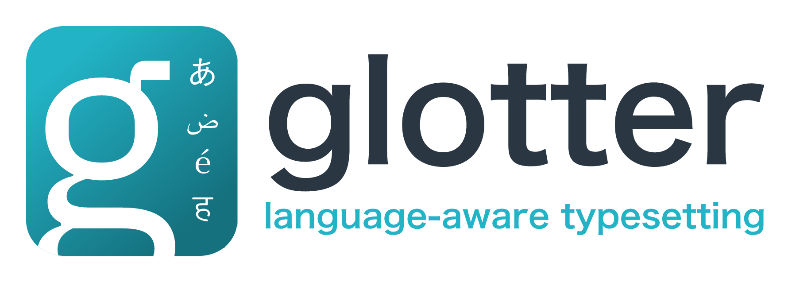
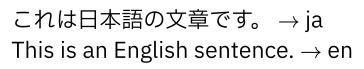
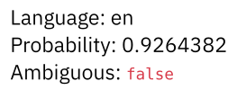
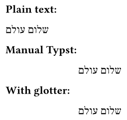
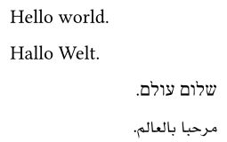
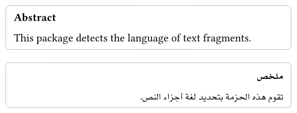
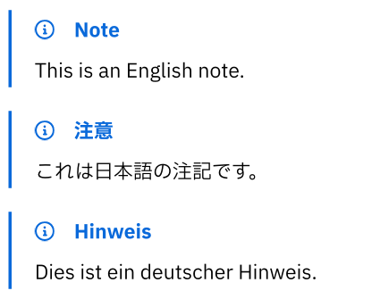

# 

**glotter** is a Typst package for detecting the language of text fragments and applying language-aware settings to content.

The Typst plugin is compiled to WebAssembly using [`fasttext-pure-rs`](https://crates.io/crates/fasttext-pure-rs), a pure Rust implementation of fastText.

## Usage

```typst
#import "@preview/glotter:0.1.0": *

#let samples = (
  ja: "これは日本語の文章です。",
  en: "This is an English sentence.",
)

#let print-lang(text) = [
  #text $arrow$ #lang(text) \
]

#print-lang(samples.ja)
#print-lang(samples.en)
```



To retrieve detailed prediction metadata, use `detect-info`:

```typst
#let info = detect-info(
  samples.en,
  k: 3,
  min-margin: 0.12,
)

#let print-info(info) = [
  Language: #info.at("lang") \
  Probability: #info.at("probability") \
  Ambiguous: #info.at("ambiguous")
]

#print-info(info)
```



To apply the detected language automatically to content:

Typst can apply language-specific text settings when the language is known, but the language must normally be specified manually. `auto-text` detects the language of a fragment and applies the corresponding `text(lang: ...)` setting automatically.

```typst
#let sample = "שלום עולם"

*Plain text:*

#sample

*Manual Typst:*

#text(lang: "he")[#sample]

*With glotter:*

#auto-text[#sample]
```



For document-wide use, `auto-par` can be installed as a paragraph show rule.
Each paragraph is detected independently, so mixed-language documents can be written without wrapping every paragraph in `text(lang: ...)`.

```typst
#show par: it => auto-par(it, fallback: "en")

Hello world.

Hallo Welt.

שלום עולם.

مرحبا بالعالم.
```



## Applications

`glotter` is designed not only for direct use, but also as a building block for downstream Typst packages, templates, and document-processing workflows.

Typst already supports language-aware text through `text(lang: ...)`.
`glotter` provides the missing step: detecting which language to apply to a given text fragment.

### Multilingual templates

Templates can use `glotter` to accept multilingual content without requiring users to annotate every fragment manually.

```typst
#let localized-abstract(body) = {
  let info = detect-info(body, fallback: "en")
  let l = info.at("lang")
  let rtl-lang = ("ar", "fa", "he", "ur").contains(l)

  let title = if l == "ja" {
    "概要"
  } else if l == "ar" {
    "ملخص"
  } else if l == "de" {
    "Zusammenfassung"
  } else if l == "fr" {
    "Résumé"
  } else {
    "Abstract"
  }

  block(
    width: 10cm,
    inset: 8pt,
    stroke: 0.5pt + luma(180),
    radius: 4pt,
  )[
    #set text(lang: l, dir: if rtl-lang { rtl } else { ltr })
    #set align(if rtl-lang { right } else { left })

    #strong[#title] \
    #auto-text(fallback: "en")[#body]
  ]
}

#localized-abstract[This package detects the language of text fragments.]

#localized-abstract[تقوم هذه الحزمة بتحديد لغة أجزاء النص.]
```



### Language-dependent rendering

Downstream packages can use `detect-info` to branch on the detected language.

```typst
#import "@preview/note-me:0.6.0": *

#let localized-note(body) = {
  let info = detect-info(body, fallback: "en")
  let l = info.at("lang")

  let title = if l == "ja" {
    "注意"
  } else if l == "de" {
    "Hinweis"
  } else if l == "fr" {
    "Remarque"
  } else {
    "Note"
  }

  note(title: title)[
    #auto-text(fallback: "en")[#body]
  ]
}

#localized-note[This is an English note.]

#localized-note[これは日本語の注記です。]

#localized-note[Dies ist ein deutscher Hinweis.]
```



## API

- `detect(input, k: 1, threshold: 0.0)`: returns raw predictions as dictionaries with `lang`, `label`, and `probability`.
- `detect-info(input, k: 3, threshold: 0.0, min-margin: 0.12, fallback: "und")`: returns a dictionary containing the final language, top prediction, all predictions, probability margin, ambiguity flag, fallback value, and normalized input.
- `lang(input, ...)`: returns a language code.
- `is-lang(input, expected, ...)`: checks whether the detected language matches a given string or any string in an array.
- `is-cjk(input, ...)`, `is-rtl(input, ...)`, `is-latin(input, ...)`: convenience script-family checks.
- `auto-text(body, fallback: "en", debug: false, ...)`: detects the language of `body` and wraps it in `text(lang: detected-language)`; any additional named arguments are forwarded to `text(...)`.
- `auto-par(it, fallback: "en")`: detects a paragraph and applies the detected language; intended for use with `#show par`.
- `debug-info(info)`: renders a compact diagnostic label for a `detect-info` result.
- `supported-languages`: array of the 176 language codes supported by the embedded fastText language identification model.
- `supported-language-count`: number of language codes supported by the embedded fastText language identification model.
- `is-supported-language(language)`: checks whether a language code or fastText label is supported.

The embedded model expects UTF-8 text.

## fastText Model Provenance

`glotter.wasm` embeds data from the fastText language identification model `lid.176.ftz`, the compressed variant of fastText's 176-language identification model.

Official source: [https://fasttext.cc/docs/en/language-identification.html](https://fasttext.cc/docs/en/language-identification.html)

The official fastText documentation states that the language identification models were trained on data from Wikipedia, Tatoeba, and SETimes, and are distributed under CC-BY-SA-3.0.

## License

`glotter` is distributed under `MIT AND CC-BY-SA-3.0`.

This package does not include the standalone fastText model file `lid.176.ftz`.
However, this package includes `glotter.wasm`, which embeds model data from `lid.176.ftz`. For that reason, the package contains material under both:

- MIT License for the Typst package and plugin code.
- Creative Commons Attribution-ShareAlike 3.0 Unported for the embedded fastText model data.

The package code is MIT licensed. The embedded fastText model data in `glotter.wasm` is licensed under CC-BY-SA-3.0. See [`NOTICE.md`](NOTICE.md) for attribution, checksums, modification status, and redistribution notes. License texts are provided in [`LICENSE-MIT`](LICENSE-MIT) and [`LICENSE-CC-BY-SA-3.0`](LICENSE-CC-BY-SA-3.0).