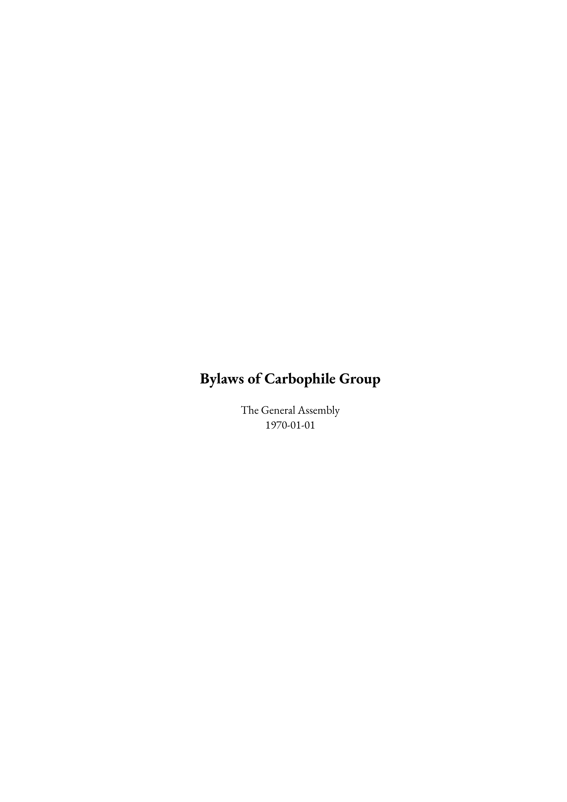
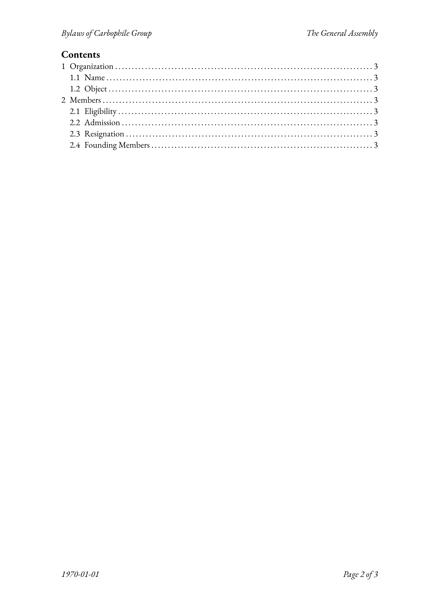
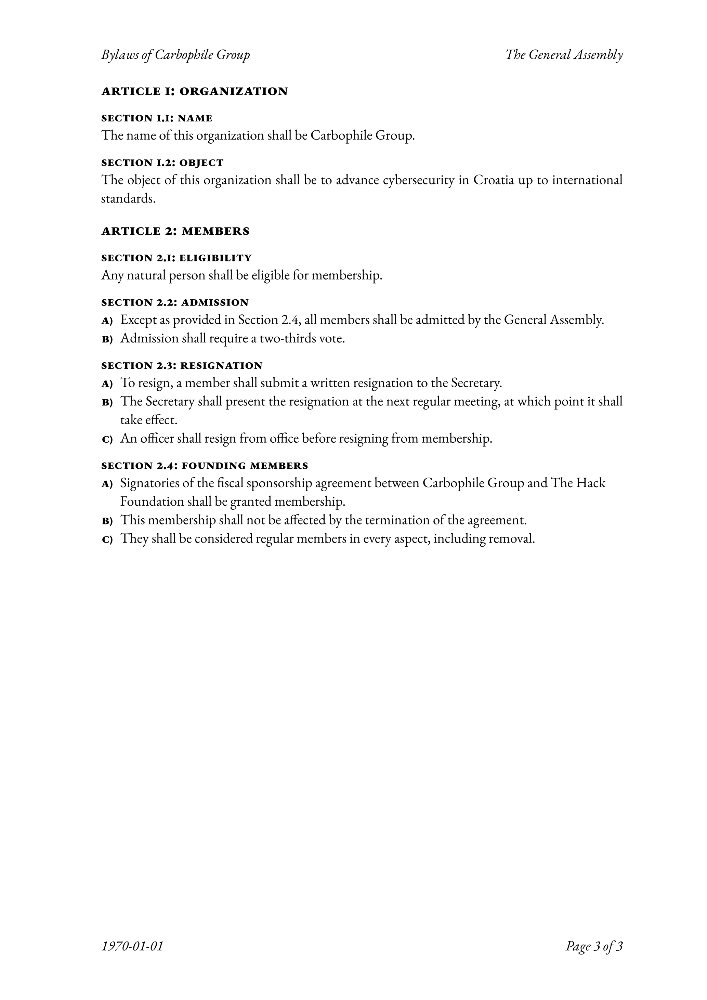

# govern

A clean, traditional [Typst](https://typst.app/) template for formal governance documents, bylaws, and articles.

<div align="center">
    
    
    
</div>

Originally made for my work at [Carbophile Group](https://carbophile.org/) due to a lack of governance templates in
English.

I decided to make it public so all kinds of organizations can benefit.

## Example

```typst
#import "@preview/govern:0.2.1": govern

#set document(
  title: "Bylaws of Carbophile Group",
  author: "The General Assembly",
  date: datetime(year: 1970, month: 1, day: 1),
)

#show: govern.with(draft: false)

= Organization

== Name

The name of this organization shall be Carbophile Group.

== Object

The object of this organization shall be to advance cybersecurity in Croatia up to international standards.

= Members

== Eligibility

Any natural person shall be eligible for membership.

== Admission

+ Except as provided in @founding, all members shall be admitted by the General Assembly.
+ Admission shall require a two-thirds vote.

== Resignation

+ To resign, a member shall submit a written resignation to the Secretary.
+ The Secretary shall present the resignation at the next regular meeting, at which point it shall take effect.
+ An officer shall resign from office before resigning from membership.

== Founding Members <founding>

+ Signatories of the fiscal sponsorship agreement between Carbophile Group and The Hack Foundation shall be granted membership.
+ This membership shall not be affected by the termination of the agreement.
+ They shall be considered regular members in every aspect, including removal.
```

## Usage

Native Typst parameters `document.title`, `document.author`, and `document.date` must be set before initializing the
template.

`document.date` must not be left at the default `auto` and can instead be set to `datetime.today()` to replicate the
default behavior.

### Options Reference

| Option | Value   | Default | Description                                     |
|--------|---------|---------|-------------------------------------------------|
| draft  | Boolean | false   | Places a "DRAFT" watermark[^1] over every page. |

[^1]: Watermarks aren't visible to screen readers. For accessibility, I recommend you also append `[DRAFT]` to the title
so it reads `Title [DRAFT]`.
