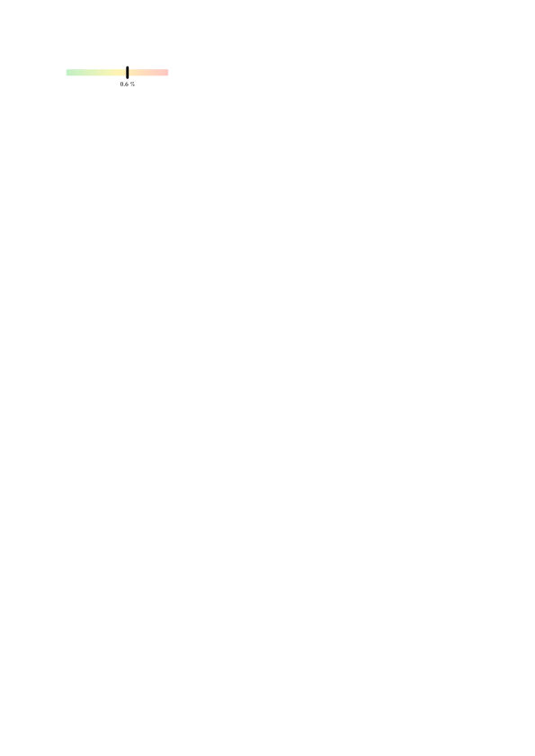

# `gradslide`

Simple component to show a value between 0 and 1 on a nice, customizable gradient slider.
Here is an example:

```typ
#import "@preview/gradslide:0.1.0": *

#slider(0.6,
  bar-height: 0.25cm,
  bar-width: 4cm,
  bar-gradient-colors: (green.lighten(70%), yellow.lighten(70%), red.lighten(70%)),
  bar-radius: 1pt,
  indicator-height: 0.5cm,
  indicator-width: 0.1cm,
  indicator-color: black,
  indicator-radius: 100%,
  label-size: 8pt,
  label-color: black,
  label-unit: "%",
  outer-padding: 0.1cm,
  space-between-indicator-and-label: 0.1cm,
)
```


