# Grape Suite

The grape suite is a suite consisting of following templates:

- exercises (for exams, homework, etc.)

  - essays and protocols

- seminar papers

- slides (using polylux)

## Exercises

Usable as an exercise sheet:

<table>
    <tr>
        <td>
            <a href="examples/homework01.typ">
                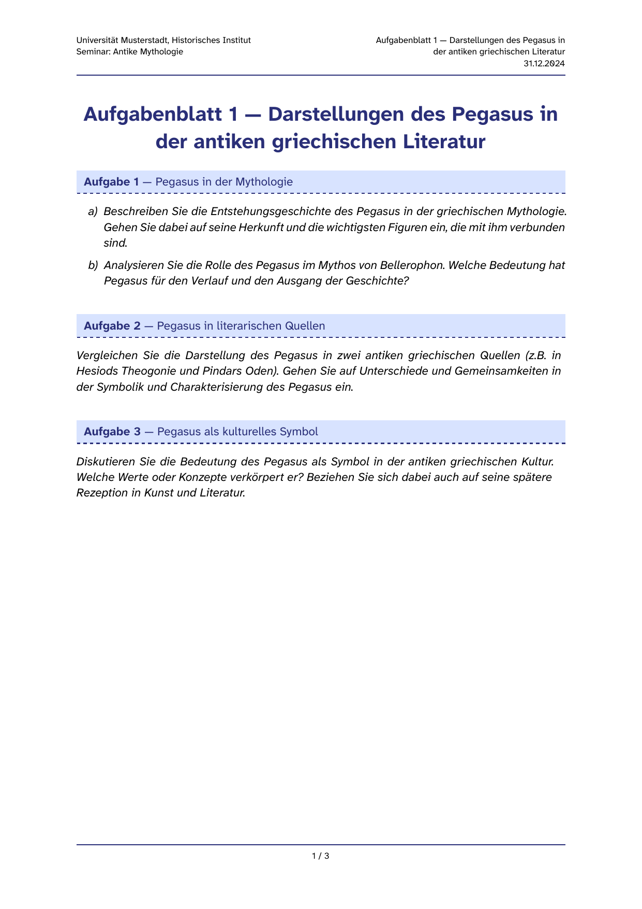
            </a>
        </td>
        <td>
            <a href="examples/homework01.typ">
                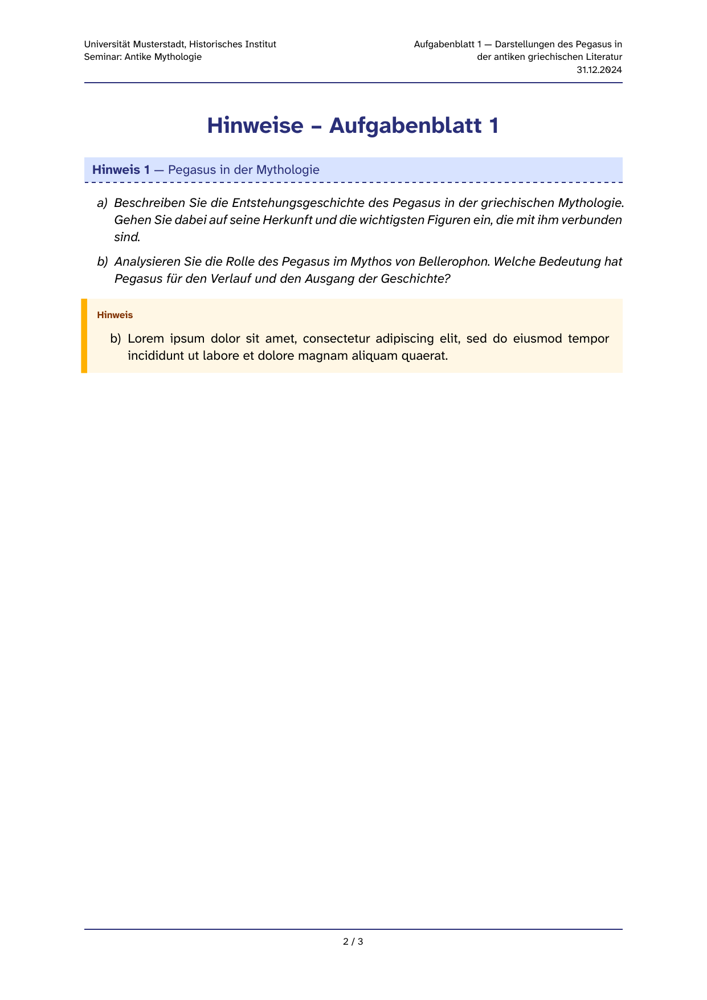
            </a>
        </td>
        <td>
            <a href="examples/homework01.typ">
                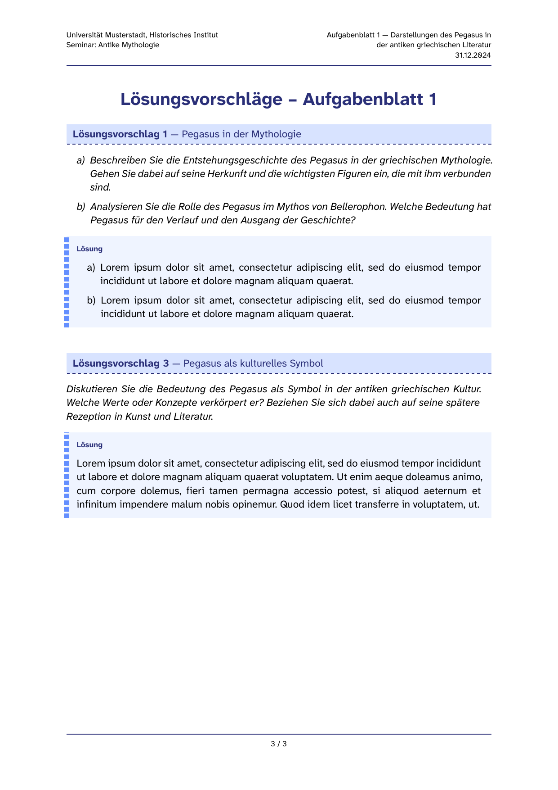
            </a>
        </td>
    </tr>
    <tr>
        <td>Tasks</td>
        <td>Hints</td>
        <td>Solutions</td>
    </tr>
</table>

For protocols and essays see [subtypes module](#subtypes).

### Setup

```typ
#import "@preview/grape-suite:2.1.0": exercise
#import exercise: project, task, subtask

#show: project.with(
    title: "Lorem ipsum dolor sit",

    university: [University],
    institute: [Institute],
    seminar: [Seminar],

    abstract: lorem(100),
    show-outline: true,

    author: "John Doe",

    show-solutions: false
)
```

### Documentation

| `project`                                |                                                                                                                                                                                                                                                                                            |
| :--------------------------------------- | :----------------------------------------------------------------------------------------------------------------------------------------------------------------------------------------------------------------------------------------------------------------------------------------- |
| `no`                                     | optional, number, default: `none`, number of the sheet in the series                                                                                                                                                                                                                       |
| `type`                                   | optional, content, default: `[Exam]`, type of the series, eg. exam, homework, protocol, ...                                                                                                                                                                                                |
| `title`                                  | optional, content, default: `none`, title of the document: if none, then generated from no, type and suffix-title                                                                                                                                                                          |
| `suffix-title`                           | optional, content, default: `none`, used if title is none to generate the title of the document                                                                                                                                                                                            |
| `show-outline`                           | optional, bool, default: `false`, show outline after title iff true                                                                                                                                                                                                                        |
| `abstract`                               | optional, content, default: `none`, show abstract between outline and title                                                                                                                                                                                                                |
| `document-title`                         | optional, content, default: `none`, shown in the upper right corner of the page header: if none, `title` is used                                                                                                                                                                           |
| `show-hints`                             | optional, bool, default: `false`, generate hints from tasks iff true                                                                                                                                                                                                                       |
| `show-solutions`                         | optional, bool, default: `false`, generate solutions from tasks iff true                                                                                                                                                                                                                   |
| `show-namefield`                         | optional, bool, default: `false`, show namefield at the end of the left header iff true                                                                                                                                                                                                    |
| `namefield`                              | optional, content, default: `[Name:]`, content shown iff `show-namefield`                                                                                                                                                                                                                  |
| `show-timefield`                         | optional, bool, default: `false`, show timefield at the end of right header iff true                                                                                                                                                                                                       |
| `timefield`                              | optional, function, default: `(time) => [Time: #time min.]`, to generate the content shown as the timefield iff `show-timefield` is true                                                                                                                                                   |
| `max-time`                               | optional, number, default: `0`, time value used in the `timefield` function generator                                                                                                                                                                                                      |
| `show-lines`                             | optional, bool, default: `false`, draw automatic lines for each task, if `lines` parameter of `task` is set                                                                                                                                                                                |
| `show-point-distribution-in-tasks`       | optional, bool, default: `false`, show point distribution after tasks iff true                                                                                                                                                                                                             |
| `show-point-distribution-in-solutions`   | optional, bool, default: `false`, show point distributions after solutions iff true                                                                                                                                                                                                        |
| `solutions-as-matrix`                    | optional, bool, default: `false`, show solutions as a matrix iff true, **mind that**: now the solution parameter of task expects a list of 2-tuples, where the first element of the 2-tuple is the amount of points, a number and the second element is content, how to achieve all points |
| `university`                             | optional, content, default: `none`                                                                                                                                                                                                                                                         |
| `faculty`                                | optional, content, default: `none`                                                                                                                                                                                                                                                         |
| `institute`                              | optional, content, default: `none`                                                                                                                                                                                                                                                         |
| `seminar`                                | optional, content, default: `none`                                                                                                                                                                                                                                                         |
| `semester`                               | optional, content, default: `none`                                                                                                                                                                                                                                                         |
| `docent`                                 | optional, content, default: `none`                                                                                                                                                                                                                                                         |
| `author`                                 | optional, content, default: `none`                                                                                                                                                                                                                                                         |
| `date`                                   | optional, datetime or content, default: `datetime.today()`                                                                                                                                                                                                                                 |
| `date-format`                            | optional, function, default: `(date) => if type(date) == type(datetime.today()) { date.display("[day].[month].[year]") } else { date }`                                                                                                                                                    |
| `header-gutter`                          | optional, length, default: `20%`, overwrite header gutter                                                                                                                                                                                                                                  |
| `header`                                 | optional, content, default: `none`, overwrite page header                                                                                                                                                                                                                                  |
| `header-right`                           | optional, content, default: `none`, overwrite right header part                                                                                                                                                                                                                            |
| `header-middle`                          | optional, content, default: `none`, overwrite middle header part                                                                                                                                                                                                                           |
| `header-left`                            | optional, content, default: `none`, overwrite left header part                                                                                                                                                                                                                             |
| `show-header-line`                       | optional, bool, default: `true`, show purple line in header                                                                                                                                                                                                                                |
| `footer`                                 | optional, content, default: `none`, overwrite footer part                                                                                                                                                                                                                                  |
| `footer-right`                           | optional, content, default: `none`, overwrite right footer part                                                                                                                                                                                                                            |
| `footer-middle`                          | optional, content, default: `none`, overwrite middle footer part                                                                                                                                                                                                                           |
| `footer-left`                            | optional, content, default: `none`, overwrite left footer part                                                                                                                                                                                                                             |
| `show-footer-line`                       | optional, bool, default: `true`, show purple line in footer                                                                                                                                                                                                                                |
| `task-type`                              | optional, content, default: `[Task]`, content shown in task title box before numbering                                                                                                                                                                                                     |
| `extra-task-type`                        | optional, content, default: `[Extra task]`, for tasks where the `extra` parameter is true, content shown in title box before numbering                                                                                                                                                     |
| `box-task-title`                         | optional, content, default: `[Task]`, shown as the title of a task box used by the `slides` library                                                                                                                                                                                        |
| `box-hint-title`                         | optional, content, default: `[Hint]`, shown as the title of a tasks colored hint box                                                                                                                                                                                                       |
| `box-solution-title`                     | optional, content, default: `[Solution]`, shown as the title of a tasks colored solution box                                                                                                                                                                                               |
| `box-definition-title`                   | optional, content, default: `[Definition]`, shown as the title of a definition box used by the `slides` library                                                                                                                                                                            |
| `box-notice-title`                       | optional, content, default: `[Notice]`, shown as the title of a notice box used by the `slides` library                                                                                                                                                                                    |
| `box-example-title`                      | optional, content, default: `[Example]`, shown as the title of a example box used by the `slides` library                                                                                                                                                                                  |
| `hint-type`                              | optional, content, default: `[Hint]`, title of a tasks hint version                                                                                                                                                                                                                        |
| `hints-title`                            | optional, content, default: `[Hints]`, title of the hints section                                                                                                                                                                                                                          |
| `solution-type`                          | optional, content, default: `[Suggested solution]`, title of a tasks solution version                                                                                                                                                                                                      |
| `solutions-title`                        | optional, content, default: `[Suggested solutions]`, title of the solutions section                                                                                                                                                                                                        |
| `solution-matrix-task-header`            | optional, content, default: `[Tasks]`, first column header of solution matrix, column contains the reasons on how to achieve the points                                                                                                                                                    |
| `solution-matrix-achieved-points-header` | optional, content, default: `[Points achieved]`, second column header of solution matrix, column contains the points the one achieved                                                                                                                                                      |
| `show-solution-matrix-comment-field`     | optional, bool, default: `false`, show comment field in solution matrix                                                                                                                                                                                                                    |
| `solution-matrix-comment-field-value`    | optional, content, default: `[*Note:* #v(0.5cm)]`, value of solution matrix comment fields                                                                                                                                                                                                 |
| `distribution-header-point-value`        | optional, content, default: `[Point]`, first row of point distribution, used to indicate the points needed to get a specific grade                                                                                                                                                         |
| `distribution-header-point-grade`        | optional, content, default: `[Grade]`, second row of point distribution                                                                                                                                                                                                                    |
| `message`                                | optional, function, default: `(points-sum, extrapoints-sum) => [In sum #points-sum + #extrapoints-sum P. are achievable. You achieved #box(line(stroke: purple, length: 1cm)) out of #points-sum points.]`, used to generate the message part above the point distribution                 |
| `grade-scale`                            | optional, array, default: `(([excellent], 0.9), ([very good], 0.8), ([good], 0.7), ([pass], 0.6), ([fail], 0.49))`, list of grades and percentage of points to reach that grade                                                                                                            |
| `page-margins`                           | optional, margins, default: `none`, overwrite page margins                                                                                                                                                                                                                                 |
| `text-font`                              | optional, content, default: `("Atkinson Hyperlegible Next", "Atkinson Hyperlegible", "Libertinus Serif")`, overwrite font family for text content                                                                                                                                          |
| `math-font`                              | optional, content, default: `("STIX Two Math", "New Computer Modern Math")`, overwrite font family for math equations                                                                                                                                                                      |
| `fontsize`                               | optional, size, default: `11pt`, overwrite font size                                                                                                                                                                                                                                       |
| `show-todolist`                          | optional, bool, default: `true`, show list of usages of the `todo` function after the outline                                                                                                                                                                                              |
| `body`                                   | content, document content                                                                                                                                                                                                                                                                  |

`task` creates a task element in an exercise project.

| `task`             |                                                                                                                                             |
| :----------------- | :------------------------------------------------------------------------------------------------------------------------------------------ |
| `lines`            | optional, number, default: `0`, number of lines to draw if `show-lines` in exercise's `project` is set to `true`                            |
| `points`           | optional, number, default: `0`, number of points achievable                                                                                 |
| `extra`            | optional, bool, default: `false`, determines if the task is obligatory (`false`) or additional (`true`)                                     |
| `numbering-format` | optional, function, default: `none`,                                                                                                        |
| `title`            | content, title of the task                                                                                                                  |
| `instruction`      | content, instruction of the task, highlighted                                                                                               |
| `..args`           | 1: content, task body; 2: content, task solution, not highlighted (see `solution-as-matrix` of exercise's `project`), 3: content, task hint |

`subtask` creates a part of a task. Its points are added to the parent task. **_Subtasks are to be use inside of the task's body or inside of another subtask's body._**

| `subtask`     |                                                                                                                                         |
| :------------ | :-------------------------------------------------------------------------------------------------------------------------------------- |
| `points`      | optional, number, default: `0`, points achievable, adds to a tasks point                                                                |
| `tight`       | optional, bool, default: `false`, enum style                                                                                            |
| `markers`     | optional, array, default: `("1.", "a)")`, numbering format for each level, fallback is `i.`                                             |
| `show-points` | optional, bool, default: `true`, show points next to subtask's body iff `true`                                                          |
| `counter`     | optional, counter, default: `none`, change number styled by the numbering format; if `none`, each level has an incremental auto counter |
| `content`     | content, subtask body                                                                                                                   |

## Seminar paper

<table>
    <tr>
        <td>
            <a href="examples/seminar-paper01.typ">
                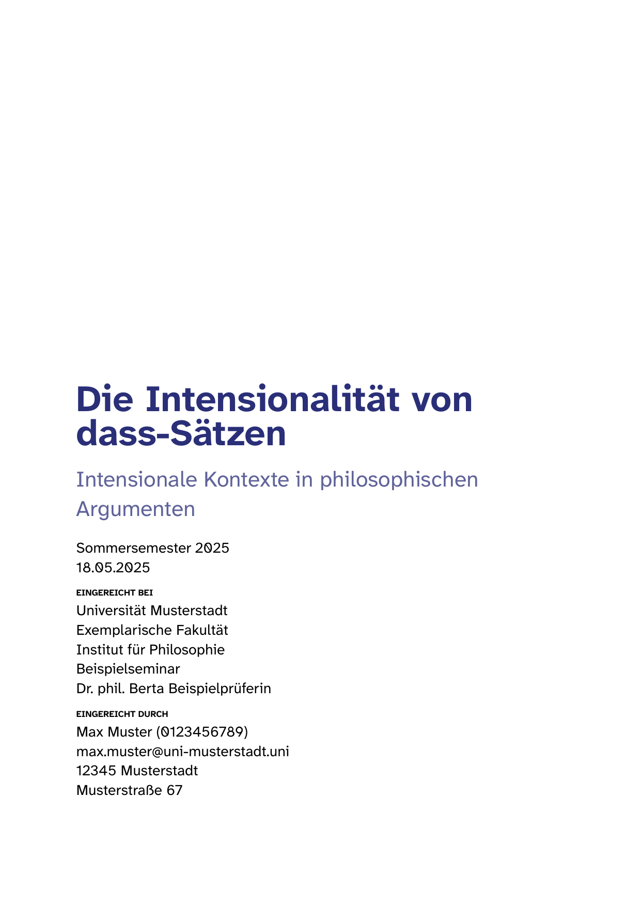
            </a>
        </td>
        <td>
            <a href="examples/seminar-paper01.typ">
                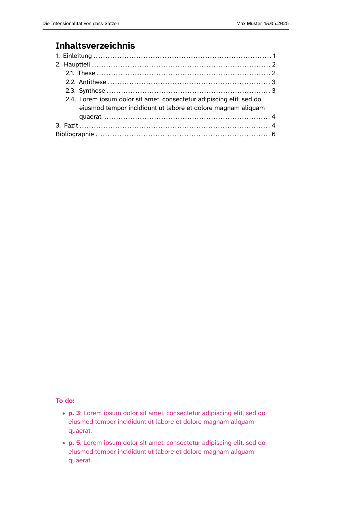
            </a>
        </td>
        <td>
            <a href="examples/seminar-paper01.typ">
                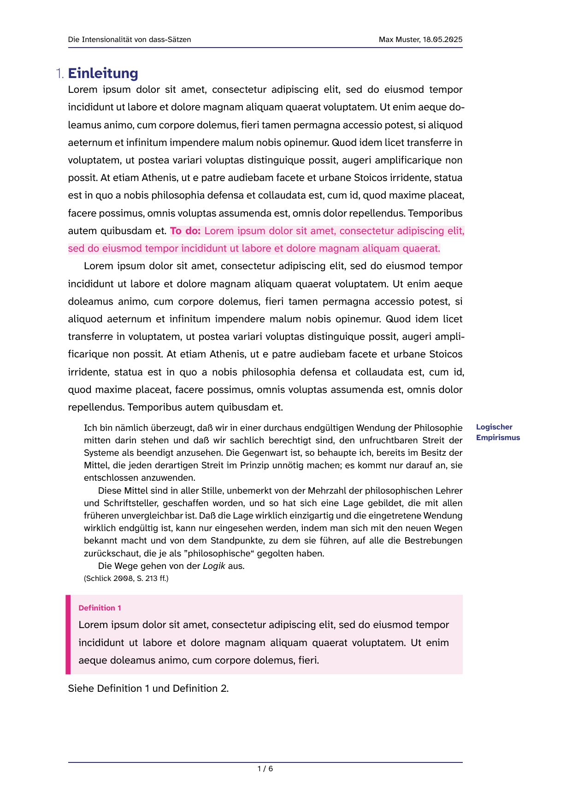
            </a>
        </td>
    </tr>
    <tr>
        <td>Title page</td>
        <td>Outline</td>
        <td>Body</td>
    </tr>
</table>

_Note:_ The template generates a German statement of authorship as the last page by default. This behavior can be deactivated by using `show-declaration-of-independent-work`.

### Setup

```typ
#import "@preview/grape-suite:2.1.0": seminar-paper

#show: seminar-paper.project.with(
    title: "Die Intensionalität von dass-Sätzen",
    subtitle: "Intensionale Kontexte in philosophischen Argumenten",

    university: [Universität Musterstadt],
    faculty: [Exemplarische Fakultät],
    institute: [Institut für Philosophie],
    docent: [Dr. phil. Berta Beispielprüferin],
    seminar: [Beispielseminar],

    submit-to: [Eingereicht bei],
    submit-by: [Eingereicht durch],

    semester: german-dates.semester(datetime.today()),

    author: "Max Muster",
    email: "max.muster@uni-musterstadt.uni",
    address: [
        12345 Musterstadt \
        Musterstraße 67
    ]
)
```

### Documentation

| `project`                              |                                                                                                                                                   |
| :------------------------------------- | :------------------------------------------------------------------------------------------------------------------------------------------------ |
| `title`                                | optional, content, default: `none`, title used on the title page                                                                                  |
| `subtitle`                             | optional, content, default: `none`, subtitle used on title page                                                                                   |
| `submit-to`                            | optional, content, default: `"Submitted to"`, title for the assignees's section                                                                   |
| `submit-by`                            | optional, content, default: `"Submitted by"`, title for the assigned's section                                                                    |
| `university`                           | optional, content, default: `"UNIVERSITY"`                                                                                                        |
| `faculty`                              | optional, content, default: `"FACULTY"`                                                                                                           |
| `institute`                            | optional, content, default: `"INSTITUTE"`                                                                                                         |
| `seminar`                              | optional, content, default: `"SEMINAR"`                                                                                                           |
| `semester`                             | optional, content, default: `"SEMESTER"`                                                                                                          |
| `docent`                               | optional, content, default: `"DOCENT"`                                                                                                            |
| `author`                               | optional, content, default: `"AUTHOR"`                                                                                                            |
| `student-number`                       | optional, content, default: `none`                                                                                                                |
| `email`                                | optional, content, default: `"EMAIL"`                                                                                                             |
| `address`                              | optional, content, default: `"ADDRESS"`                                                                                                           |
| `title-page-part`                      | optional, content, default: `none`, overwrite date, assignee and assigned section                                                                 |
| `title-page-part-submit-date`          | optional, content, default: `none`, overwrite date section                                                                                        |
| `title-page-part-submit-to`            | optional, content, default: `none`, overwrite assignee section                                                                                    |
| `title-page-part-submit-by`            | optional, content, default: `none`, overwrite assigned section                                                                                    |
| `date`                                 | optional, datetime or content, default: `datetime.today()`                                                                                        |
| `date-format`                          | optional, function, default: `(date) => if type(date) == type(datetime.today()) { date.display("[day].[month].[year]") } else { date }`           |
| `header`                               | optional, content, default: `none`, overwrite page header                                                                                         |
| `header-right`                         | optional, content, default: `none`, overwrite right header part                                                                                   |
| `header-middle`                        | optional, content, default: `none`, overwrite middle header part                                                                                  |
| `header-left`                          | optional, content, default: `none`, overwrite left header part                                                                                    |
| `show-header-line`                     | optional, bool, default: `true`, show purple line in header                                                                                       |
| `footer`                               | optional, content, default: `none`, overwrite footer part                                                                                         |
| `footer-right`                         | optional, content, default: `none`, overwrite right footer part                                                                                   |
| `footer-middle`                        | optional, content, default: `none`, overwrite middle footer part                                                                                  |
| `footer-left`                          | optional, content, default: `none`, overwrite left footer part                                                                                    |
| `show-footer-line`                     | optional, bool, default: `true`, show purple line in footer                                                                                       |
| `show-outline`                         | optional, bool, default: `true`, show outline                                                                                                     |
| `show-declaration-of-independent-work` | optional, bool, default: `true`, show German declaration of independent work                                                                      |
| `page-margins`                         | optional, margins, default: `none`, overwrite page margins                                                                                        |
| `text-font`                            | optional, content, default: `("Atkinson Hyperlegible Next", "Atkinson Hyperlegible", "Libertinus Serif")`, overwrite font family for text content |
| `math-font`                            | optional, content, default: `("STIX Two Math", "New Computer Modern Math")`, overwrite font family for math equations                             |
| `fontsize`                             | optional, size, default: `11pt`, overwrite fontsize                                                                                               |
| `show-todolist`                        | optional, bool, default: `true`, show list of usages of the `todo` function after the outline                                                     |
| `body`                                 | content, document content                                                                                                                         |

| `sidenote` |                                                                                                         |
| :--------- | :------------------------------------------------------------------------------------------------------ |
| `body`     | sidenote content, which is a block with 3cm width and will be displayed in the right margin of the page |

## Slides

<table>
    <tr>
        <td>
            <a href="examples/slides01.typ">
                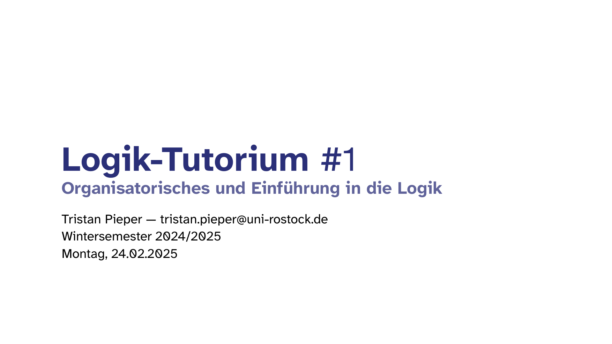
            </a>
        </td>
        <td>
            <a href="examples/slides01.typ">
                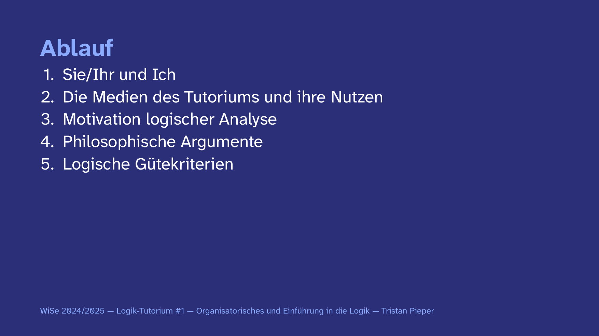
            </a>
        </td>
        <td>
            <a href="examples/slides01.typ">
                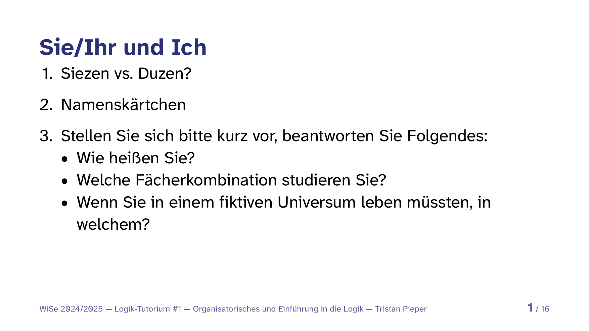
            </a>
        </td>
    </tr>
    <tr>
        <td>
            <a href="examples/slides01.typ">
                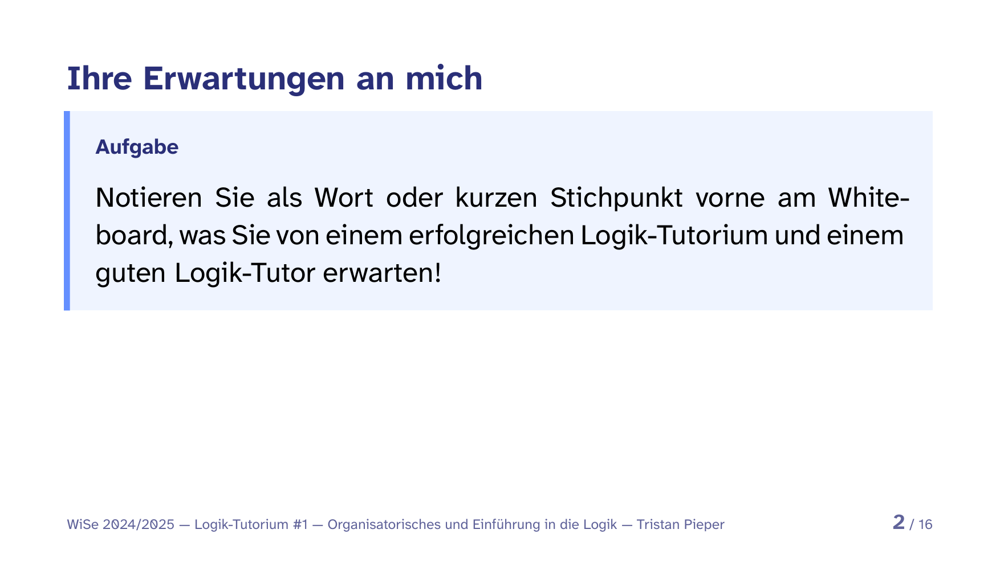
            </a>
        </td>
        <td>
            <a href="examples/slides01.typ">
                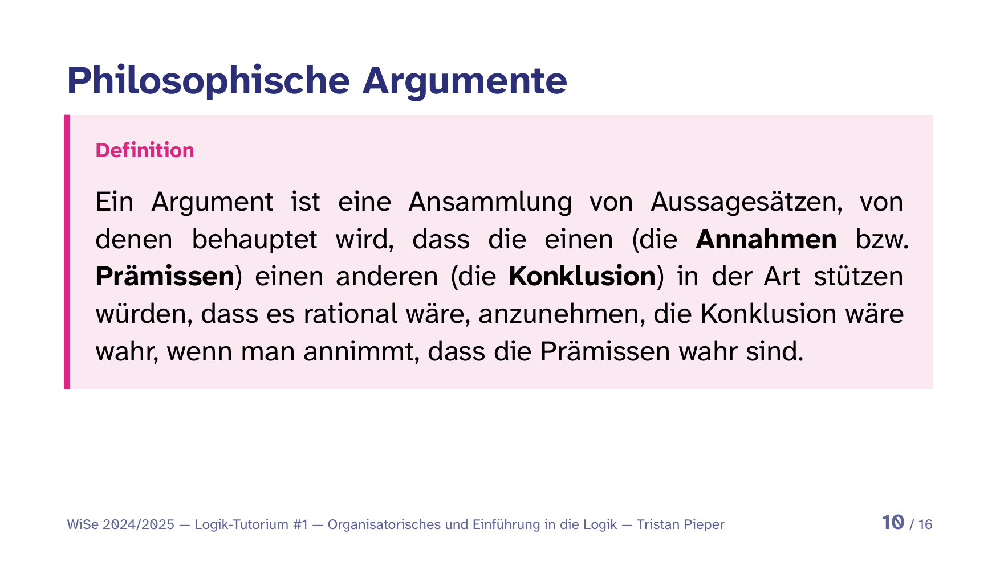
            </a>
        </td>
    </tr>
</table>

### Setup

```typ
#import "@preview/grape-suite:2.1.0": slides
#import slides: *

#show: slides.with(
    no: 1,
    series: [Logik-Tutorium],
    title: [Organisatorisches und Einführung in die Logik],

    author: "Tristan Pieper",
    email: link("mailto:tristan.pieper@uni-rostock.de"),
)
```

### Documentation

| `slides`               |                                                                                                                                                                  |
| :--------------------- | :--------------------------------------------------------------------------------------------------------------------------------------------------------------- |
| `no`                   | optional, number, default: `0`, number in the series                                                                                                             |
| `series`               | optional, content, default: `none`, name of the series                                                                                                           |
| `title`                | optional, content, default: `none`, title of the presentation                                                                                                    |
| `topics`               | optional, array, default: `()`, topics of the presentation                                                                                                       |
| `author`               | optional, content, default: `none`, author                                                                                                                       |
| `email`                | optional, content, default: `none`, author's email                                                                                                               |
| `head-replacement`     | optional, content, default: `none`, replace head on title slide with given content                                                                               |
| `title-replacement`    | optional, content, default: `none`, replace title below head on title slide with given content                                                                   |
| `footer`               | optional, content, default: `none`, replace footer on slides with given content                                                                                  |
| `page-numbering`       | optional, function, default: `(n, total) => {...}`, function that creates the page numbering (where `n` is the current, `total` is the last page)                |
| `show-semester`        | optional, bool, default: `true`, show name of the semester (e.g. "SoSe 24")                                                                                      |
| `show-date`            | optional, bool, default: `true`, show date in german format                                                                                                      |
| `show-outline`         | optional, bool, default: `true`, show outline on the second slide                                                                                                |
| `box-task-title`       | optional, content, default: `[Task]`, shown as the title of a slide's task box                                                                                   |
| `box-hint-title`       | optional, content, default: `[Hint]`, shown as the title of a slide's tasks colored                                                                              |
| `box-solution-title`   | optional, content, default: `[Solution]`, shown as the title of a slide's tasks colored                                                                          |
| `box-definition-title` | optional, content, default: `[Definition]`, shown as the title of a slide's definition box                                                                       |
| `box-notice-title`     | optional, content, default: `[Notice]`, shown as the title of a slide's notice box                                                                               |
| `box-example-title`    | optional, content, default: `[Example]`, shown as the title of a slide's example box                                                                             |
| `date`                 | optional, datetime or content, default: `datetime.today()`                                                                                                       |
| `date-format`          | optional, function, default: `(date) => if type(date) == type(datetime.today()) [#weekday(date.weekday()), #date.display("[day].[month].[year]")] else { date }` |
| `show-todolist`        | optional, bool, default: `true`, show list of usages of the `todo` function after the outline                                                                    |
| `show-title-slide`     | optional, bool, default: `true`, show title slide                                                                                                                |
| `show-author`          | optional, bool, default: `true`, show author name on title slide                                                                                                 |
| `show-footer`          | optional, bool, default: `true`, show footer on slides                                                                                                           |
| `show-page-numbers`    | optional, bool, default: `true`, show page numbering                                                                                                             |
| `outline-title-text`   | optional, content, default: `"Outline"`, title for the outline                                                                                                   |
| `text-font`            | optional, content, default: `("Atkinson Hyperlegible Next", "Atkinson Hyperlegible", "Libertinus Serif")`, overwrite font family for text content                |
| `math-font`            | optional, content, default: `("STIX Two Math", "New Computer Modern Math")`, overwrite font family for math equations                                            |
| `body`                 | content, document content                                                                                                                                        |

| `focus-slide` |                           |
| :------------ | :------------------------ |
| `body`        | content, document content |

- `slide`, `later`, `only`, `uncover`: imported from polylux

## Subtypes

The `subtypes` module contains templates for essays and protocols based on the `exercise` module.

<table>
    <tr>
        <td>
            <a href="examples/essay01.typ">
                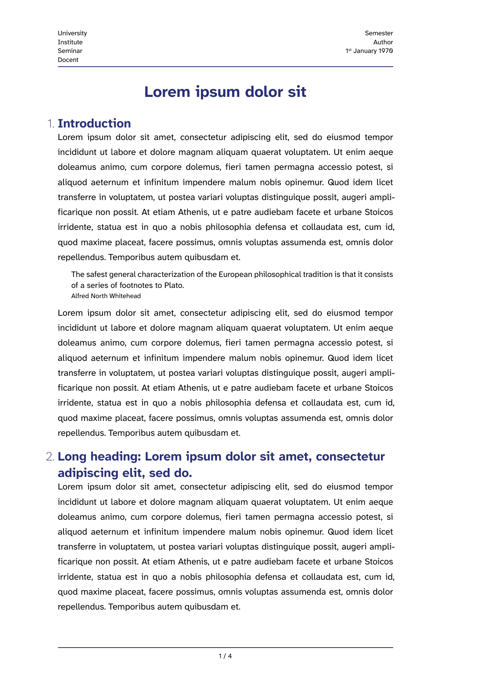
            </a>
        </td>
        <td>
            <a href="examples/essay01.typ">
                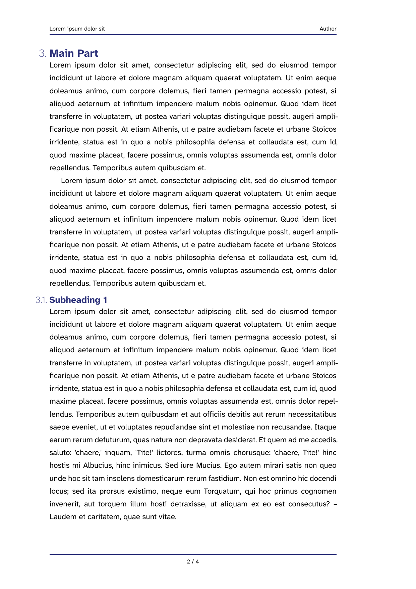
            </a>
        </td>
        <td>
            <a href="examples/essay01.typ">
                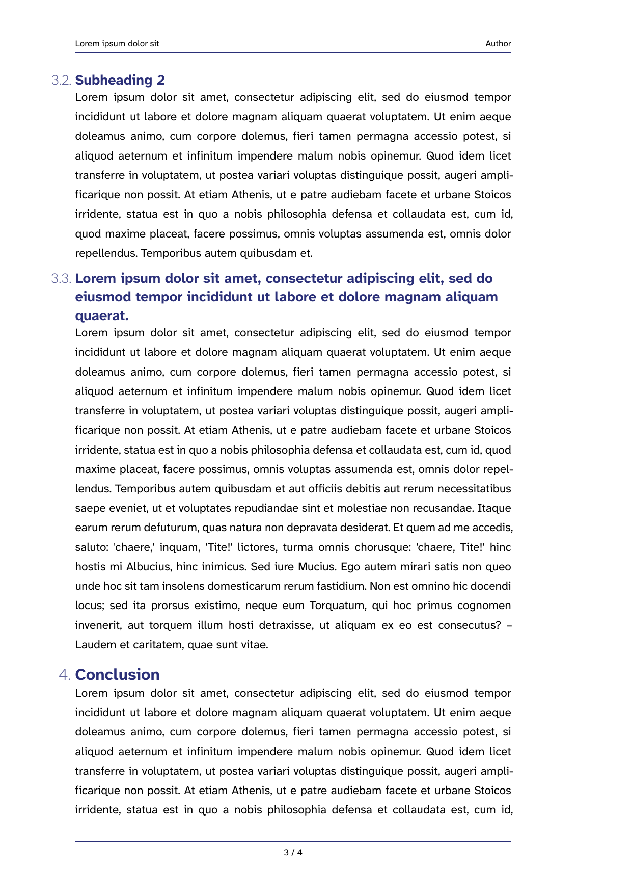
            </a>
        </td>
    </tr>
    <tr>
        <td>
            <a href="examples/protocol01.typ">
                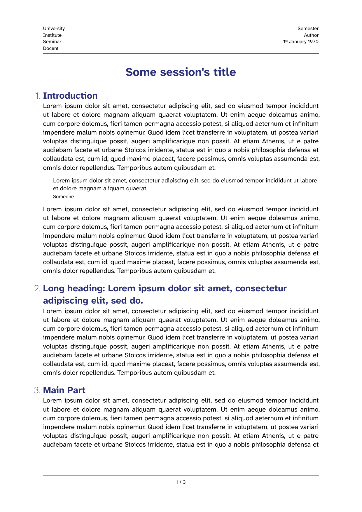
            </a>
        </td>
        <td>
            <a href="examples/protocol01.typ">
                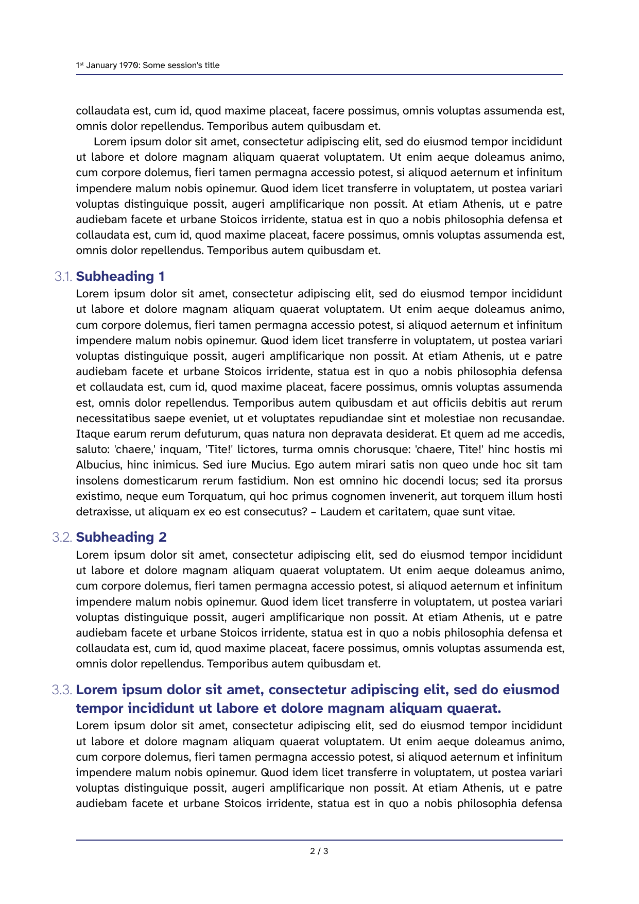
            </a>
        </td>
        <td>
            <a href="examples/protocol01.typ">
                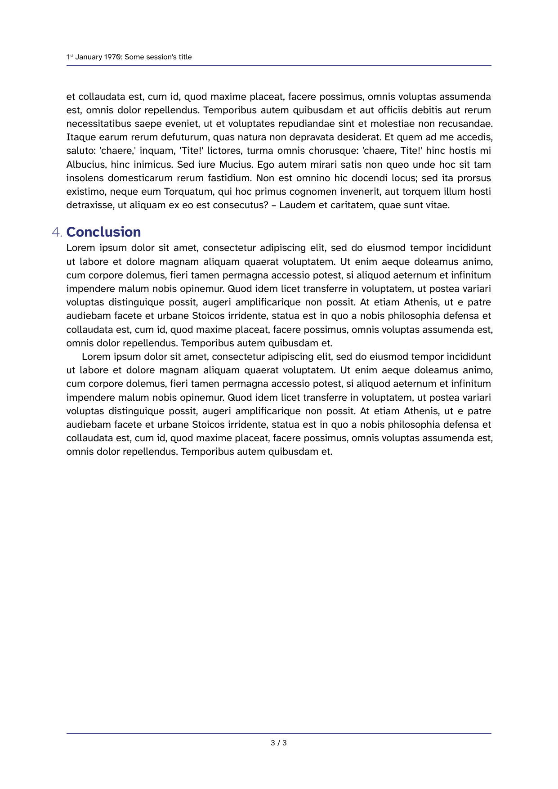
            </a>
        </td>
    </tr>
</table>

### Setup

Essay:

```typ
#import "@preview/grape-suite:2.1.0": subtype

#show: subtype.essay.with(
    title: "Lorem ipsum dolor sit",
    university: [University],
    institute: [Institute],
    seminar: [Seminar],
    semester: [Semester],
    docent: [Docent],
    author: [Author],
    date: [1#super[st] January 1970],
)
```

Protocol:

```typ
#import "@preview/grape-suite:2.1.0": subtype

#show: subtype.protocol.with(
    title: "Some session's title",
    university: [University],
    institute: [Institute],
    seminar: [Seminar],
    semester: [Semester],
    docent: [Docent],
    author: [Author],
    date: [1#super[st] January 1970],
)
```

### Documentation

The base layout of these functions is provided by `exercise.project`. Other named arguments than the following are passed to `exercise.project`.

| `essay`      |                                                   |
| :----------- | :------------------------------------------------ |
| `title`      | optional, content, default: `[#todo[Title]]`      |
| `university` | optional, content, default: `[#todo[University]]` |
| `institute`  | optional, content, default: `[#todo[Institute]]`  |
| `seminar`    | optional, content, default: `[#todo[Seminar]]`    |
| `semester`   | optional, content, default: `[#todo[Semester]]`   |
| `docent`     | optional, content, default: `[#todo[Docent]]`     |
| `author`     | optional, content, default: `[#todo[Author]]`     |
| `date`       | optional, content, default: `[#todo[Date]]`       |
| `body`       | content, document content                         |

| `protocol`   |                                                   |
| :----------- | :------------------------------------------------ |
| `title`      | optional, content, default: `[#todo[Title]]`      |
| `university` | optional, content, default: `[#todo[University]]` |
| `institute`  | optional, content, default: `[#todo[Institute]]`  |
| `seminar`    | optional, content, default: `[#todo[Seminar]]`    |
| `semester`   | optional, content, default: `[#todo[Semester]]`   |
| `docent`     | optional, content, default: `[#todo[Docent]]`     |
| `author`     | optional, content, default: `[#todo[Author]]`     |
| `date`       | optional, content, default: `[#todo[Date]]`       |
| `body`       | content, document content                         |

## Todos

The following functions can be imported from `slides`, `exercise` and `seminar-paper`:

- `todo(content, ...)` - create a highlighted inline todo-note
- `list-todos()` - create list of all todo-usages with page of usage and content
- `hide-todos()` - hides all usages of `todo()` in the document

## Elements

The following functions can be imported from `slides`, `exercise` and `seminar-paper`: `definition`

# Changelog

## 2.1.0

Fixes:

- `sidenote` in `seminar-paper`

New:

- `subtypes`:
  - `subtypes.essay`
  - `subtypes.protocol`
- `show-header-line` and `show-footer-line` in `exercise.project` and `seminar-paper.project`
- styling for Typst-native `quote` in favor of `blockquote`

Changes:

- `seminar-paper`: adjust `par.leading` to comply with internal requierments (in addition: `par.spacing` and `par.first-line-indent` for aesthetical purposes)
- `blockquote` now just creates a `quote` element with attribution
- `date` (in `seminar-paper`, `exercise` and `slides`) now accepts `content` too
- `big-heading` moved from `tasks` module to `elements` module

## 2.0.0

Fixes:

- typos in Readme file

New:

- `math-font` and `text-font` options in `slides`, `exercise.project` and `seminar-paper.project`
- `date-format` in `slides`

**Breaking Changes:**

- updated polylux to 0.4.0: replacing `#pause` in favor of `#show: later`

## 1.0.1

Fixes:

- titles of solutions and hints
- generation of semester name in `german-dates.typ`

New:

- `focus-slide` in `slides`
- `header-gutter` option in `exercise.typ`

## 1.0.0

New:

- `todo`, `list-todos`, `hide-todos` in `todo.typ`, importable from `slides`, `exercise.project` and `seminar-paper.project`
- `show-todolist` attribute in above templates
- `ignore-points` attribute in `task` and `subtask` of exercises, so that their points won't be shown in the solution matrix or point distribution
- comment field and a standard-value for solution matrix via `show-solution-matrix-comment-field` and `solution-matrix-comment-field-value` options in `exercise.project`
- optional parameter `type` in `slides.task`
- new parameters in `slides.slides`:
  - `head-replacement`
  - `title-replacement`
  - `footer`
  - `page-numbering`
  - `show-title-slide`
  - `show-author` (on title slide)
  - `show-date`
  - `show-footer`
  - `show-page-numbers`
- optional parameter `show-outline` in `seminar-paper.project`

Changes:

- `dates.typ` becomes `german-dates.typ`

Fixes:

- remove forced German from the slides template
- long headings are now properly aligned
- subtask counter now resets for each part of task

**Breaking Changes:**

- `dates` becomes `german-dates`
- changed all `with-outline` to `show-outline`
