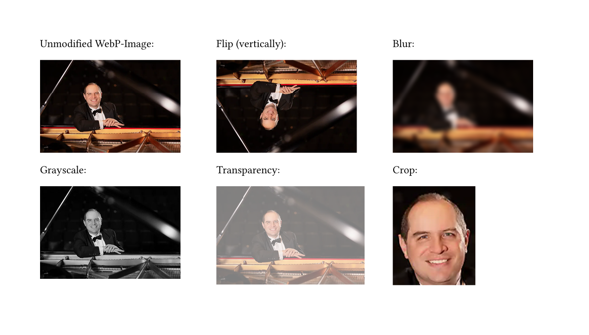

# Grayness

A package providing simple image editing capabilities via a WASM plugin.

Available functionality includes converting images to grayscale, cropping and flipping the images.
Furthermore, this package supports adding transparency and bluring (very slow) as well as handling additional raster image formats.

The package name is inspired by the blurry, gray images of Nessie, the [Loch Ness Monster](https://en.wikipedia.org/wiki/Loch_Ness_Monster)

## Usage

Due to the way typst currently interprets given paths, you have to read the images yourself in the calling typst file. This raw imagedata can then be passed to the grayness-package functions, like grayscale-image. These functions also optionally accept all additional parameters of the original typst image function like `width` or `height`:

```typst
#import "@preview/grayness:0.1.0": grayscale-image

#let data = read("Art.webp", encoding: none)
#grayscale-image(data, width: 50%)
```
A detailed descriptions of all available functions is provided in the [manual](manual.pdf).


## Examples

Here are several functions applied to a WEBP image of [Arturo Nieto Dorantes](https://commons.wikimedia.org/wiki/File:Arturo_Nieto-Dorantes.webp) (CC-By-SA 4.0):

