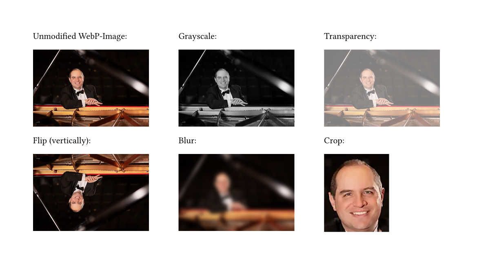

# Grayness

A package providing simple image editing capabilities via a WASM plugin.

Available functionality includes converting images to grayscale, cropping, applying color transforms (as matrix or hue-rotation).
Furthermore, this package supports adding transparency and bluring (very slow) as well as handling additional raster image formats and getting image dimensions.

The package name is inspired by the blurry, gray images of Nessie, the [Loch Ness Monster](https://en.wikipedia.org/wiki/Loch_Ness_Monster)

## Usage

Due to the way Typst interprets given paths, you cannot specify the path to a file as string directly. Instead, you have to either read the images yourself in the calling Typst file or provide the direction to the file with the path-type (using typst 0.15 or later). This imagedata can then be passed to the grayness-package functions, like `image-grayscale()`. These functions also optionally accept all additional parameters of the original Typst image function like `width` or `height`:

```typst
#import "@preview/grayness:0.8.0": image-grayscale

#let data = path("Arturo_Nieto-Dorantes.webp")
#image-grayscale(data, width: 50%)
```

```typst
#let data = path("gallardo.svg")
#image-grayscale(data)
```

## Examples

Here are several functions applied to a WEBP image of [Arturo Nieto Dorantes](https://commons.wikimedia.org/wiki/File:Arturo_Nieto-Dorantes.webp) (CC-By-SA 4.0):
, more functions are shown in [the example PDF](examples/examples.pdf).
A detailed descriptions of all available functions is provided in the [manual](manual/manual.pdf).

## Limitations

The functions provided in this package are quite slow and only serve as a prove of concept. You really should use dedicated image processing software to edit and potentially convert your source images into a format Typst understands natively.
