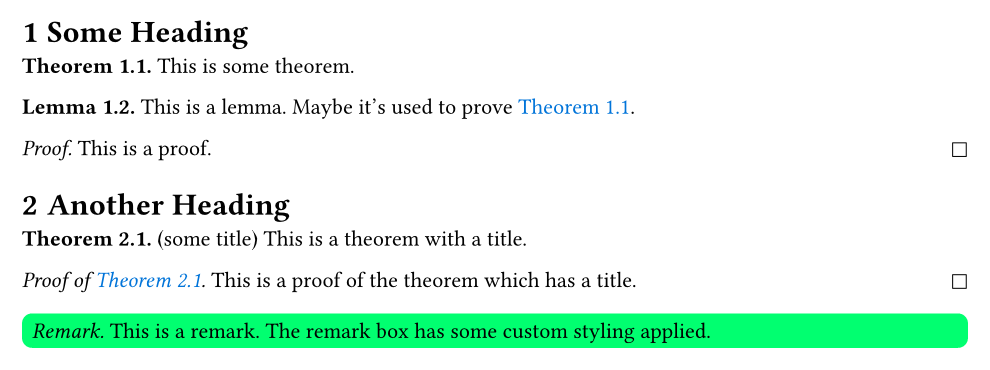

# `great-theorems`

This package allows you to make **theorem/proof/remark/...** blocks.

Features:
- supports advanced counters through both [headcount](https://typst.app/universe/package/headcount/) and [rich-counters](https://typst.app/universe/package/rich-counters/)
- easy adjustment of style:
  * change prefix
  * change how title is displayed
  * change formatting of body
  * change suffix
  * change numbering style
  * configure _all_ parameters of the [`block`](https://typst.app/docs/reference/layout/block/), including background color, stroke color, rounded corners, inset, ...
- can adjust style also on individual basis (e.g. to highlight main theorem)
- works with labels/references
- sane and smart defaults

## Showcase

In the following example we use [rich-counters](https://typst.app/universe/package/rich-counters/) to configure section-based counters.
You can also use [headcount](https://typst.app/universe/package/headcount/).

```typ
#import "@preview/great-theorems:0.1.1": *
#import "@preview/rich-counters:0.2.1": *

#set heading(numbering: "1.1")
#show: great-theorems-init

#show link: text.with(fill: blue)

#let mathcounter = rich-counter(
  identifier: "mathblocks",
  inherited_levels: 1
)

#let theorem = mathblock(
  blocktitle: "Theorem",
  counter: mathcounter,
)

#let lemma = mathblock(
  blocktitle: "Lemma",
  counter: mathcounter,
)

#let remark = mathblock(
  blocktitle: "Remark",
  prefix: [_Remark._],
  inset: 5pt,
  fill: lime,
  radius: 5pt,
)

#let proof = proofblock()

= Some Heading

#theorem[
  This is some theorem.
] <mythm>

#lemma[
  This is a lemma. Maybe it's used to prove @mythm.
]

#proof[
  This is a proof.
]

= Another Heading

#theorem(title: "some title")[
  This is a theorem with a title.
] <thm2>

#proof(of: <thm2>)[
  This is a proof of the theorem which has a title.
]

#remark[
  This is a remark.
  The remark box has some custom styling applied.
]
```


## Usage

### `great-theorems-init`

First, make sure to apply the following inital `show` rule to your document:
```typ
#show: great-theorems-init
```
This is important to make the blocks have the correct alignment and to display references correctly.

### `mathblock`

The main constructor you will use is `mathblock`, which allows you to construct a theorem/proof/remark/... environment in exactly the way you like it.

Please see the showcase above for on example on how to use it.
We now list and explain all possible arguments.

- `blocktitle` (required)

  Usually something like `"Theorem"` or `"Lemma"`. Determines how references are displayed, and also determines the default `prefix`.

- `counter` (default: `none`)

  If you want your `mathblock` to be counted, pass the counter here.
  Accepts either a Typst-native [`counter`](https://typst.app/docs/reference/introspection/counter/) (which can be made to depend on the section with the [headcount](https://typst.app/universe/package/headcount/) package) or a `rich-counter` from the [rich-counters](https://typst.app/universe/package/rich-counters/) package.
  If you want multiple `mathblock` environments to share the same counter, just pass the same counter to all of them.

- `numbering` (default: `"1.1"`)

  The numbering style that should be used to display the counters.

  **Note:** If you use the [headcount](https://typst.app/universe/package/headcount/) package for your counters, you have to pass the `dependent-numbering` here.

- `prefix` (default: contructed from `blocktitle`, bold style)

  What should be displayed before the body.
  If you didn't pass a counter, it should just be a piece of content like `[*Theorem.*]`.
  _If you passed a counter_, it should a function/closure, which takes the current counter value as an argument and returns the corresponding prefix; for example `(count) => [*Theorem #count.*]`

- `titlix` (default: `title => [(#title)]`)

  How a title should be displayed. Will be placed after the prefix if a title is present.
  Must be function which takes the title and returns the corresponding content that should be displayed.

- `suffix` (default: `none`)

  A suffix that will be displayed after the body.

- `bodyfmt` (default: `body => body` i.e. no special formatting)

  A function that will style/transform the body.
  For example, if you want your theorem contents to be displayed in oblique style, you could pass `text.with(style: "oblique")`.

- arguments for the surrounding [`block`](https://typst.app/docs/reference/layout/block/)

  The `mathblock`, as the name suggests, is surrounded by a [`block`](https://typst.app/docs/reference/layout/block/), which can be styled to have a background color, stroke color, rounded corners, etc. .
  You can just pass all arguments that you could pass to a `block` also to `mathblock`, and it will be "passed through" the surrounding `block`.
  For example, you could write `#let theorem = mathblock(..., fill: yellow, inset: 5pt)`.

So far we have discussed how you _setup_ your environment with `#let theorem = mathblock(...)`.
Now let's discuss how to use the resulting `theorem` command.
Again, please see the showcase above for some examples on how to use it.
We now list and explain all possible arguments (apart from the body).

- `title` (default: `none`)

  This allows you to set a title for your theorem/lemma/..., which will be displayed according to `titlix`.

- all the arguments from `mathblock`, except `blocktitle` and `counter`

  You can change all the parameters of your `mathblock` also on an individual basis, i.e. for each occurrence separately, by just passing the respective arguments, including `numbering`, `prefix`, `titlix`, `suffix`, `bodyfmt`, and arguments for `block`.
  These will take precedence over the global configuration.

### `proofblock`

Also a proof environment can be constructed with `mathblock`, for example:
```
#let proof = mathblock(
  blocktitle: "Proof",
  prefix: [_Proof._],
  suffix: [#h(1fr) $square$],
)
```
However, for convenience, we have made another `proofblock` constructor.
It works exactly the same as `mathblock`, the only differences being:

- it has different default values for `blocktitle`, `prefix`, and `suffix`
- it has no `counter` and `numbering` argument
- the `titlix` argument is replaced with a `prefix_with_of` argument (also consisting of a function), which will be used as a prefix when the constructed environment is used with `of` parameter

The constructed environment will have the following changes compared to an environment constructed with `mathblock`

- the `title` argument is replaced with an `of` argument, which is used to denote to which theorem/lemma/... the proof belongs

  This can be either just content, or a label, in which case a reference to the label is displayed.


## FAQ

- _What is the difference to the ctheorems package?_

  You can achieve pretty much the same results with both packages.
  One goal of `great-theorems` was to have a cleaner implementation, for example by separating the counter functionality from the theorem block functionality.
  `ctheorems` also uses deprecated Typst functionality that will soon be removed.
  In the end, however, in comes down to personal preference, and `ctheorems` was certainly a big inspiration for this package!

- _How to set up the counters the way I want?_

  Please consult the documentation of [headcount](https://typst.app/universe/package/headcount/) and [rich-counters](https://typst.app/universe/package/rich-counters/) respectively, we support both packages as well as native [`counter`](https://typst.app/docs/reference/introspection/counter/)s.

- _My theorems are all center aligned?!_

  You forgot to put the initial show rule at the start of your document:
  ```typ
  #show: great-theorems-init
  ```

- _My theorems break across pages, how do I stop that behavior?_

  You can pass `breakable: false` to `mathblock` to construct a non-breakable environment.

- _I have a default style for all my theorems/lemmas/remarks/..., and I'm writing boilerplate when I construct theorem/lemma/remark environments._

  You can essentially define your own defaults like this:
  ```typ
  #let my_mathblock = mathblock.with(fill: yellow, radius: 5pt, inset: 5pt)
  
  #let theorem = my_mathblock(...)
  #let lemma = my_mathblock(...)
  #let remark = my_mathblock(...)
  ...
  ```

- _The documentation is too short or unclear... how do I do X?_

  Please just open an [issue on GitHub](https://github.com/jbirnick/typst-great-theorems/issues), and I will happily answer your question and extend the documentation!
