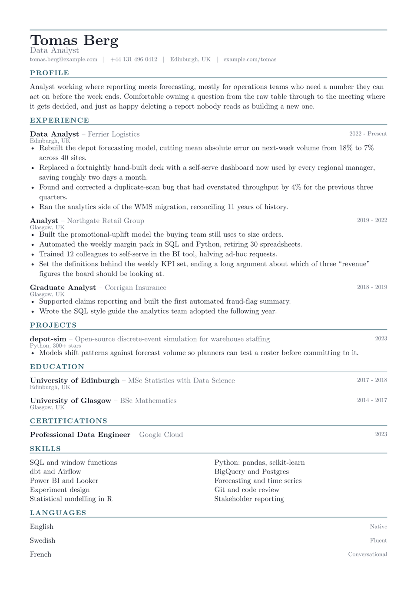

# Grid CV

Skills go in a grid here, not in a comma-separated run. That is the only unusual
thing about the layout. Everything above it stays conventional, because this
design has to survive being read by software about as often as by a person, and
there are no panels or sidebars for a parser to misread.

The grid exists because twenty tools set as prose are unreadable at a glance and
useless to somebody scanning for one word.

<div align="center">
  
</div>

## Getting started

**In the Typst app**, open
[the package page](https://typst.app/universe/package/grid-cv) and choose
*Create project in app*.

**On the command line:**

```sh
typst init @preview/grid-cv:0.1.0 my-cv
typst compile my-cv/main.typ
```

Grid is set in **New Computer Modern**, which ships with Typst, so it
compiles identically everywhere with nothing to install.

## Using it as a package

```typ
#import "@preview/grid-cv:0.1.0": *

#let accent = "#2c5f6e"

#show: resume.with(
  author: "Tomas Berg",
  font: "New Computer Modern",
)

#masthead(
  author: "Tomas Berg",
  profession: "Data Analyst",
  accent-color: accent,
  contact: [tomas.berg\@example.com #h(0.6em) | #h(0.6em) Edinburgh, UK],
)

#cv-section("Experience", accent-color: accent)

#grid-entry(
  title: "Data Analyst",
  subtitle: "Ferrier Logistics",
  dates: "2022 - Present",
  location: "Edinburgh, UK",
)[
  - Something you did, with the number that makes it land.
]

#cv-section("Skills", accent-color: accent)

#skill-grid((
  "SQL and window functions",
  "Python: pandas, scikit-learn",
))
```

The package exports `resume`, `masthead`, `cv-section`, `skill-grid`,
`grid-entry` and `grid-language`.

`grid-entry` takes `title`, `subtitle`, `dates`, `location` and `meta`, all
optional, followed by the body. Blank arguments collapse rather than
reserving space, which matters more here than elsewhere. This is the layout most
likely to be read by software, and an empty field is one more thing to trip on.

`skill-grid` takes an array of strings and balances them across two columns in
the order given. Reading order runs left to right, so pair related items if you
want them side by side.

## Customising

| Parameter | Default | Notes |
|---|---|---|
| `accent-color` | `"#2c5f6e"` | The section labels and the masthead rule. Pass it to `masthead` and `cv-section`, as the sample does. |
| `font` | `"New Computer Modern"` | Any installed family. |
| `font-size` | `10.5pt` | The rest of the scale is derived from this. |
| `paper` | `"a4"` | `"us-letter"` also works. |
| `margin` | `1.5cm` | Applied on all four sides. |

## License

The package source is MIT. Everything under `template/`, which is the part you
edit and publish as your own CV, is MIT-0, so nothing has to travel with it.

Maintained by [JobSprout](https://jobsprout.ai), where this design is also
available as a [hosted CV builder](https://jobsprout.ai/resume-templates/grid).
