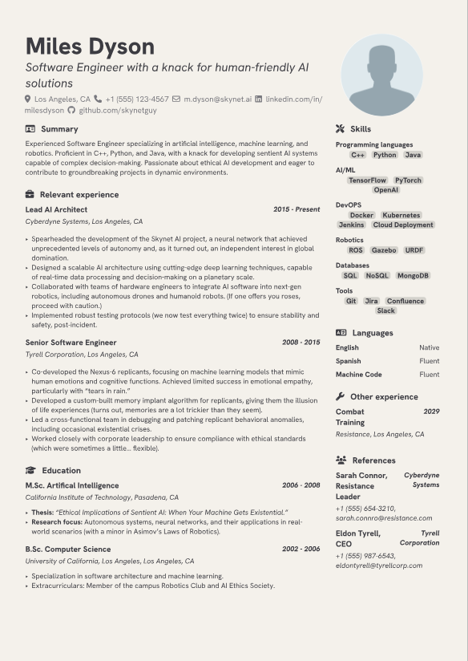

# Grotesk CV

A simple, one-page CV template with a clean and modern design. Inspired by https://github.com/mintyfrankie/brilliant-CV and Skywalker template from Typst.

## Requirements
You will need to install the following fonts in your local system:

- [Hanken Grotesk](https://fonts.google.com/specimen/Hanken+Grotesk)

This template also uses FontAwesome icons via the [fontawesome](https://typst.app/universe/package/fontawesome) package.

## Usage

The main content layout is defined in the `cv.typ` file, which is responsible for importing the different sections from `/content` into the document . Change the `metadata.typ` file to suit your needs. 
Different sections can be added or removed by modifying the `cv.typ` file. Sections can be edited by modifying the corresponding `.typ` file in the `/content` directory. 

## Preview

