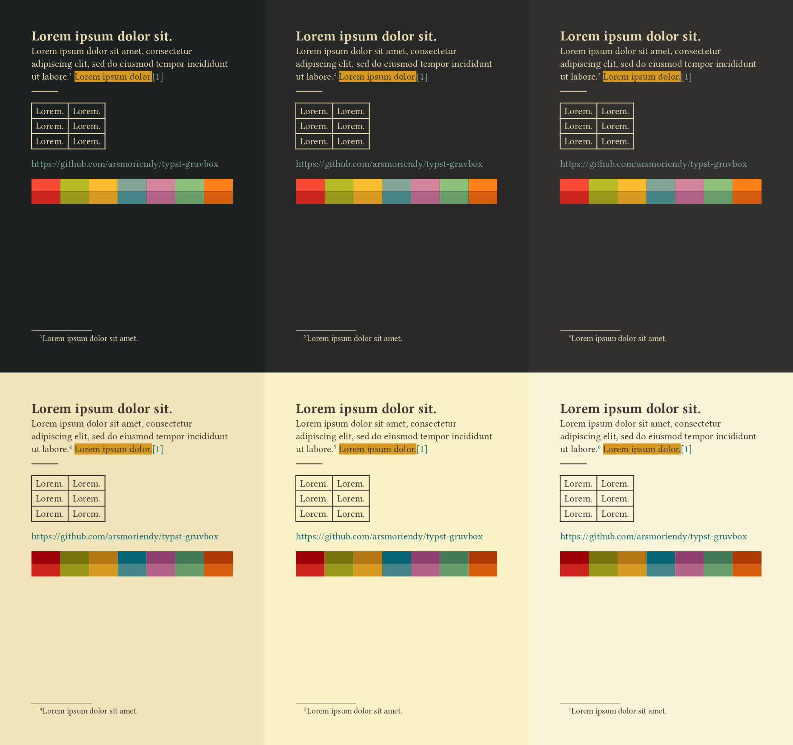

## Usage

```typst
#import "@preview/gruvy:1.0.0": gruvbox

#show: gruvbox
```

## Configuration

The main `gruvbox` function has 4 parameters:

1. `theme` (string): Can be `light` or `dark`
1. `contrast` (string): Can be `soft`, `medium` or `hard`
1. `accent` (string): Can be `red`, `green`, `yellow`, `blue`, `purple`, `aqua` or `orange`
1. `print` (boolean): Setting this to true will make the background white (`#FFFFFF`) and override the `theme` as light mode

By default, the configuration will use the `dark` theme, `hard` contrast and `blue` accent

For example:

```typst
#import "@preview/gruvy:1.0.0": gruvbox

#show: gruvbox.with(theme: "light", contrast: "soft", accent: "orange")
```

## Accessing colors

```typst
#import "@preview/gruvy:1.0.0": colors, theme-colors
```

Within the snippet above:

- `colors` is a dictionary with the following keys:
  - `bright`, `neutral` and `faded`, each with a dictionary value with the following keys:
    - `red`
    - `green`
    - `yellow`
    - `blue`
    - `purple`
    - `aqua`
    - `orange`
  - `monochrome` with an array value of colors from 0 to 14 ascending in brightness
- `theme-colors` is a higher level dictionary consisting:

  - `light` and `dark` theme dictionaries, each consisting:
    - `strong` dictionary that maps to either `bright` or `faded` within the `colors` dictionary respective to the selected theme
    - `fg0` that represents the foreground color of each respective theme
    - `soft`, `medium` and `hard` contrast dictionaries that has:
      - `bg0` as the background color of each respective contrast
  - `muted` colors that maps to `neutral` within the `colors` dictionary

For example:

```typst
#import "@preview/gruvy:1.0.0": colors, theme-colors

#text(fill: colors.bright.red)[Example]
#text(fill: colors.monochrome.at(0))[Example]
#text(fill: theme-colors.light.strong.purple)[Example]
#text(fill: theme-colors.muted.green)[Example]
```

## Credits

Original Gruvbox Vim theme by morhetz https://github.com/morhetz/gruvbox
