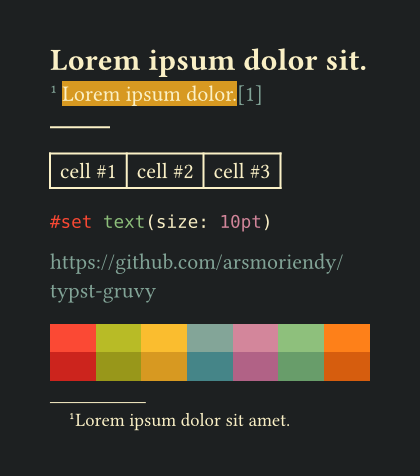
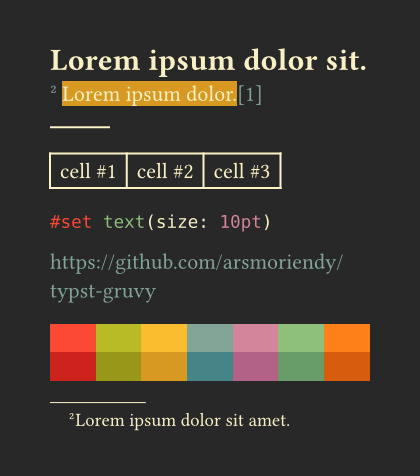
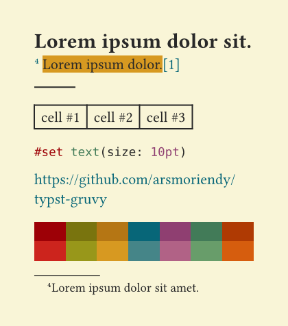
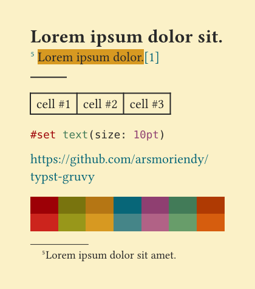
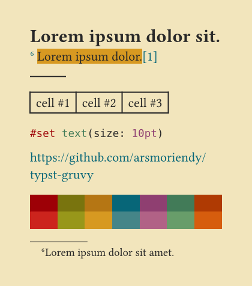

## Examples

| Dark Hard                                    | Dark Medium                                    | Dark Soft                                    |
| -------------------------------------------- | ---------------------------------------------- | -------------------------------------------- |
|  |  |  |

| Light Hard                                    | Light Medium                                    | Light Soft                                    |
| --------------------------------------------- | ----------------------------------------------- | --------------------------------------------- |
|  |  |  |

## Features

- Access to each unique Gruvbox color (via `colors`)
- Higher level theme colors (dark or light themes; hard, medium or soft contrast; via `theme-colors`)
- Apply Gruvbox colors for common typst components (e.g. page bg/fg, borders, links; via `gruvbox`)
- Supports printable documents
- Code highlighting within `raw` elements
- Extendable to other plugins (see [In-depth usage example](#in-depth-usage-example))

## Simple usage example

```typst
#import "@preview/gruvy:2.0.0": gruvbox

#show: gruvbox
```

## In-depth usage example

```typst
#import "@preview/gruvy:2.0.0": gruvbox, theme-colors, colors

// choose your preferred theme color
#let theme-color = theme-colors.dark.hard

// apply colors to common typst components
#show: gruvbox.with(
    // use your preferred theme color as a default preset
    theme-color: theme-color,
    // customize `ref`, `link` and `footnote` colors
    accent: theme-color.strong.blue,
    // customize `highlight` color
    hl: theme-color.muted.yellow,
    // is the document printable?
    print: false,
)

// extend your preferred theme color to other plugins (e.g. gentle-clues)
#import "@preview/gentle-clues:1.2.0": clue
#let info-color = theme-color.strong.blue
#let info = clue.with(
  accent-color: info-color,
  header-color: info-color.darken(40%),
  border-color: info-color.darken(50%),
)

// use colors outside of your preferred theme color
#text(fill: colors.bright.orange)[Hello world!]
```

## Reference

The main `gruvbox` function the following parameters (excluding `body`):

- `theme-color` (dictionary): Can be any of the presets from `theme-colors` (i.e. `theme-colors.{dark/light}.{light/medium/hard}`). Defaults to `theme-colors.dark.hard`.
- `accent` (color|none): Accent color for links, refs and footnote. Defaults to `theme-color.strong.blue`.
- `hl` (color|none): Highlight colors. Defaults to `theme-color.muted.yellow`.
- `print` (boolean): Wether or not to make the background pure white (`#FFFFFF`) and force light colors with hard contrast.

You can access the following colors from your preferred color preset (i.e. the `theme-color` variable) or any other color presets from `theme-colors` (e.g. `theme-colors.light.hard`):

- `muted`
- `strong`
- `fg0`
- `fg1`
- `fg2`
- `fg3`
- `fg4`
- `bg0`
- `bg1`
- `bg2`
- `bg3`
- `bg4`

You can import `colors` which is a lower level color dictionary, with no duplicates, and the following keys:

- `bright`, `neutral` and `faded`, each with a dictionary value with the following keys:
  - `red`
  - `green`
  - `yellow`
  - `blue`
  - `purple`
  - `aqua`
  - `orange`
- `dark0-hard` - monochrome colors in ascending brightness
- `dark0`
- `dark0-soft`
- `dark1`
- `dark2`
- `dark3`
- `dark4`
- `gray`
- `light4`
- `light3`
- `light2`
- `light1`
- `light0-soft`
- `light0`
- `light0-hard`

## Credits

Original Gruvbox Vim theme by morhetz https://github.com/morhetz/gruvbox
