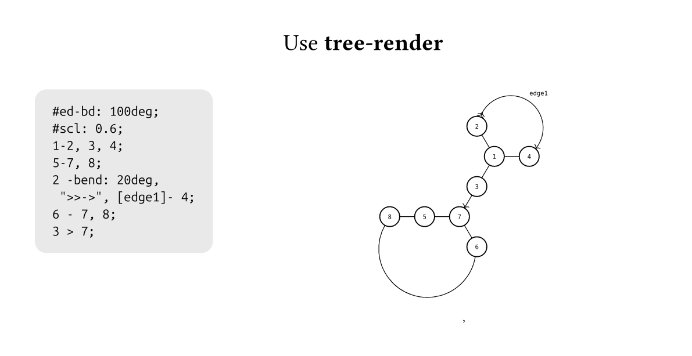
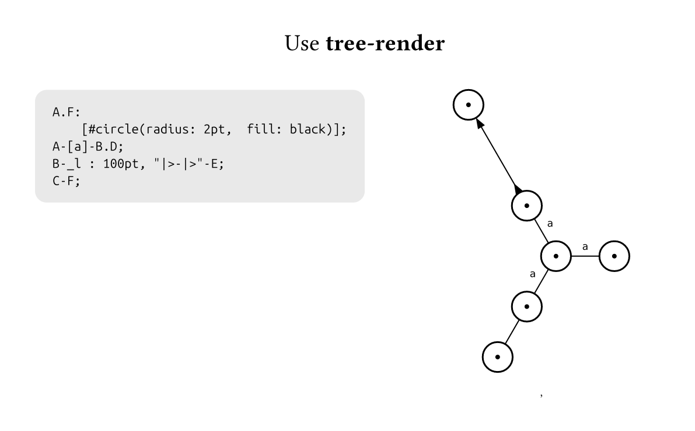
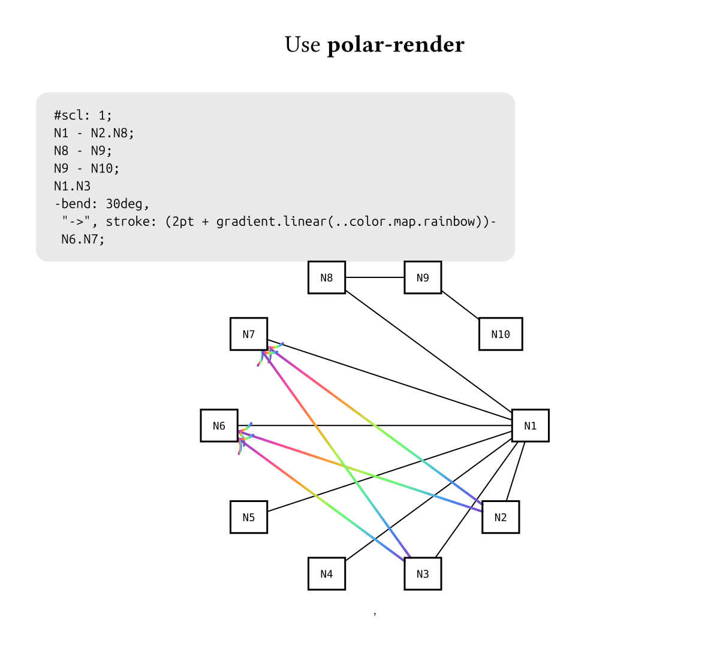
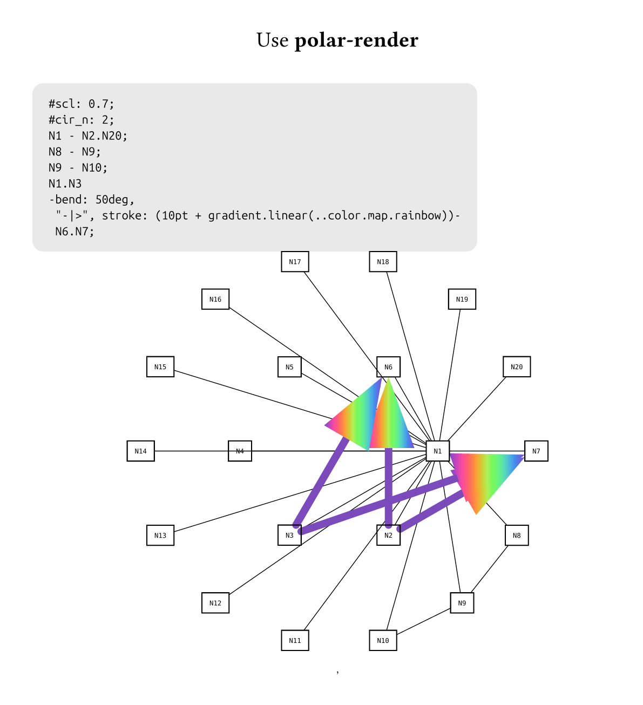

# H-Graph

[中文文档](./docs/README-cn.md)
H-Graph is a concise graph description language built on [Typst](https://typst.app/). It parses information into nodes, edges, and rendering parameters, and ships with a rendering backend using [fletcher](https://typst.app/universe/package/fletcher).  
It lets you describe a graph's **nodes, edges, and content** with a minimal DSL, and supports **custom renderers** to flexibly arrange layouts.

## ✨ Features

* **Simple and intuitive syntax** `A - B;` defines an edge — no prior declaration required (though you may declare nodes ahead of time).
* **Ranges and expansion** `A.Z;` automatically generates nodes `A,B,C...Z`. `A.C - A1-B12` connects all left items with all right items.
* **Macro substitution** content inside `|...|` acts as a macro. The system provides compile-time macros that start with an underscore, and renderers may provide their own runtime macros. For example: `A: [hello, i am $|_name|$];` — `|_name|` will be replaced with the node's name. Combined with name expansion you can implement customized per-node displays.
* **Meta controls** enable/disable self-loops and multi-edges.
* **Custom rendering** includes `polar-render` (circular polar layout) and `tree-render` (tree layout). You may also use the language parser alone and supply your own renderer.

---
## 🚀 Quick Start

### 1. Enable with `raw`:
```typst
#import ...

#show raw.where(lang: "graph"): enable-graph-in-raw(polar-render)
// or #show raw.where(lang: "graph"): enable-graph-in-raw(tree-render)
\`\`\`graph
#scl: 0.8;
1-2, 3, 4;
5-6, 7, 8;
2- 3, 4;
6 - 7, 8;
3 > 7;
4- 8;
`\`\`

```

### 2. More flexible usage
```typst
// first parse the code and get info
#let infos = h-graph-parser("A.C; B-A;")
// use render to display
#let (nodes, edges, render_args) = infos
#tree-render(
  ..render_args,
)(nodes: nodes, edges: edges)

// or even simpler
#h-graph("A.C; B-A;", tree-render)
````

---

## 📷 Examples








---

## ⚙️ Language Specification

The basic unit of `h-graph` is the statement; every statement **must** end with a semicolon.
Outside of content-declaration statements, the characters `";", ":",` are reserved and cannot be used directly — please choose other symbols if needed, or use
`\:`, `\,` for `:` and `\,`.
The `h-graph` processing flow is:

```
Parse h-graph into nodes, edges, and metadata (compile time) --> pass to renderer for drawing (render time)

```
```

### 1. Node name units

```h-graph
A;
B;
A.C, 1.10, Node;
```

When two names are connected by `.`, they are automatically expanded: letters and digits expand sequentially.
For example `1.10` becomes `1,2,3...10`; `A.C` becomes `A,B,C`; `A1.A3` expands to `A1, A2, A3`.

Multiple ranges or single names can be separated by commas to form a **name unit**.
A name unit can stand alone as a statement — that is, a node without any edges.

### 2. Edges

Edge declarations connect two **name units** using infix tokens `-`, `>`, `<`, `-..-`:

```
A.C - A.C;
1,2, 10.20 - A;
E > D;
D > A;
A < C;
A - bend: 30deg, "-|>" - D;
```

`-` is a plain straight edge; `>` and `<` are directed arrows (left→right and right→left respectively).
Use `-..-` to attach edge properties. If a property inside `-..-` is `key:value`, it is treated as a dictionary entry; otherwise it is an array entry. These parameters are passed to fletcher's `edge` in rendering — check the fletcher docs for common options. By convention keys that start with `_` are private parameters: they are intercepted by the renderer and used as renderer-specific runtime options.

Inside `-..-`, the characters `,` and `:` must be escaped as `\,` and `\:`.

Two compile-time macros are available inside `-..-`: `|_from|` and `|_to|`, representing the left and right node names of the current edge. Example:

```
A - bend: 30deg, "-|>", [|_from| -> |_to|'s' content is $a + b = c$] - D;
```

This defines an edge with a 30° bend, an arrow style `-|>`, and a label that contains typst content showing `|_from|` and `|_to|`.

### 3. Content declarations

By default a node renderer shows the node's name. To override this, use a content declaration: a name unit followed by `:`, and everything after the colon is unconditionally parsed as typst content for display:

```
A.B, 1: [this is node];
```

Content declarations support the macro `|_name|`, which expands to the current node's name. For example:

```
A.Z: $|_name|$;
```

will render those nodes' content as their names in math mode.

### 4. Metadata

Metadata statements provide parsing-time options:

* `@noloop;` — disable self-loops
* `@multi-edge;` — allow multiple edges
* `----;` — resets metadata to defaults for subsequent statements

For example:

```
@noloop;
A-A;
```

this will suppress the self-loop.

```
@multi-edge;
A-B;
A-bend:30deg-B;
```

will display two edges between `A` and `B`. By default, when multi-edge is not enabled, only the first declared edge between any two nodes is shown.
`----;` clears the previous metadata, returning to defaults (no self-loops, no multi-edges). For instance:

```
@noloop;
----;
A-A;
```

will still show the self-loop because the reset restores default behavior.

### 5. Rendering parameters

Rendering parameters let you pass values into the renderer from inside the text, using `#key: value;`. Examples:

```
#cir_n: 3;
#scl: 0.8;
```

You should only use these inside `raw`-embedded `h-graph` code, because in that context you cannot directly call the renderer. Otherwise you can parse first and then call a renderer function manually with parameters. Parameter names and effects are renderer-specific.

---

## 🎨 Renderers

H-Graph provides these default renderers:

#### Tree layout (expand along a backbone)

```
tree-render(
  scl: 1,         // scale factor
  ed-bd: "30deg", // default bend for non-backbone edges
  min-space: "50pt", // default spacing per edge
  base-deg: "0",  // overall rotation angle
)
```

This renderer also supports a private edge parameter `_l`:

```h-graph
A-_l: 100pt-B;
```

which sets that edge's length to `100pt` — useful for resolving overlaps.

#### Polar / concentric circles layout

```
polar-render(
  cir_n: 1, // number of concentric circles
  scl: 1,   // scale
)
```

You can also write your own renderer:

```typst
#let my-render(scl: 1) = (nodes: dictionary, edges: array) => {
  scl = int(scl) // if parameter comes from inline code it is a string, normalize it
  diagram(
    ..nodes.keys().map((n, i) => node((i*20pt, 0), n, name: <n>)),
    // we recommend using render-help-draw-edge to draw edges; this helper resolves edge parameter conflicts
    ..edges.map(ed => render-help-draw-edge(ed: ed)), 
  )
}
```

Then call it like:

```typst
#h-graph("A...D; A - B;", my-render)
```

---

## 📌 TODO / Roadmap

* [ ] More layout algorithms (force-directed, etc.)
* [ ] Node style customization
* [ ] Subgraphs / grouping

