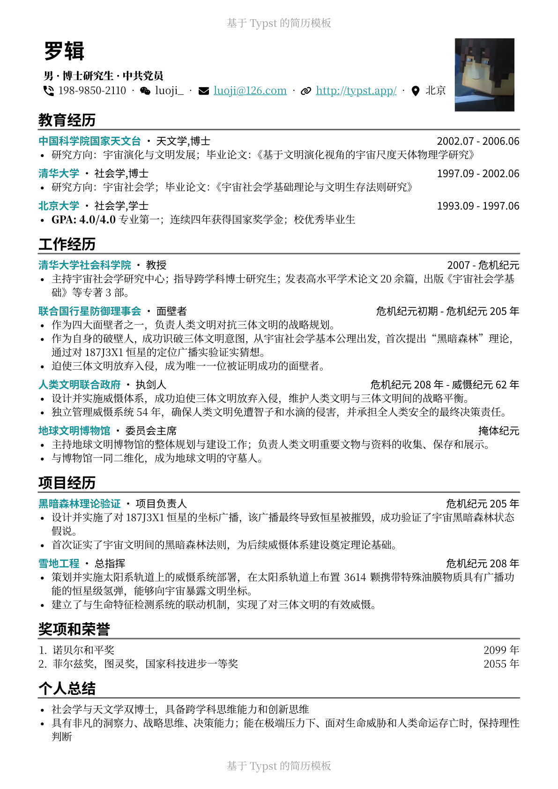
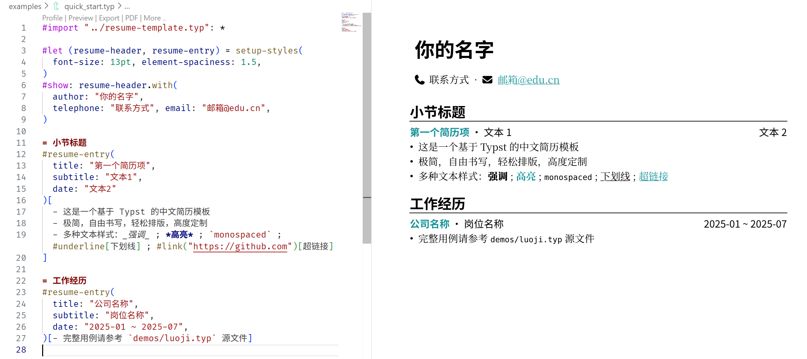

# A Minimalistic Resume Template

A minimalist, highly customizable Typst resume template with Chinese typesetting in mind. Make resume writing simple, flexible, and visually clean. By tuning a single spacing parameter, you can adapt the layout to make the content fit exactly one page while keeping the typesetting polished and balanced.

基于 [Typst](https://typst.app/) 的中文简历模板。极简，易用，轻松排版，高度定制。能无痛排版让内容刚好填满一页。



---

## 快速开始

> Note: 
> 如果您在 Typst Web App 使用该模板，请手动下载 [NerdFonts 图标](https://github.com/ryanoasis/nerd-fonts/releases/download/v3.4.0/NerdFontsSymbolsOnly.zip) 并将字体文件上传至项目目录

使用本模板，你将通过编写 Typst 源文件来制作简历，借助 IDE 插件可以实时预览。编写文件只需要用到基本的标记语法，不需要编程语言基础。



1. 克隆本仓库，或者使用 Typst Universe 模板初始化
   ```bash
   git clone https://github.com/habaneraa/typst-resume-one-page.git
   # 或者
   typst init @preview/habaneraa-one-page-resume-zh:0.1.0 my-resume
   ```

2. 打开你喜欢的 IDE (例如 VSCode)，搜索并安装插件 [Tinymist](https://github.com/Myriad-Dreamin/tinymist)

3. 编辑示例文件 `examples/luoji.typ` 或 `examples/quick_start.typ`，编写你的简历内容

4. 在文件起始处点击 "Preview"，借助插件功能可以实时查看效果

5. 点击 "Export PDF" 导出 PDF 格式简历（Tinymist 功能）。或者使用 `typst compile` 命令行工具进行编译。

## 使用指南

**第一步**，在你的 Typst 源文件里导入模板，并初始化样式：

```typst
#import "@preview/habaneraa-one-page-resume-zh:0.1.0": setup-styles
#let (resume-header, resume-entry) = setup-styles(
  font-size: 11pt,
)
```

样式设置参数：

| 参数名 | 说明 | 默认值 |
|---------------------|------------------------------|-------------------|
| `accent-color`      | 主颜色，如希望纯黑白可设为 `rgb("#000000")` | `rgb("#179299")` (青色) |
| `background-color`  | 背景色 | `rgb("#ffffff")` |
| `sans-serif-font`   | 标题文本的无衬线字体 | 思源黑体 |
| `serif-font`        | 正文文本的衬线字体 | 思源宋体 |
| `alt-font`          | 用于副标题第二种字体 | 思源黑体 |
| `font-size`         | 字体大小（会同时影响字大小和间距），推荐 10pt–12pt | 11pt |
| `element-spaciness` | 元素距离乘数（影响页边距和行距），可调节整体排版 | 推荐在 0.9 到 1.5 之间进行调整 |
| `separator`         | 分隔不同信息的符号 | ` · ` |

请注意，如果你的设备上缺少相关字体，你可以更改为其他常见字体（例如 Microsoft YaHei 微软雅黑），或者手动安装[思源黑体](https://github.com/adobe-fonts/source-han-sans)、[思源宋体](https://github.com/adobe-fonts/source-han-serif). 此外，如果你发现你的图标不能正常显示，请手动下载安装 [NerdFonts 图标](https://github.com/ryanoasis/nerd-fonts/releases/download/v3.4.0/NerdFontsSymbolsOnly.zip).

**第二步**，使用 `resume-header` 填写基本信息和联系方式。

```typst
#show: resume-header.with(
  author: "你的名字",
  profile-image: image("assets/avatar.png"), // 头像图片路径
  basic-info: (),              // 基础信息行内容
  telephone: "",               // 电话号码
  wechat-id: "",               // 微信号
  email: "",                   // 邮箱地址
  github-id: "",               // GitHub 用户名，会自动生成主页链接
  other-link: "",              // 填写任意 URL，会自动生成链接
  location: "",                // 位置，例如 [北京-海淀区]
)
```

说明：
- 所有字段信息都可以留空不填，空字段不会显示；
- `basic-info` 是单独设置的一行基础信息，如果填入，则会在名字下方生成两行内容。一般情况下，简历中包含联系方式和地址已经足够，如果投递简历需要其他关键基础信息，例如性别、年龄、求职意向、政治面貌等，可以填这里。如果不填该参数则不会显示基础信息行。
- `profile-image` 推荐使用 `image("path/to/avatar.png")`，如不需要显示图片请直接删除该参数。

**第三步**，编写正文。

使用 `= 标题` 来创建最显眼的一级标题，通常为 “教育经历”，“项目经历”，“技能”，“荣誉奖项” 等。

使用 `resume-entry` 来添加简历条目，条目标题会被高亮显示，其余参数都会显示在一行内，正文可以使用任何 Typst 语法，推荐使用无序列表编写条目内容正文。

```typst
#resume-entry(
  title: "学校名称 / 公司名称 / 项目名称",
  subtitle: "学位 / 职位 / 项目角色",
  date: "2023.09 ~ 2025.06",
)[
  - 条目描述
]
```

如果不希望使用 `resume-entry` 提供的样式，可以直接编写正文，这通常用于不需要段落区分的小节，例如 “个人总结” 或 “技能”。

*One More Thing*: 现代 IDE 里面的 coding agent 只需要引用到两个 typ 文件即可获取全部上下文，你完全可以使用 Copilot/Cursor/ClaudeCode 等工具帮助你调整内容、润色文本、修改样式。

---

<p align="center">最后祝你求职顺利🥰~ </p>
