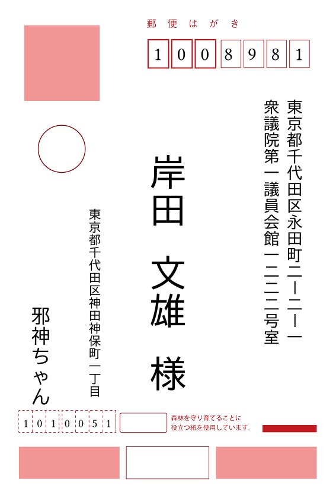

# Typst Hagaki

Typst package for printing address labels on Japanese Hagaki paper.

年賀状などのはがきの宛名印刷用のTypstパッケージです。

## Usage

```typst
#import "@preview/hagaki:0.1.0": hagaki-from-csv

#hagaki-from-csv("jyuusyoroku.csv", 0, 1, 2, 3, debug: true)
```

`jyuusyoroku.csv`: first name, last name, postal code, address

```csv
姓,名,郵便番号,住所
,邪神ちゃん,101-0051,東京都千代田区神田神保町1丁目
岸田,文雄,1008981,東京都千代田区永田町2-2-1 衆議院第1議員会館1222号室
```

Below image is just an example.
Please do not maliciously use this image.


