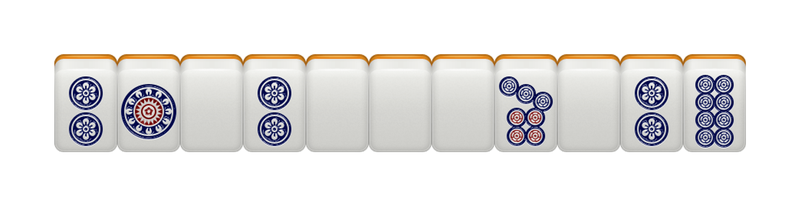

# Typst-Handy-Dora

Handy Dora is a wrapper of [riichi-hand-rs](https://github.com/m4tx/riichi-hand-rs) in Typst, powered by wasm.

## Usage

Start with `#import "@preview/handy-dora:0.1.0": mahjong`.

Parameters:

- `hand`: A string of tiles in the hand.
- `tile-set`: The tile set to use. Default is `"yellow-fluffy-stuff"`. `"red-fluffy-stuff"`, `"black-fluffy-stuff"`, `"martin-persson"` are also available.
- `tile-gap`: The gap between tiles. Default is `0.0`.
- `group-gap`: The gap between groups. Default is `1.0 / 3.0`.
- `..args`: Other arguments to pass to the `image.decode()` fuction.

## Example

- ```typst
  #mahjong("21w2www7w28p", tile-set: "martin-persson", alt: "majhong")
  ```

  

- ```typst
  #mahjong("2312936963s", tile-gap: 0.5, group-gap: 1.0 / 4.0, alt: "majhong")
  ```

  

- ```typst
  #mahjong("2312936963s???", tile-set: "red-fluffy-stuff", alt: "majhong")
  ```

  

- ```typst
  #mahjong("2312936963s???", tile-set: "black-fluffy-stuff", alt: "majhong")
  ```

  

## Credits

- [riichi-hand-rs](https://github.com/m4tx/riichi-hand-rs)
