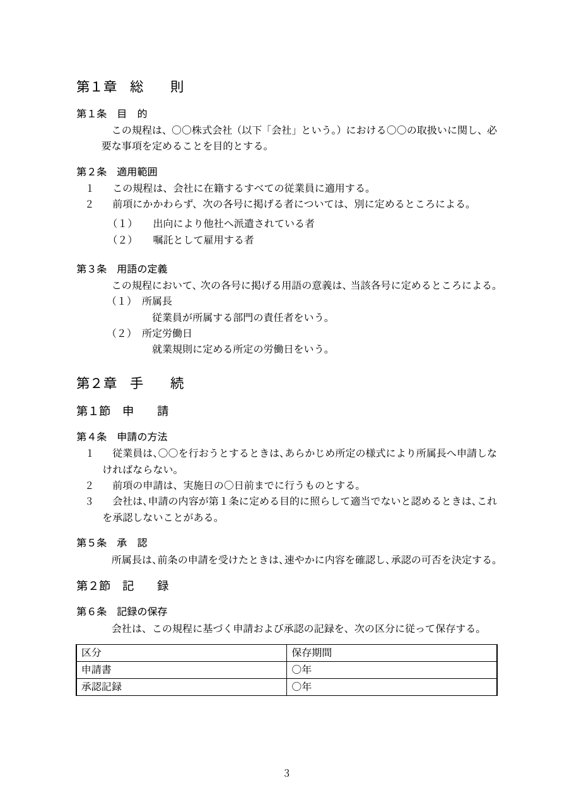
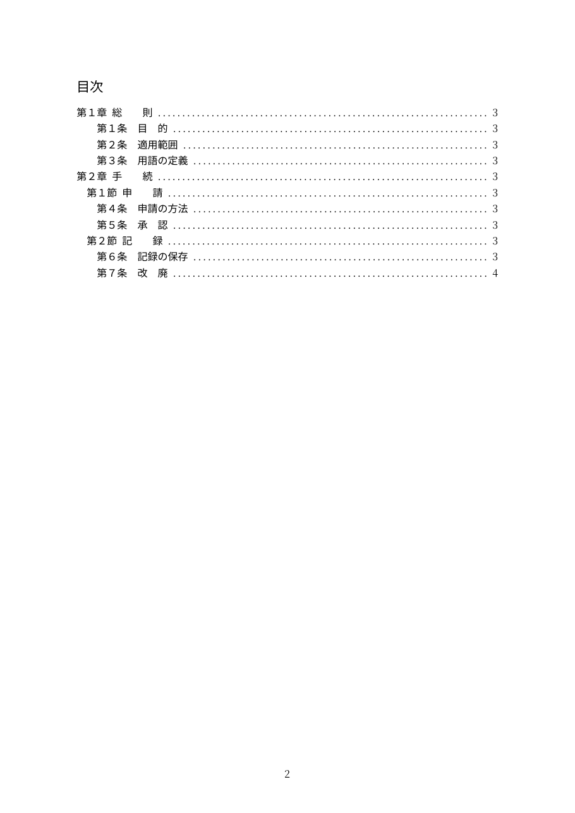

# hanko-kitei

日本語の規程文書を、Typst標準の構造を活かして記述するための小さなパッケージです。
章・節・条・項・号の採番、相互参照、目次を自動化します。

| 文書構造 | 記法 | 表示 |
| --- | --- | --- |
| 章 | `= 総則` | `第１章　総　則` |
| 節 | `== 採用` | `第１節　採　用` |
| 条 | `#article(<目的>)[...]` | `第１条　目　的` |
| 項 | `+ 本文` | `1`、`2`、`3` |
| 号 | 入れ子の `+ 本文` | `（１）`、`（２）` |
| 見出し型の号 | `/ 正社員: 説明` | `（１）正社員` ＋ 説明段落 |
| 参照 | `@目的` | `第１条` |




## テンプレートとして始める

`typst init` で、上の画像と同じ内容の雛形を作成できます。

```sh
typst init @preview/hanko-kitei:0.1.0 my-regulation
```

作成されるのは次の構成です。本文は `rules/` 以下に分けて書きます。

```text
main.typ                 表題・書式設定・各章の取り込み
rules/01-general.typ     総則（条、項、号、見出し型の号）
rules/02-procedure.typ   手続（節、参照、表、改ページ）
```

パッケージとして既存文書へ組み込む場合は、次のように import します。

## 使用例

```typst
#import "@preview/hanko-kitei:0.1.0": article, regulation

#show: regulation.with(title: "就業規則")

= 総則

#article(<目的>)[
  + この規則の目的を定めます。
]

#article(<適用範囲>)[
  + #ref(<目的>)に基づき、適用範囲を定めます。

  + 適用対象は次のとおりとします。
    + 正社員

    + 契約社員
]
```

同梱の example は次のように確認できます。既定フォントを利用環境へ用意してください。

```sh
typst compile examples/basic.typ basic.pdf
```

### 和文の段落は1行で書く

Typst はソースの改行を空白として扱うため、和文の段落を途中で折り返すと、その位置へ
空白が入ります。段落はソース上でも1行に収めてください。

```typst
+ この規程は、○○の取扱いに関し、必要な事項を定めることを目的とする。   // 正しい

+ この規程は、○○の取扱いに関し、
  必要な事項を定めることを目的とする。                                  // 「関し、 必要な」となる
```

## 条

条番号は `article` の**出現順だけ**で決まります。番号を明示する引数はなく、枝番条
（`第96条の2`）にも対応しません。条を挿入しても後続が自動で振り直されます。

第1引数は参照用の安定したラベルです。既定ではラベル名がそのまま条名として表示されます。

```typst
#article(<目的>)[...]                    // 第１条　目　的
#article(<目的>, title: [趣旨])[...]      // 第１条　趣旨
```

`title` は、ラベル名と違う表示名にしたい場合と、後述の自動字間を止めたい場合に使います。

### 2文字題名の字間

2文字の章・節・条名には、表示時に自動で字間が入ります（章・節は全角2字分、条は1字分）。
本文と目次の両方へ適用されます。

**字間を手で書かないでください。** `title: [採 用]` のように空白を入れると自動処理が
働かず、その条だけ字間が狭くなります。字間を入れたくない場合は `title` に2文字を
そのまま渡してください（`title` を指定した時点で自動字間は適用されません）。

対象の文字数は `short-title-length`、字間の量は `short-chapter-gap` /
`short-section-gap` / `short-article-gap` で変更できます。

## 項と号

項と号は標準の `+` 列挙です。入れ子にすると号になります。

- **項が1つだけの条は、その項番号を表示しません**（`omit-single-paragraph-number: false` で変更可）。
- 号は項数にかかわらず `（１）` から採番します。
- 各本文の一行目には全角1字分の字下げが入ります（`paragraph-indent`）。
- 号リストの直後に項が続く場合、境界を示す余白が入ります（`item-group-below`）。

項目間に空きを入れたい場合は、標準の loose list どおり項目の間へ空行を置きます。

## 見出し型の号

「正社員」のように、短い見出しと後続の説明段落を持つ号には標準の用語リストを使います。

```typst
#article(<社員の種類>)[
  + 社員の種類は、次のとおりとする。

  / 正社員: 期間の定めのない労働契約により雇用する者
  / 契約社員: 期間の定めのある労働契約により雇用する者
]
```

`（１）正社員` に続いて説明段落が字下げされて表示されます。採番は**条ごとに1へ戻り**、
目次には掲載されません。通常の短い号には入れ子の `+` を使ってください。

体裁は `described-item-label-width`、`described-item-indent`、`described-item-gap`、
および前後の余白で調整します。

## 参照

参照は標準のラベルと `@ラベル` です。Tinymist のリネーム、参照検索、ラベル補完がそのまま
使え、存在しないラベルは Typst のコンパイルエラーになります。

日本語がラベル名の続きとして解釈される場合があるため、参照の直後へ助詞などを続けるときは
`#ref(<目的>)に` のように参照範囲を明示します。

特定の項への参照は対象外です。

## 目次

章・節・条を自動で掲載します。項・号・見出し型の号は掲載しません。`toc: false` で
目次全体を、`cover: false` で表紙を省略できます。表紙にページ番号は表示しませんが、
ページ数の計上は継続します。

## 書式設定

書式の既定値は `default-config` に集約されています。変更する値だけを
`regulation(config: (...))` へ渡します。辞書は入れ子にせずフラットにしてあります。

```typst
#show: regulation.with(
  title: "就業規則",
  author: "総務部",
  config: (line-spacing: "compact", toc-depth: 2),
)
```

| 分類 | 設定 |
| --- | --- |
| フォント | `body-font`, `heading-font` |
| ページ | `paper`, `page-margin`, `page-numbering`, `page-number-align` |
| 表紙・目次 | `cover`, `toc`, `toc-title`, `toc-depth`, `toc-indent`, `toc-entry-indent`, `toc-column-gap`, `toc-label-gap`, `toc-title-size` |
| 見出し | `title-size`, `chapter-size`, `section-size`, `article-size`, `heading-weight`, `heading-title-gap`, 各 `*-above` / `*-below` |
| 2文字題名 | `short-title-length`, `short-chapter-gap`, `short-section-gap`, `short-article-gap` |
| 本文・列挙 | `body-size`, `body-justify`, `paragraph-indent`, `enum-indent`, `enum-body-indent`, `omit-single-paragraph-number` |
| 行送り | `line-spacing`, `body-leading`, `enum-spacing`, `article-below`, `item-group-below` |
| 見出し型の号 | `described-item-label-width`, `described-item-gap`, `described-item-indent`, `described-item-above`, `described-item-below` |

既定では本文に `Noto Serif CJK JP`、見出しに `Noto Sans CJK JP` を指定します。
フォントは同梱しないため、利用環境で用意してください。

### 行送り

縦方向の間隔は `line-spacing` プリセットで選びます。10.5pt の本文でのベースライン間隔は
次のとおりです。

| プリセット | 間隔 | 本文サイズ比 |
| --- | --- | --- |
| `roomy` | 約18.2pt | 1.73倍 |
| `normal`（既定） | 約16.6pt | 1.58倍 |
| `compact` | 約15.0pt | 1.43倍 |

段落内の折り返しは `body-leading`、項・号・条名などの区切りはブロック間隔
（`enum-spacing`、`article-below`、`described-item-above` / `-below`）が決めます。
この2つが食い違うと、段落内の行より段落どうしが詰まって見えます。プリセットは両者を
揃えるので、選ぶだけで縦のリズムが均一になります。個別の値を `config` に書けば
プリセットより優先されます。

## このパッケージが上書きするTypstの挙動

`regulation` は文書全体へ show ルールを適用します。標準の記法が規程向けの体裁で
描画されるため、次の点に注意してください。

| 対象 | 挙動 |
| --- | --- |
| `enum` | 列挙を再構築し、項・号の採番と一行目字下げを適用します |
| `terms` | **すべての用語リストが `（１）用語` 形式の号になります** |
| `ref` | `article` のラベルへの参照を条番号へ置き換えます。それ以外はTypst標準のままです |
| `heading` | レベル1・2を独自描画し、章・節の採番と2文字題名の字間を適用します |
| `outline.entry` | 見出しの目次項目を独自描画します。図表など見出し以外の outline は変更しません |

別の体裁で使いたい箇所での逃がし方は、要素によって異なります。

列挙は `numbering` を明示すれば、このパッケージの show ルールにマッチしなくなります。

```typst
#[
  #set enum(numbering: "a)")
  + アルファ
  + ベータ
]
```

用語リストは `show terms: it => it` では逃がせません。`terms` 要素のまま返すと、
このパッケージのルールが後から適用されます。`terms` 以外の要素へ変換するか、
`/` 構文を使わずに `grid` などで組んでください。

```typst
#[
  #show terms: it => for entry in it.children [*#entry.term* — #entry.description\ ]
  / 用語A: 説明A
]
```

## 制約

- 1つのコンパイル単位で `regulation` は1回だけ使用します。目次はコンパイル単位全体の
  見出しを検索するため、複数文書の結合には対応しません。2回目の呼び出しはコンパイル
  エラーになります。
- 枝番条および特定項への参照は扱いません。
- サポート対象の公開APIは `regulation`、`article`、`default-config`、
  `line-spacing-presets` です。アンダースコアで始まる名前は内部実装であり、
  互換性の対象外です。

## ライセンス

MIT-0
