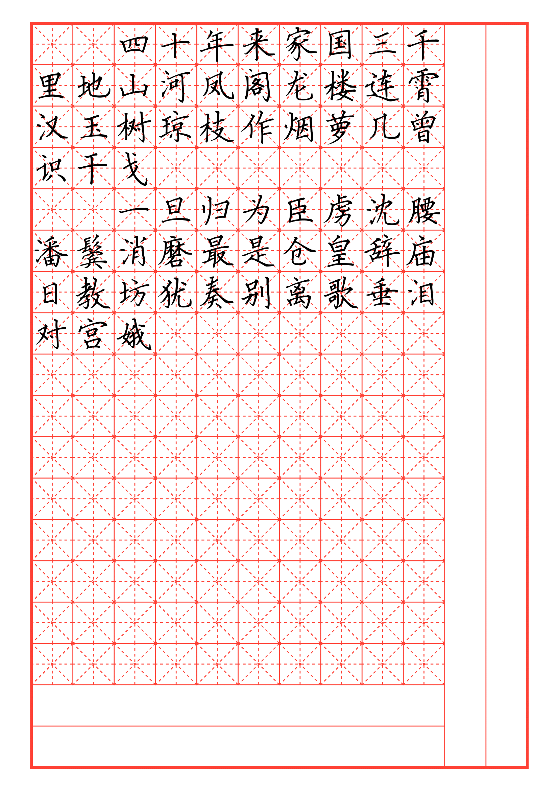
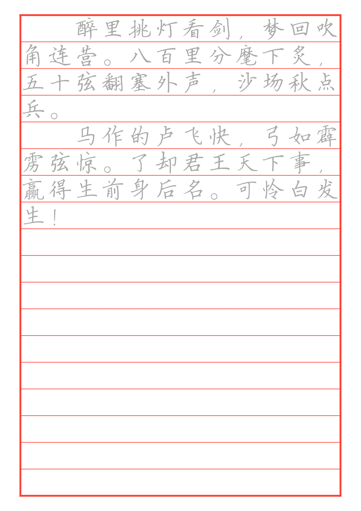
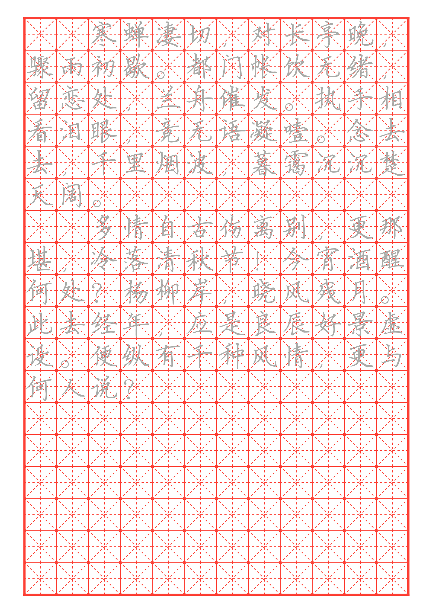

# hanzi-calligraphy





## Overview

This project provides a customizable **calligraphy practice template**, primarily designed for Chinese character (Hanzi) writing exercises. The template features grid-based **Tian Zi Ge** (田字格) layout, allowing users to configure various parameters such as grid size, color, spacing, and blank areas. Additionally, it supports different layout modes and optional tracing to assist in writing practice.

## Features

- **Customizable Grid Layout**

  - Define the number of rows and columns.
  - Adjust grid size and color.
  - Control blank rows and columns for spacing flexibility.
- **Tian Zi Ge Guidelines**

  - Dashed diagonal and center lines for character positioning.
- **Tracing Support**

  - Option to enable gray-colored tracing text for guided practice.

## Usage

Click "Start from template" in the Typst web app and search for hanzi-calligraphy.

Alternatively, run the following command to create a directory initialized with all necessary files:

```
typst init @preview/hanzi-calligraphy:0.1.0
```

### Example Usage

```typst
#calligraphy-work(miao: true)[
  　　四十年来家国三千\
  里地山河凤阁龙楼连霄\
  汉玉树琼枝作烟萝几曾\
  识干戈

  　　一旦归为臣虏沈腰\
  潘鬓消磨最是仓皇辞庙\
  日教坊犹奏别离歌垂泪\
  对宫娥
]
```

## Configuration

| Parameter      | Description                                          | Default Value |
| -------------- | ---------------------------------------------------- | ------------- |
| `cols`       | Number of columns in the grid                        | `12`        |
| `rows`       | Number of rows in the grid                           | `18`        |
| `size`       | Font size of characters                              | `4em`       |
| `color`      | Color of grid lines                                  | `red`       |
| `blank-row`  | Number of blank rows at the bottom                   | `2`         |
| `blank-col`  | Number of blank columns on the right                 | `2`         |
| `type`       | Grid type (`Normal`, `AllH`, `AllV`, `Full`) | `"Normal"`  |
| `showTianZi` | Show or hide Tian Zi Ge guidelines                   | `true`      |
| `miao`       | Enable gray tracing text for practice                | `false`     |

## Layout Modes

1. **Normal (default):**

   - Regular grid with blank spaces.
2. **AllH:**

   - Entire rows left blank for custom writing.
3. **AllV:**

   - Entire columns left blank for flexible layout.
4. **Full:**

   - No blank spaces; fills the entire page.

## License

This project is licensed under the MIT License.
