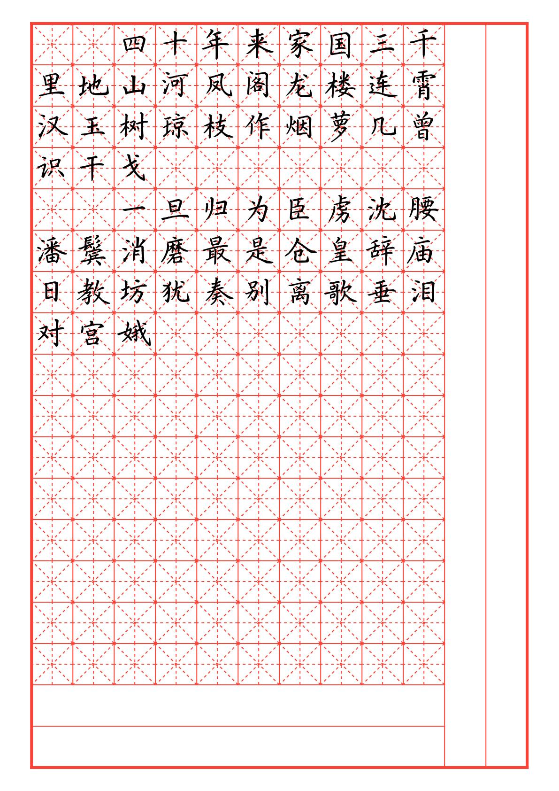
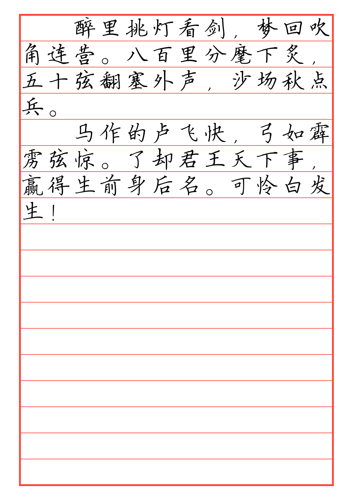
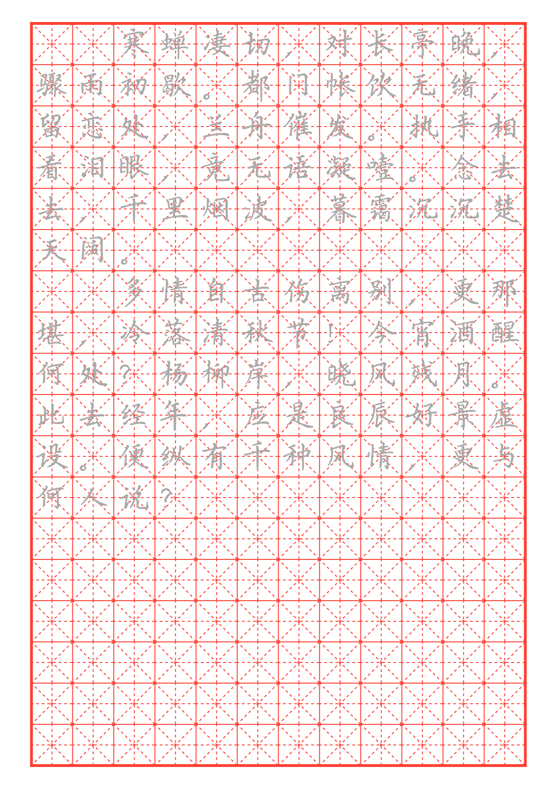
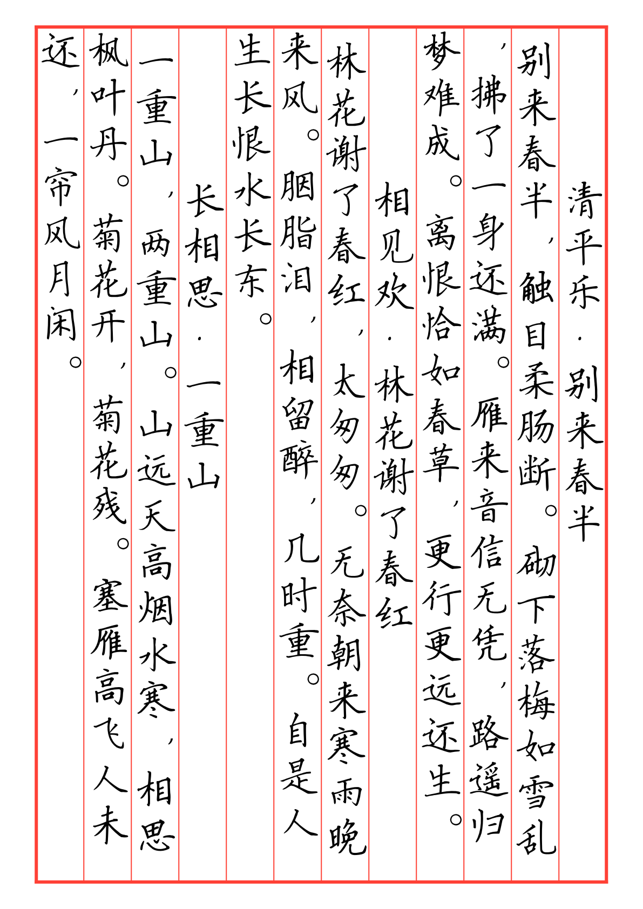
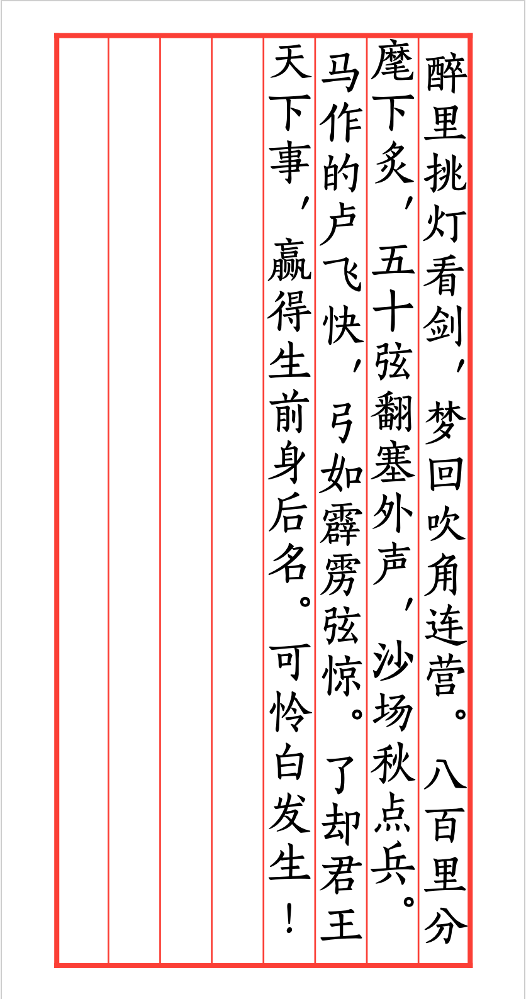
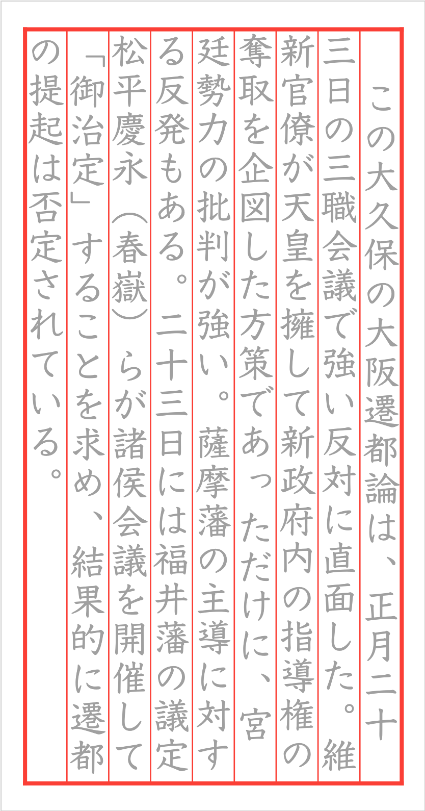

# hanzi-kanji-calligraphy

## Examples

### Horizontal Layout





### RTL Vertical Layout with punctuation (New!)
| Chinese Vertical Text | Japanese Vertical Text |
|:---------------------:|:----------------------:|
|  |  |

## Overview

This project provides a customizable **calligraphy practice template**, designed for Chinese character (Hanzi) and Japanese (Kanji/Kana) writing exercises. The template features grid-based **Tian Zi Ge** (田字格) layout, allowing users to configure various parameters such as grid size, color, spacing, and blank areas. Additionally, it supports different layout modes, optional tracing, and **traditional vertical text layout** with automatic punctuation positioning.

This is an extended version of the original [hanzi-calligraphy](https://github.com/yuegeao/hanzi-calligraphy) package.

## Features

- **Customizable Grid Layout**
  - Define the number of rows and columns.
  - Adjust grid size and color.
  - Control blank rows and columns for spacing flexibility.

- **Tian Zi Ge Guidelines**
  - Dashed diagonal and center lines for character positioning.

- **Tracing Support**
  - Option to enable gray-colored tracing text for guided practice.

- **Traditional Vertical Text Support** *(New)*
  - Right-to-left column flow for traditional Chinese/Japanese text
  - Adjustable column gutter (spacing between columns)
  - Automatic vertical punctuation positioning
  - Japanese small kana (sutegana) support
  - Customizable positioning parameters for different fonts

## Usage

Click "Start from template" in the Typst web app and search for hanzi-calligraphy.

Alternatively, run the following command to create a directory initialized with all necessary files:

```
typst init @preview/hanzi-calligraphy:0.2.0
```

### Example Usage

#### Horizontal Text (Default)

```typst
#import "@preview/hanzi-calligraphy:0.2.0": *

#calligraphy-work(miao: true)[
  四十年来家国三千里地山河凤阁龙楼连霄汉玉树琼枝作烟萝几曾识干戈

  一旦归为臣虏沈腰潘鬓消磨最是仓皇辞庙日教坊犹奏别离歌垂泪对宫娥
]
```

#### Traditional Vertical Text (Right-to-Left)

```typst
#import "@preview/hanzi-calligraphy:0.2.0": *

#set text(dir: rtl)

#calligraphy-work(miao: false, type: "AllV", font: "FZSongKeBenXiuKaiS-R-GB", spacing-rate: 25%, y-rate: 10%, width: 11cm, height: 21cm, cols: 8, blank-col: 0, size: 2.8em, x-rate: 15%, col-gutter: 0.35em)[
醉里挑灯看剑，梦回吹角连营。八百里分麾下炙，五十弦翻塞外声，沙场秋点兵。 #v(18em)

马作的卢飞快，弓如霹雳弦惊。了却君王天下事，赢得生前身后名。可怜白发生！#v(18em)
]
```

#### Japanese Vertical Text

```typst
#import "@preview/hanzi-calligraphy:0.2.0": *
#set text(dir: rtl)

#calligraphy-work(
  type: "AllV",
  font: "YuKyokasho",
  width: 11cm,
  height: 21cm,
  cols: 8,
  col-gutter: 0.35em,
  // Adjust positioning for this font
  open-bracket-dy: 0.3em,
  close-bracket-dy: -0.4em,
)[
この大久保の大阪遷都論は、正月二十三日の三職会議で強い反対に直面した。
]
```

## Configuration

### Basic Parameters

| Parameter | Description | Default Value |
| --- | --- | --- |
| `cols` | Number of columns in the grid | `12` |
| `rows` | Number of rows in the grid | `18` |
| `size` | Font size of characters | `4em` |
| `color` | Color of grid lines | `red` |
| `blank-row` | Number of blank rows at the bottom | `2` |
| `blank-col` | Number of blank columns on the right | `2` |
| `type` | Grid type (`Normal`, `AllH`, `AllV`, `Full`) | `"Normal"` |
| `show-tian-zi` | Show or hide Tian Zi Ge guidelines | `true` |
| `miao` | Enable gray tracing text for practice | `false` |
| `paper` | Paper size (`"a3"`, `"a4"`, `"a5"`, `"iso-b5"`, `"us-letter"`, `"us-legal"`) | `"a4"` |
| `width` | Custom page width (overrides `paper`) | `auto` |
| `height` | Custom page height (overrides `paper`) | `auto` |
| `first-line-indent` | Enable first line indentation | `true` |
| `spacing-rate` | Line spacing adjustment ratio | `29%` |
| `x-rate` | Horizontal offset adjustment ratio | `16%` |
| `y-rate` | Vertical offset adjustment ratio | `26%` |

### New Parameters for Vertical Text

| Parameter | Description | Default Value |
| --- | --- | --- |
| `col-gutter` | Gap between columns (for `AllV` mode) | `0pt` |
| `punc-dx` | Punctuation horizontal offset | `0.1em` |
| `punc-dy` | Punctuation vertical offset | `-0.5em` |
| `open-bracket-dx` | Opening bracket horizontal offset | `0pt` |
| `open-bracket-dy` | Opening bracket vertical offset | `0.2em` |
| `close-bracket-dx` | Closing bracket horizontal offset | `0pt` |
| `close-bracket-dy` | Closing bracket vertical offset | `-0.3em` |
| `sutegana-dx` | Small kana horizontal offset | `0.15em` |
| `sutegana-dy` | Small kana vertical offset | `-0.1em` |
| `sutegana-scale` | Small kana size scale | `0.8` |

## Automatic Vertical Punctuation

In `AllV` mode, punctuation is automatically transformed and positioned for traditional vertical text:

### Punctuation Marks (positioned upper-right)
| Input | Position |
|-------|----------|
| `，` `、` `。` `．` | Upper-right |

### Exclamation & Question Marks (centered)
| Input | Output | Position |
|-------|--------|----------|
| `！` or `!` | `！` | Centered |
| `？` or `?` | `？` | Centered |

### Brackets (automatically converted to vertical forms)

| Opening | Vertical | Position | Closing | Vertical | Position |
|---------|----------|----------|---------|----------|----------|
| `「` | `﹁` | Bottom | `」` | `﹂` | Top |
| `『` | `﹃` | Bottom | `』` | `﹄` | Top |
| `（` | `︵` | Bottom | `）` | `︶` | Top |
| `【` | `︻` | Bottom | `】` | `︼` | Top |
| `〈` | `︿` | Bottom | `〉` | `﹀` | Top |
| `《` | `︽` | Bottom | `》` | `︾` | Top |

### Japanese Small Kana (Sutegana)

Small hiragana and katakana are automatically positioned for vertical text:

- **Hiragana:** `っ` `ゃ` `ゅ` `ょ` `ぁ` `ぃ` `ぅ` `ぇ` `ぉ`
- **Katakana:** `ッ` `ャ` `ュ` `ョ` `ァ` `ィ` `ゥ` `ェ` `ォ`

## Font Alignment

When using a custom font, the characters might not align perfectly within the grid. You can adjust the alignment using `y-rate` and `spacing-rate`:

1. **Adjust `y-rate`**: Modify this value to align the **first line** of text vertically within the grid cells.
2. **Adjust `spacing-rate`**: Once the first line is aligned, modify this value to ensure **subsequent lines** align correctly. This controls the line spacing.

### Font-Specific Punctuation Positioning

Different fonts have different glyph positioning. If brackets or punctuation don't align well with your chosen font, adjust the positioning parameters:

```typst
#calligraphy-work(
  font: "Your-Font-Name",
  open-bracket-dy: 0.3em,   // Adjust as needed
  close-bracket-dy: -0.4em, // Adjust as needed
  punc-dx: 0.15em,          // Adjust as needed
  ...
)[...]
```

## Layout Modes

1. **Normal (default):**
   - Regular grid with blank spaces.
   - Text automatically wraps to avoid blank columns and rows.

2. **AllH:**
   - Entire rows left blank for custom writing.

3. **AllV:**
   - Entire columns left blank for flexible layout.
   - **Vertical writing**: Text is arranged vertically (one character per line) in this mode.
   - Add `#set text(dir: rtl)` before for traditional right-to-left column flow.
   - Automatic punctuation positioning for CJK text.

4. **Full:**
   - No blank spaces; fills the entire page.

## Tips

### Right-to-Left Vertical Text

For traditional Chinese/Japanese vertical text that reads right-to-left:

```typst
#set text(dir: rtl)
```

### Column Breaks

To create blank columns or force a new column:

```typst
#colbreak()  // Move to next column
#colbreak()  // Create a blank column (use twice for one blank)
```

### Vertical Spacing Within a Column

Use `#v()` to add vertical space within a column:

```typst
#v(1em)Title#v(18em)  // Space before and after title
```

## License

This project is licensed under the MIT License.
