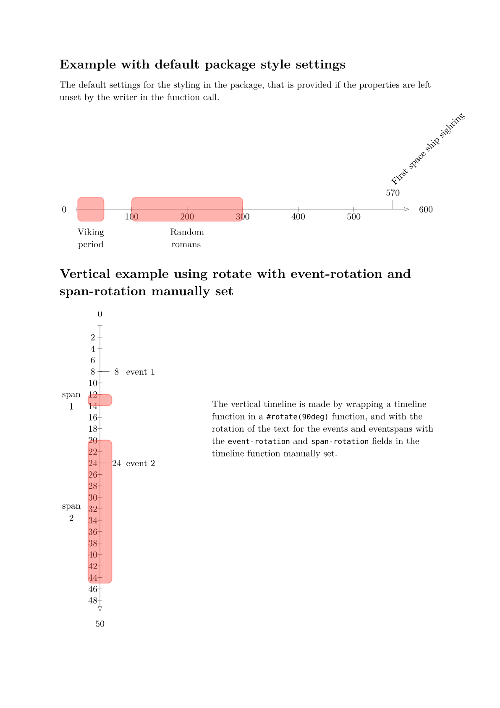
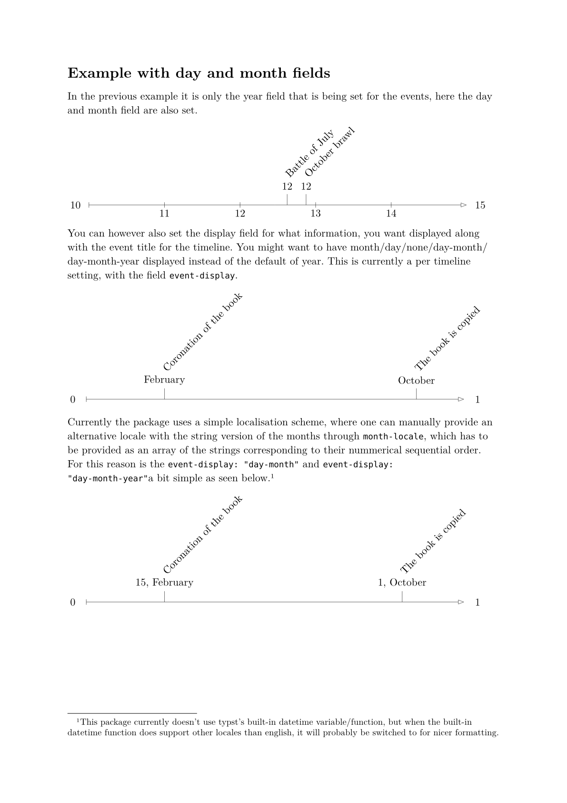
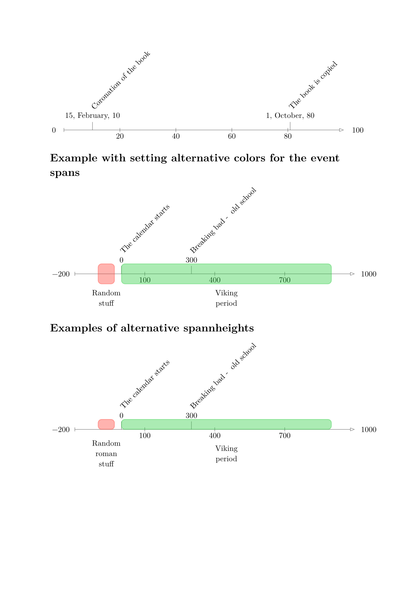
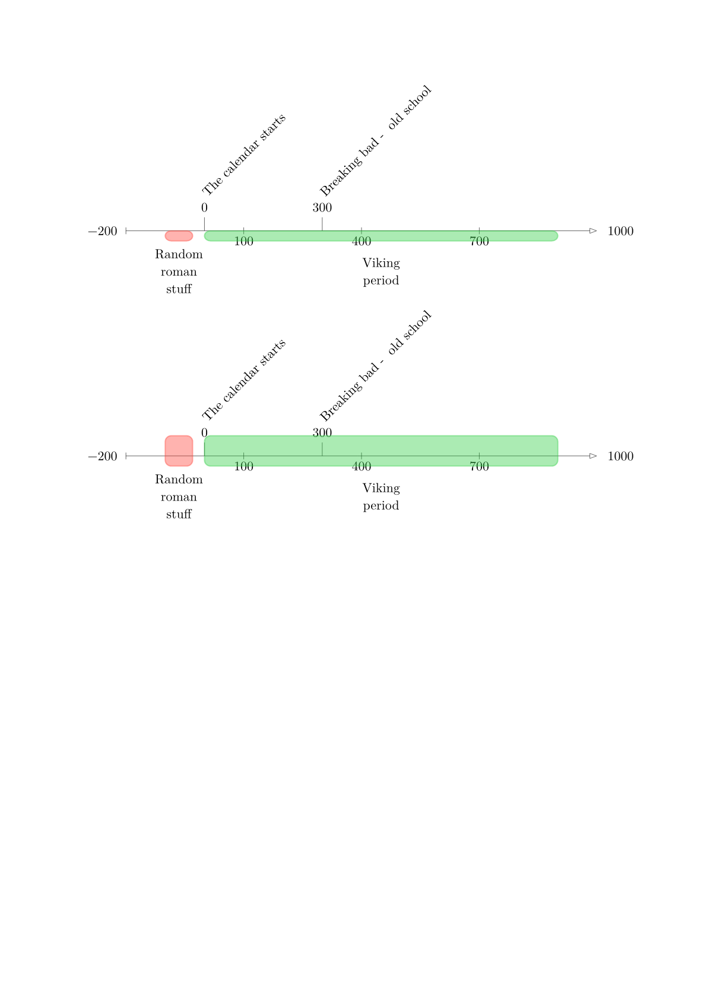

# A timeline typst package

This package uses [cetz](https://typst.app/universe/package/cetz) to
provide a interface in typst for making timelines, inspired
by the latex [`chronology`](https://ctan.org/pkg/chronology) package.

It provides the following to work with timelines.
- A event and eventspan object for grouping data
  you want displayed on the timeline.
- The timeline function itself. 

For getting started quickly add the following to your document:

```typst
#import "@preview/herodot:0.3.0" : * 

```

See the visual examples below and some examples at the end for what
fields and options the package has.






## Example

A basic example of using the timeline with the event and eventspan
constructor without setting any of the optional style settings.

```typst

#import "@preview/herodot:0.3.0" : * 

#let scifi-time = timeline(
  interval: 200,
  startyear: -200,
  endyear: 1000,
  events: (
  
    // basic event with only title and year
    event(
      title: "Alien invasion",
      year: 0
    ),

    // event with title and the exact date
    event(
      title: "First alien-human marriage",
      year: 40,
      month: 3,
      day: 20,
    ) 
  ),
  eventspans: (
    eventspan(
      title: "Climate collaps",
      start-point: -100,
      end-point: -30
    ),
    eventspan(
      title: "Integration of Earth into galatic commerce",
      start-point: 10,
      end-point: 70
    ),
  ),
)

#scifi-time

```


# Properties/fields

The settable properties for customizing the look
of the timeline. Visual examples can be seen in
the [example.pdf](examples/example.pdf)

## event

The base obligatory settings for event is the year and title.

| Property  | Description |
| -------   | ----------- |
| title     | The title of the event, as a string   |
| year      | The year of the event, as an integer  |

Herodot however also has support for setting exact date of the
event with the month and day fields.

| Property  | Description |
| -------   | ----------- |
| month     | The month represented as an integer (1-12) |
| day       | The day as an integer (1-31)  |

## eventspan

Obligatory fields for an eventspan.

| Property    | Description |
| -------     | ----------- |
| title       | Title of the event |
| start-point | It's starting point as an integer |
| end-point   | It's end-point as an integer |

See the optional styling properties for location
and color setting of the eventspan under timeline.

## timeline
| Property  | Description |
| -------   | ----------- |
| startyear | The start year for the timeline, can be a postive or negative integer |
| endyear   | The last year of the timeline, can also be either a positive or negative integer |
| interval  | Interval between years to be marked on the timeline |
| events    | Array of events to put on the timeline |
| eventspans | Array of eventspans to put on the timeline |
| event-rotation | The rotation of the text title of events (default: 45deg)|
| span-rotation | The rotation of the text title of eventspans (default: 0deg)|
| event-display | The date information displayed along the event title, the default is year, but i can be either one of day/month/year/day-month, day-month-year or none. |
| month-locale | The string locale of the months to be used to display it, by default english, but an array of strings can be manually passed to override it and used alternatively. |

| Optional styling properties | Description |
| ------                      | ------      |
| length-of-timeline          | Length of timeline in cm |
| linestroke                  | The width and color of the lines making up the timeline |
| spanheight                  | height/width of the eventspan (the same distance on both sides of the timeline) |  
| spanheight-positive-y       | Alternative height/width of the eventspan above the timeline (allows for alternative heights between the distance above and below the timeline) |  
| spanheight-negative-y       | Alternative height/width of the eventspan below the timeline (allows for alternative heights between the distance above and below the timeline) |  

