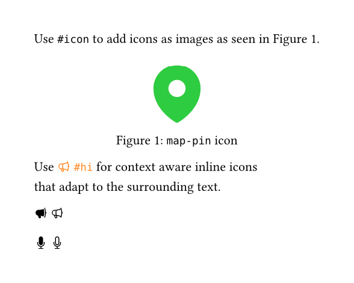

# heroic (v0.1.0)

Use [Heroicons](https://heroicons.com/) in Typst.

## Usage

Import the package and use either the `#icon` or `#hi` commands.

```typst
#import "@preview/heroic:0.1.0": icon, hi

Use `#icon` to add icons as images as seen in @map-pin-icon.
#figure(
  icon("map-pin", height: 2cm, color: green),
  caption: [`map-pin` icon],
) <map-pin-icon>

Use #text(fill: orange)[#hi("megaphone", solid: false) `#hi`] for context aware inline icons\
that adapt to the surrounding text.
```



## Commands

Both commands use the same arguments:

- **name** (`str`): Name of the icon.
- **color** (`color` | `auto`): Color of the icon (default: `auto`).
- **height** (`length`): Height of the icon (default: `1em`).
- **solid** (`boolean`): If the icon should be filled with a solid color or outlined (default: `true`).

`#hi` also takes additional arguments:

- **baseline** (`length`): Baseline of the icon.
