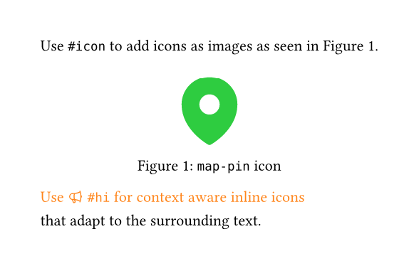

# heroic (v0.1.1)

Use [Heroicons](https://heroicons.com/) (v2.2.0) in Typst.

Compared to other icon packages `heroic` can be used without the need to install 
any icon fonts and works out of the box with bundled SVG files.

## Usage

Import the package and use either the `#icon` or `#hi` commands.

```typst
#import "@preview/heroic:0.1.1": icon, hi

Use `#icon` to add icons as images as seen in @map-pin-icon.
#figure(
  icon("map-pin", height: 2cm, color: green),
  caption: [`map-pin` icon],
) <map-pin-icon>

#text(fill: orange)[Use #hi("megaphone", solid: false) `#hi` for context aware inline icons]\
that adapt to the surrounding text.
```



## Commands

Both commands use the same arguments:

- **name** (`str`): Name of the icon.
- **color** (`color` | `auto`): Color of the icon (default: `auto`).
- **height** (`length`): Height of the icon (default: `1em`).
- **solid** (`boolean`): If the icon should be filled with a solid color or outlined (default: `true`).

`#hi` also takes additional arguments:

- **baseline** (`length`): Baseline of the icon.

## Development

### Bundling Heroicons

To update the icon files to a new version, run the `bundle.py` script from the `scripts` folder:
```sh
python3 scripts/bundle.py <release_version>
```

## Changelog

- Vesion 0.1.1 (2025-12-23)
	- Updated Heroicons to 2.2.0.
	- Improved `scripts/bundler.py` script to download and bundle new Heroicon versions.
	- Added auto-generated `src/icon-index.txt` instead of fixed list of icon names.
	- Added parameter `columns` for `#list-icons`.

- Version 0.1.0 (2025-05-15)
	- Initial release.
