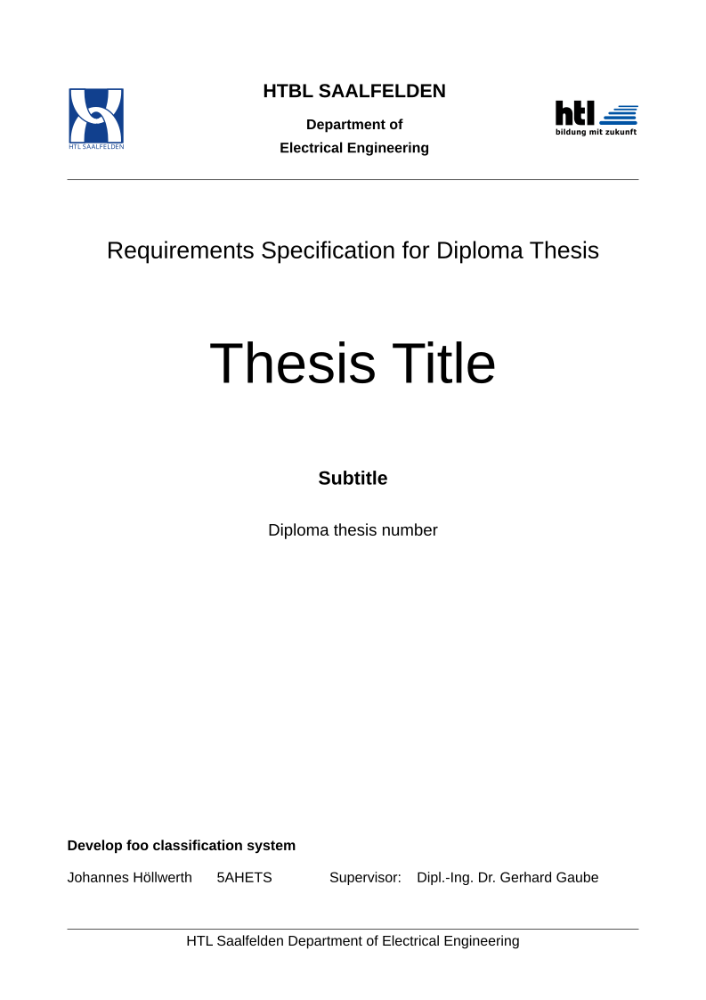

# HTL Saalfelden Thesis Requirements Template

A Typst template for creating thesis requirements specifications (Pflichtenheft) for HTL Saalfelden diploma theses. Supports German and English.

## Getting Started

See [PDF-manual](./docs/manual.pdf)

Import the template from the Typst Universe preview:

```json
{
  "title": "Thesis Title",
  "subtitle": "Subtitle",
  "lang": "en",
  "school-year": "2026/27",
  "class": "5AHETS",
  "department": "Electrical Engineering",
  "authors": "Johannes Höllwerth",
  "candidates": [
    {
      "name": "Johannes Höllwerth",
      "class": "5AHETS",
      "task": "Develop foo classification system"
    } 
  ],
  "supervisors": [
    {
      "title": "Dipl.-Ing. Dr.",
      "name": "Gerhard Gaube"
    }
  ],
  "due_date": "15.04.2027"
}
```

```typ
#import "@preview/htl-saalfelden-thesis-requirements:0.1.4": htl-doc

#show: htl-doc.with(json("requirements.json"))
```

<picture>
  <source media="(prefers-color-scheme: dark)" srcset="./thumbnail-dark.svg">
  
</picture>

## Installation

Use Typst's package manager: `@preview/htl-saalfelden-thesis-requirements`. No local installation needed for the web app.

## Usage

See the included manual (`docs/manual.pdf`) for detailed usage instructions and all available parameters.
