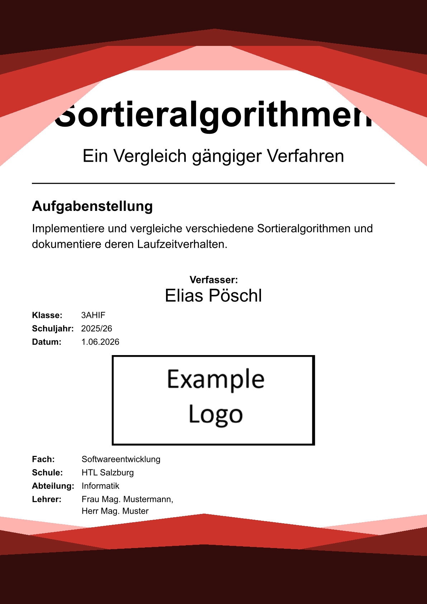
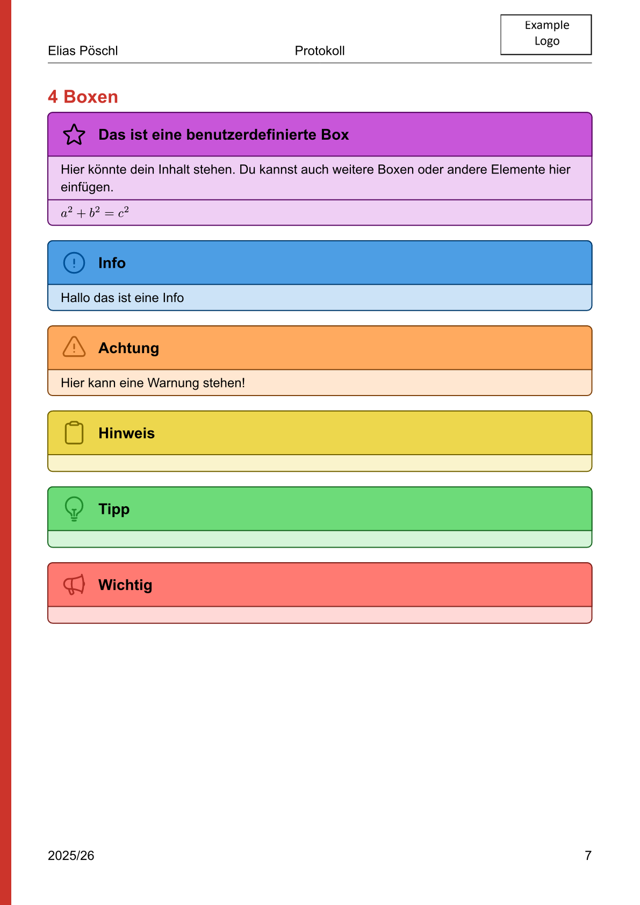
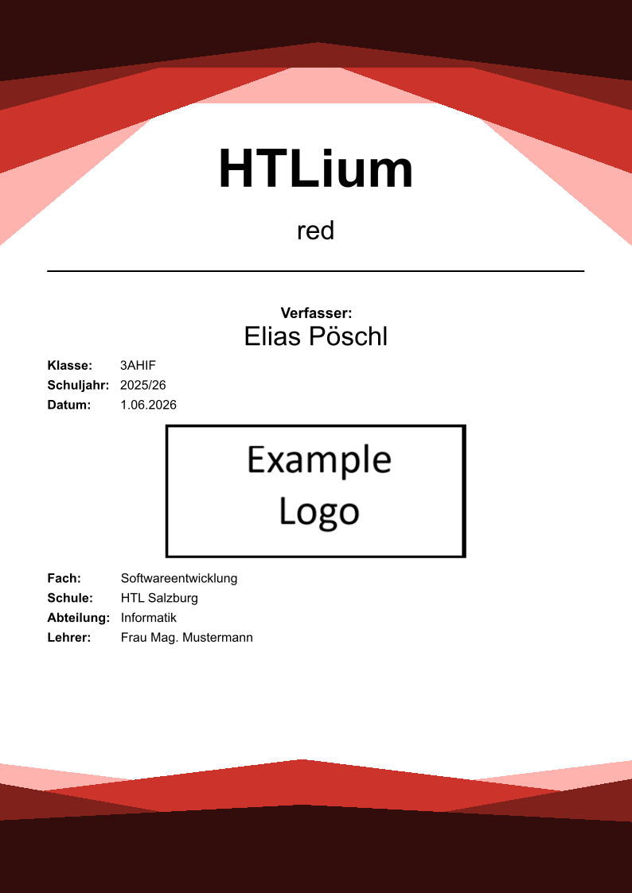
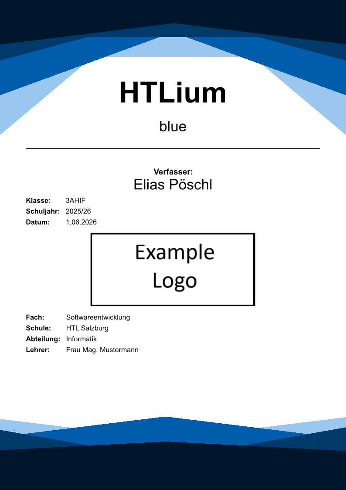
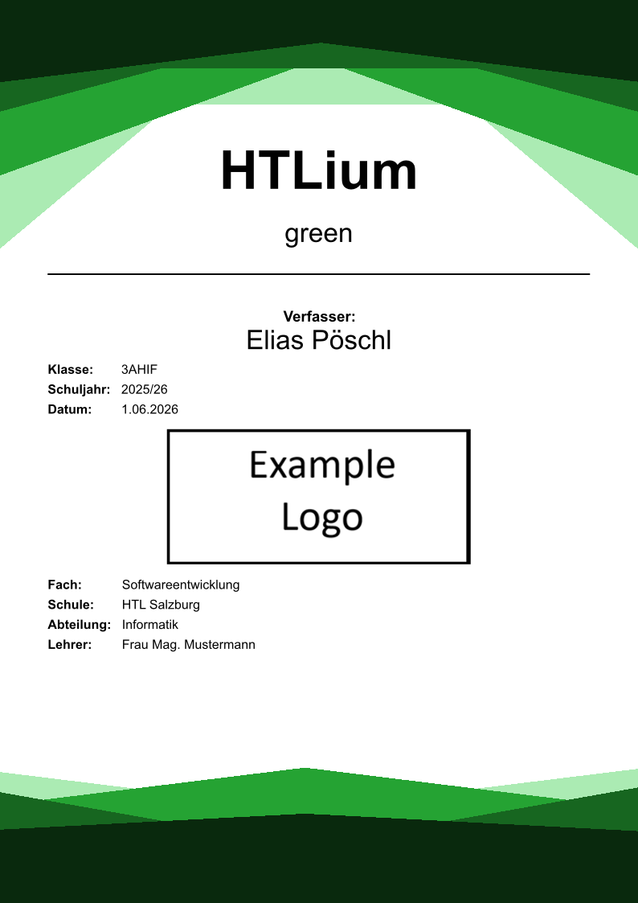
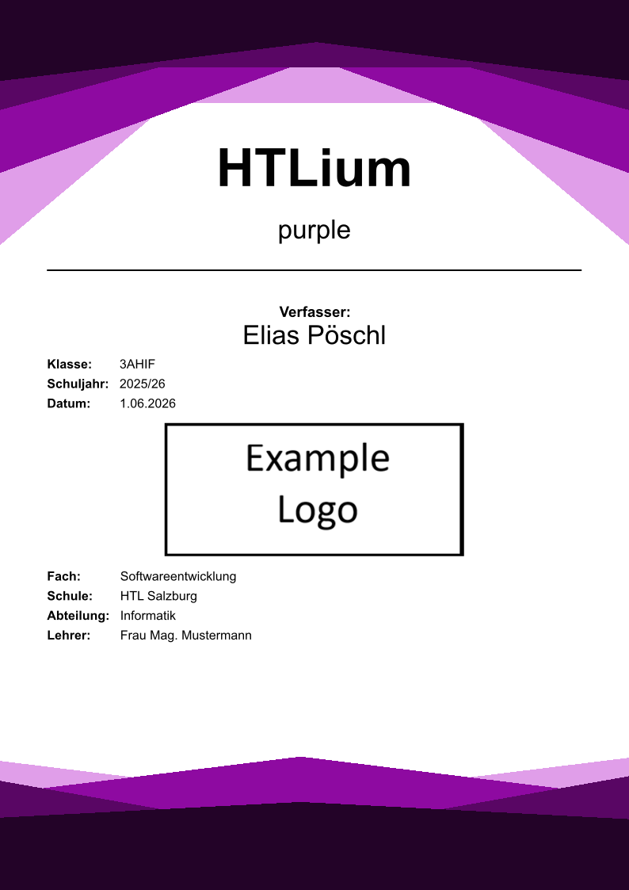
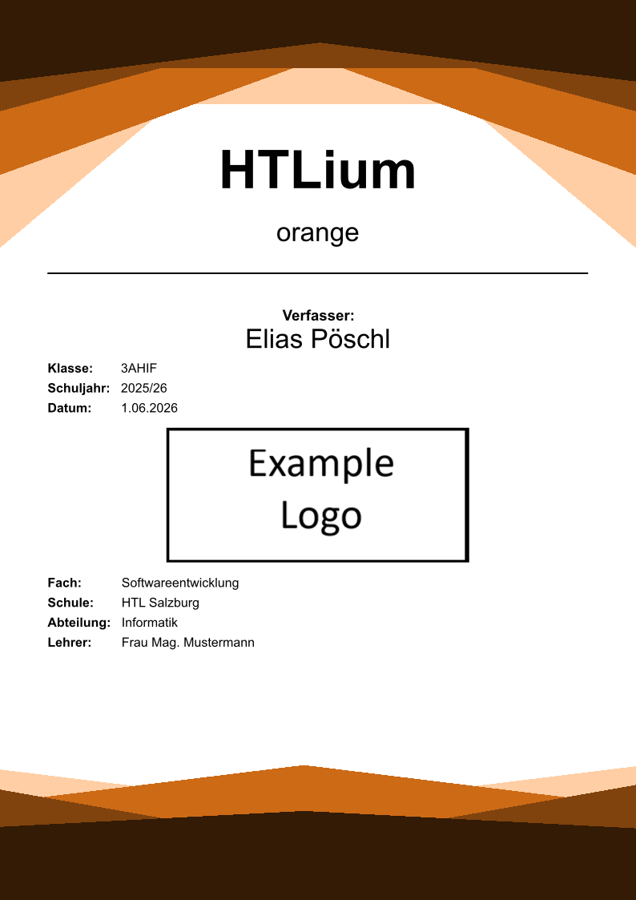
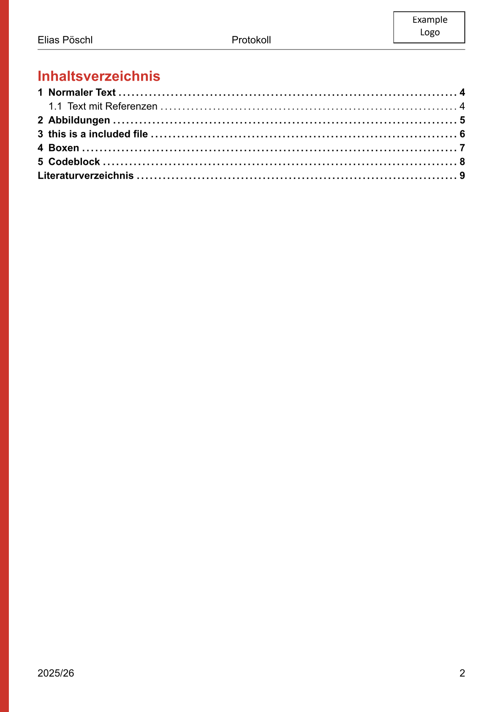
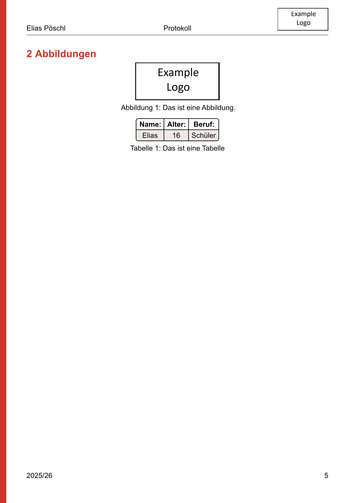

<h3 align="center">📘 HTLium</h3>

<p align="center">
  A clean, modern <a href="https://typst.app/docs/">Typst</a> template for school protocols and reports.<br>
  Built for the HTL Salzburg — adaptable to any school or course.
</p>

<p align="center">
  
  
  
</p>

<p align="center">
  
  
</p>

---

## ✨ Features

- 🎨 **Eye-catching cover page** with a geometric, color-themed design that you can switch off with a single flag.
- 🌈 **Any color scheme** — pass any Typst color and the whole document (headings, accents, tables, cover) adapts.
- 🌍 **Bilingual** — built-in German (`de`) and English (`en`) labels for the cover, outlines and bibliography.
- 📑 **Automatic front matter** — table of contents, list of figures, list of tables and an IEEE bibliography, each toggleable.
- 💬 **Ready-made callout boxes** — info, warning, note, tip and important, plus a fully custom box.
- 🎯 **Styled tables & code** — striped, rounded tables out of the box and syntax highlighting via [`codly`](https://typst.app/universe/package/codly).
- 🖼️ **Custom logo & header** — drop in your school logo; it appears on the cover and in the running header.

## 🚀 Quick start

Create a new project from the template:

```sh
typst init @preview/htlium:1.6.0
```

Or import it into an existing document:

```typ
#import "@preview/htlium:1.6.0": *

#show: body => template(
  body,
  author: "Your Name",
  title: "Sorting Algorithms",
  subtitle: "A comparison of common approaches",
  logo: image("logo.png"),
  class: "3AHIF",
  subject: "Software Engineering",
  school: "HTL Salzburg",
  department: "Computer Science",
)

= My first heading
#lorem(40)
```

Sensible defaults are set for every option, so the template compiles even with no arguments — but you'll want to fill in your own details.

## ⚙️ Configuration

`template` accepts the following named arguments:

| Argument           | Type           | Default              | Description                                            |
| ------------------ | -------------- | -------------------- | ------------------------------------------------------ |
| `lang`             | `str`          | `"de"`               | Document language — `"de"` or `"en"` for labels.       |
| `color-scheme`     | `color`        | `red`                | Accent color applied across the whole document.        |
| `author`           | `str`          | `"Your Name"`        | Full name of the author.                               |
| `title`            | `str`          | `"Title"`            | Main title on the cover page.                          |
| `subtitle`         | `str`          | `"Subtitle"`         | Subtitle shown beneath the title.                      |
| `class-long`       | `str`          | `"Protokoll"`        | Centered text in the running header.                   |
| `logo`             | `image`        | —                    | Your logo, e.g. `image("logo.png")`. Use `none` to omit. |
| `school-year`      | `str`          | `"2025/26"`          | School year, shown on the cover and in the footer.     |
| `task-title`       | `str`          | `"Task Title"`       | Heading of the assignment/task block.                  |
| `task-content`     | `str`          | `"Task Content"`     | Description of the assignment/task.                    |
| `class`            | `str`          | `"Class"`            | Your school class.                                     |
| `date`             | `str`          | today                | Date of the protocol.                                  |
| `subject`          | `str`          | `"Subject"`          | School subject.                                        |
| `school`           | `str`          | `"School"`           | School name.                                           |
| `department`       | `str`          | `"Department"`       | Department / branch.                                   |
| `teachers`         | `array(str)`   | sample names         | List of teachers, e.g. `("Ms. Smith", "Mr. Doe")`.     |
| `do-lof`           | `bool`         | `true`               | Include a list of figures.                             |
| `do-lot`           | `bool`         | `true`               | Include a list of tables.                              |
| `do-bib`           | `bool`         | `true`               | Include a bibliography.                                |
| `bib-src`          | `str` (path)   | `"refs.bib"`         | Path to your bibliography file.                        |
| `fancy-design`     | `bool`         | `true`               | Toggle the decorative cover graphics & header bar.     |
| `before-logo-info` | `array`        | `()`                 | Extra cover rows shown *above* the logo.               |
| `after-logo-info`  | `array`        | `()`                 | Extra cover rows shown *below* the logo.               |

## 🌈 Color schemes

The `color-scheme` argument accepts **any** Typst [color](https://typst.app/docs/reference/visualize/color/) and re-themes the entire document — cover graphics, headings, accent bar, and table striping all follow it. Pass a built-in color, build one with `rgb("#...")`, or use any color expression.

```typ
#show: body => template(body, color-scheme: blue)
```

| `red` *(default)* | `blue` | `green` |
| :---: | :---: | :---: |
|  |  |  |
| **`purple`** | **`orange`** | **`teal`** |
|  |  |  |

> Want a school-branded look? Try a custom color such as `color-scheme: rgb("#0a5c36")`.

## 💬 Callout boxes

The template ships with a set of ready-to-use callouts:

```typ
#info-box([Helpful background information.])
#warning-box([Watch out for this!])
#note-box([A small note.])
#tip-box([A handy tip.])
#important-box([Don't miss this.])
```

Need your own? Build one with `custom-box`:

```typ
#custom-box(
  icon("star", solid: false),  // any heroic icon, or none
  purple,                      // the box color
  "My custom box",             // the title
  [Your content goes here.],   // one or more content blocks
  [$a^2 + b^2 = c^2$],
)
```

<p align="center">
  
</p>

## 🖼️ Gallery

| Cover | Contents | Figures & tables |
| :---: | :---: | :---: |
|  |  |  |

> The full example lives in [`example/main.typ`](example/main.typ). Compile it yourself with:
>
> ```sh
> typst compile --root . example/main.typ "example/preview-{p}.png"
> ```

## 📦 Local installation

To use the template without publishing it, copy all files into your Typst local
package directory:

```text
~/AppData/Local/typst/packages/local/htlium/1.6.0/   # Windows
~/.local/share/typst/packages/local/htlium/1.6.0/    # Linux
~/Library/Application Support/typst/packages/local/htlium/1.6.0/  # macOS
```

Then import it with the `@local` namespace:

```typ
#import "@local/htlium:1.6.0": *
#show: body => template(body)
```

## 📚 Resources

- [Typst documentation](https://typst.app/docs/)
- [Typst compiler download](https://typst.app/open-source/)
- [Typst Universe](https://typst.app/universe/)

## 📄 License

Released under the [MIT License](LICENSE) © 2026 Elias Pöschl.
