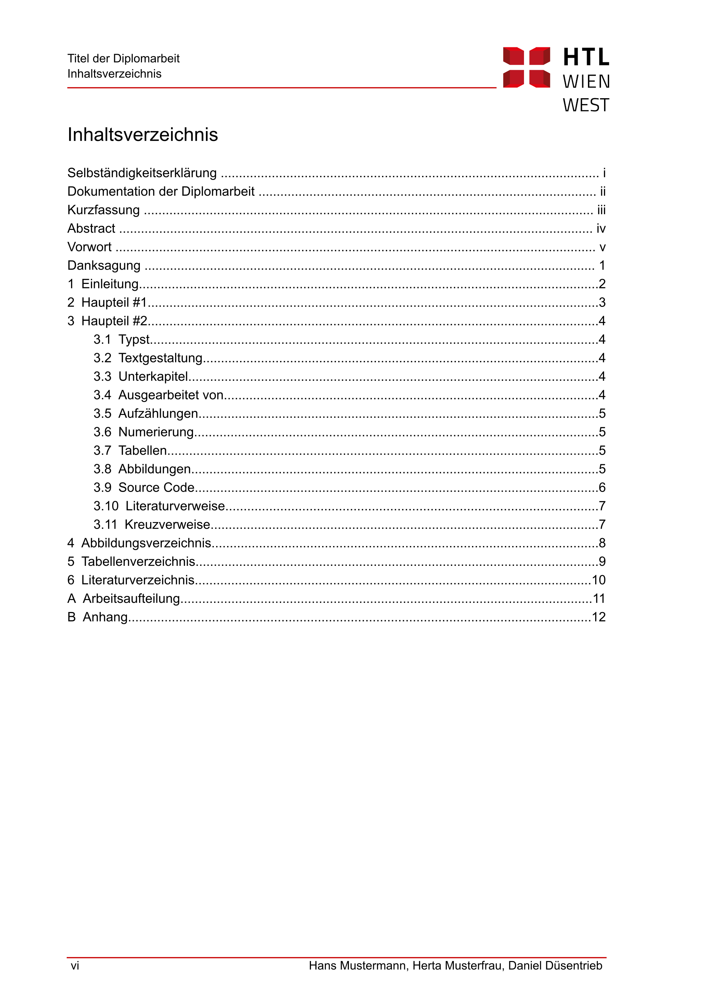
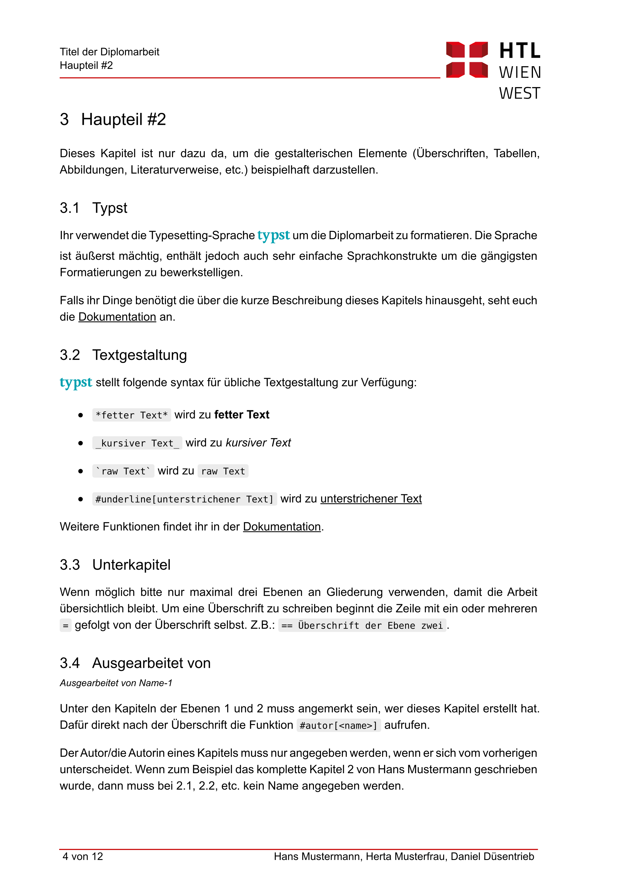
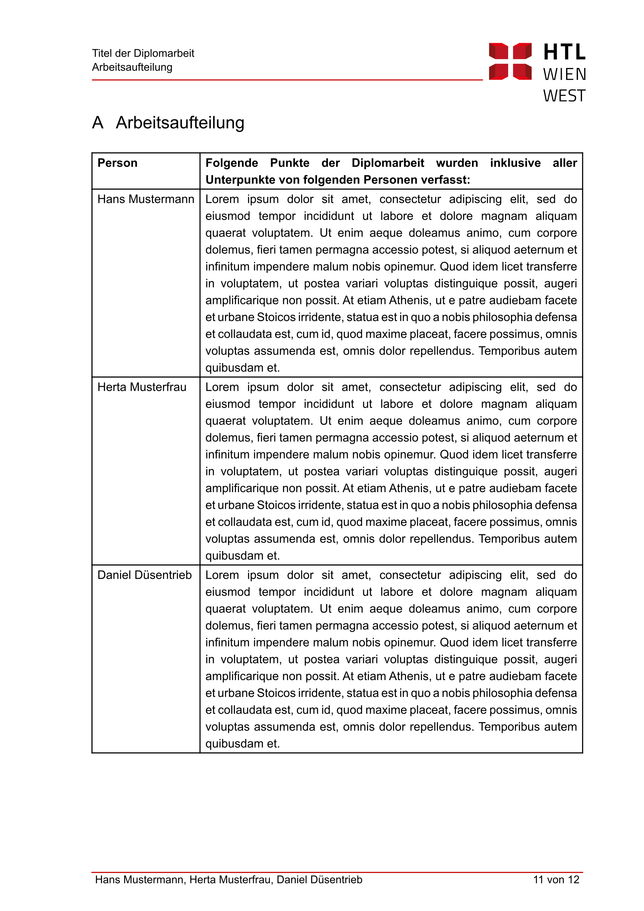

# HTL Wien West Diploma Thesis

This is a Typst diploma thesis template for students of the HTL Wien West. It fulfils all the necessary requirements for the diploma thesis.

|  | |  |  |
| -- | -- | -- | -- |
|  |  |  |  |

## Usage
You can use this template in the Typst web app by clicking "Start from template" on the dashboard and searching for `htlwienwest-da`.

Alternatively, you can use the CLI to kick this project off using the command
```
typst init @preview/htlwienwest-da
```

Typst will create a new directory with all the files needed to get you started.

## Configuration
This template exports the `diplomarbeit` function with the following named arguments:

 - `titel`: `string` - The title of the thesis
 - `schuljahr`: `string` - The current school year
 - `abteilung`: `string` - The student's department
 - `unterschrifts-datum`: `string` - The submission date
 - `autoren`: `array(dict)` - An array of all authors, represented as dictionaries. Each of them has the following properties
    - `vorname`: `string` - Firstname of the student
    - `nachname`: `string` - Lastname of the student
    - `klasse`: `string` - School class of the student
    - `betreuer`: `dict` - The student's advisor as dictionary
      - `name`: `string | content` - The advisor's name
      - `geschlecht`: `"male" | "female"` - Gender of advisor for correct gendering
    - `aufgaben`: `content` - The student's responsibilities
 - `kurzfassung`: `content` - Abstract in german as content block
 - `abstract`: `content` - Abstract in english as content block
 - `vorwort`: `content` - The thesis' preface
 - `danksagung`: `content` - Acknowledgement
 - `anhang`: `content | none` - Appendix
 - `literaturverzeichnis`: `function` - The bibliography prefilled with the BibTex file path

The function also accepts a single, positional argument for the body of the paper.

The template will initialize your package with a sample call to the `diplomarbeit`function in a show rule. If you want to change an existing project to use thistemplate, you can add a show rule like this at the top of your file:

```typ
#import "@preview/htlwienwest-da:0.1.0": *

#show: diplomarbeit.with(
  titel: "Titel der Diplomarbeit",
  abteilung: "Informationstechnologie",
  schuljahr: "2023/24",
  unterschrifts-datum: "20.04.2024",
  autoren: (
   (
     vorname: "Hans", nachname: "Mustermann",
     klasse: "5AHITN",
     betreuer: (name: "Dr. Walter Turbo", geschlecht: "male"),
     aufgaben: [
       #lorem(100)
     ]
   ),
   (
     vorname: "Herta", nachname: "Musterfrau",
     klasse: "5AHITN",
     betreuer: (name: "Dipl.-Ing Maria Kreisel", geschlecht: "female"),
     aufgaben: [
       #lorem(100)
     ]
   ),
  kurzfassung: [
    Die Kurzfassung muss die folgenden Inhalte darlegen (§8, Absatz 5 Prüfungsordnung): Thema, Fragestellung, Problemformulierung, wesentliche Ergebnisse. Sie soll einen prägnanten Überblick über die Arbeit geben.
  ],
  abstract: [
    Englische Version der Kurzfassung (siehe #link(<Kurzfassung>)[_Kurzfassung_])
  ],
  vorwort: [
    Perönlicher Zugang zum Thema. Gründe für die Themenwahl.
  ],
  danksagung: [
    Dank an Personen, die bei der Erstellung der Arbeit unterstützt haben.
  ],
  anhang: include "anhang.typ", // entfernen falls nicht benötigt
  literaturverzeichnis: bibliography.with("literaturverzeichnis.bib")
)

// Your content goes below.
```

## Provided Functions

Beside the `diplomarbeit` function, the template also provides the `autor` function that is used after a heading to indicate the specific author of the current section.

```
== Some Heading
#autor[Your Name]
```

This will render additional information to the section's heading.


# Installing

To install the template locally, you can use 
```bash
just install
```
which uses the [just](https://github.com/casey/just) command runner. 

If you don't want to install `just`, you can run 
```bash
bash ./scripts/package @local
```


The installed version can be used via `@local` instead of `@preview`. To create a new typst project from the template, run
```bash
typst init @local/htlwienwest-da:<version-in-typst.toml>
```
