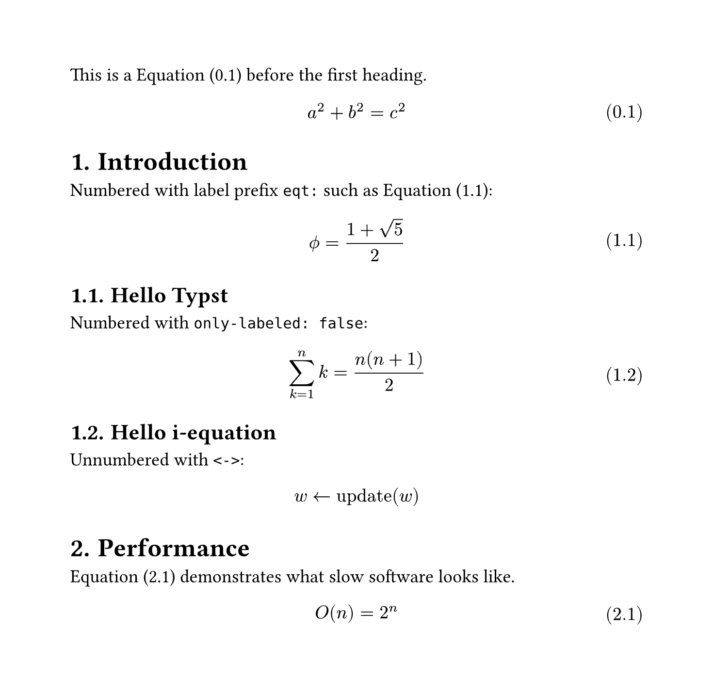
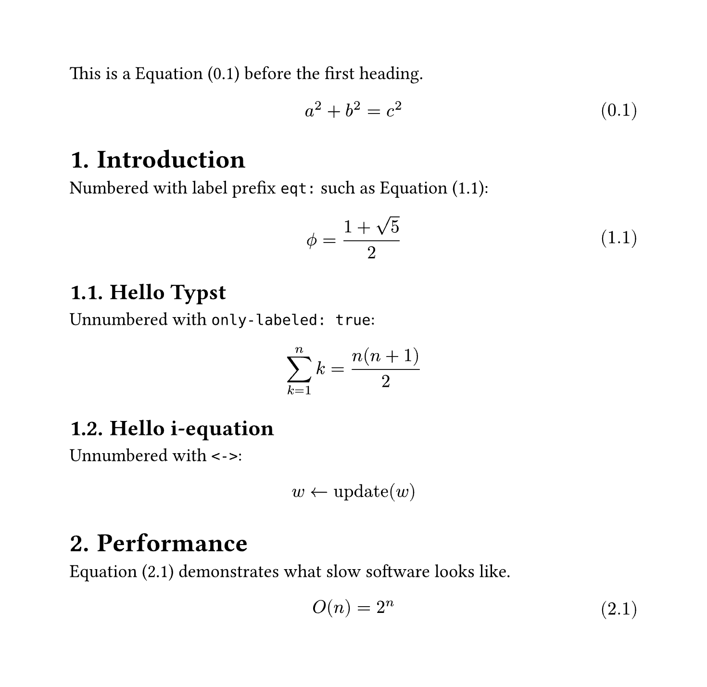

# I equation

Configurable math equation numbering per section.

## Examples

### Basic

Have a look at the source [here](./examples/basic.typ).



### Only numbering labeled

Have a look at the source [here](./examples/only-labeled.typ).



### Two levels deep

Have a look at the source [here](./examples/level-two.typ).


## Usage

The package mainly consists of two customizable show rules, which set up all the
numbering for equations.

Because the [`show-equation()`](#show-equation) function must internally create
another equation element, attached labels cannot directly be used for references.
To circumvent this, a new label is attached to the internal equation, with the
same name but prefixed with `eqt:`. This new label can be used for referencing without problems.

```typ
// import the package
#import "@preview/i-equation:0.1.0"

// make sure you have some heading numbering set
#set heading(numbering: "1.")

// apply the show rules (these can be customized)
#show heading: i-equation.reset-counters
#show math.equation: i-equation.show-equation

= Hello World

Numbered with label prefix `eqt:` such as @eqt:ratio:

$ phi.alt = (1 + sqrt(5)) / 2 $ <ratio>

Numbered with `only-labeled: false`:

$ sum_(k=1)^n k = (n(n+1)) / 2 $

Unnumbered with `<->`:

$ w <- op("update")(w) $ <->
```

## Reference

### `reset-counters`

Reset all equation counters. To be used in a heading show rule like
`#show heading: i-equation.reset-counters`.

```typ
#let reset-counters(it, level: 1) = { .. }
```

**Arguments:**

- `it`: [`content`] &mdash; The heading element from the show rule.
- `level`: [`int`] &mdash; At which heading level to reset the counters. A value
  of `2` will cause the counters to be reset at level two _and_ level one
  headings.

**Returns:** [`content`] &mdash; The unmodified heading.

### `show-equation`

Show a equation with per-section numbering. To be used in a equation show rule like
`#show math.equation: i-equation.show-equation`.

```typ
#let show-equation(
  it,
  level: 1,
  zero-fill: true,
  leading-zero: true,
  numbering: "(1.1)",
  prefix: "eqt:",
  only-labeled: false,
  unnumbered-label: "-",
) = { .. }
```

**Arguments:**

- `it`: [`content`] &mdash; The equation element from the show rule.
- `level`: [`int`] &mdash; How many levels of the current heading counter should
  be added in front. Note that you can control this individually from the
  `level` parameter on [`show-equation()`](#show-equation).
- `zero-fill`: [`bool`] &mdash; If `true` and assuming a `level` of `2`, a
  equation after a `1.` heading but before a `1.1.` heading will show `1.0.1` as
  numbering, else the middle zero is excluded. Note that if set to `false`, not
  all equation numberings are guaranteed to have the same length.
- `leading-zero`: [`bool`] &mdash; Whether equations before the first top-level
  heading should have a leading `0`. Note that if set to `false`, not all equation
  numberings are guaranteed to have the same length.
- `numbering`: [`str`] or [`function`] &mdash; The actual numbering pattern to
  use for the equations.
- `prefix`: [`str`] &mdash; The label prefix to use for equation, default to be `"eqt:"`.
- `only-labeled`: [`boolean`] &mdash; If only-labled is `true`, then ignore equations without label when numbering, default to be `false`.
- `unnumbered-label`: [`str`] &mdash; Ignore equations with label like `<->` when numbering, default to be `"-"`.

**Returns:** [`content`] &mdash; The modified equation.


## Acknowledgements

The core code was forked from [i-figured](https://github.com/RubixDev/typst-i-figured), the author is [@RubixDev](https://github.com/RubixDev). And [@OrangeX4](https://github.com/OrangeX4) transformed the code to fit the math equations.

The core code is based off code from [@PgBiel](https://github.com/PgBiel)
(`@PgSuper` on Discord) and [@aagolovanov](https://github.com/aagolovanov)
(`@aag.` on Discord). Specifically from
[this message](https://discord.com/channels/1054443721975922748/1088371919725793360/1158534418760224809)
and the conversation around
[here](https://discord.com/channels/1054443721975922748/1088371919725793360/1159172567282749561).
