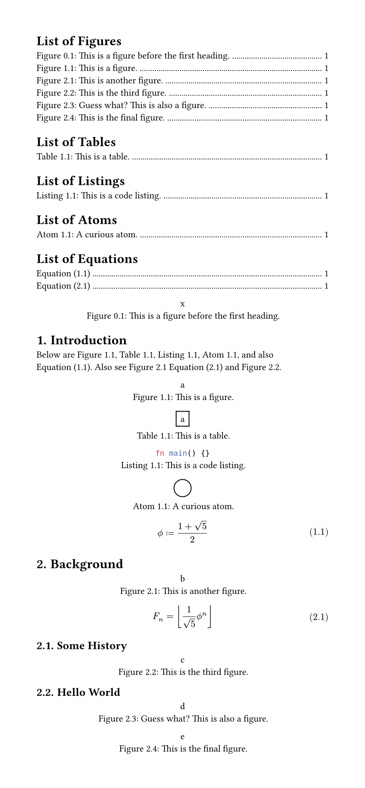
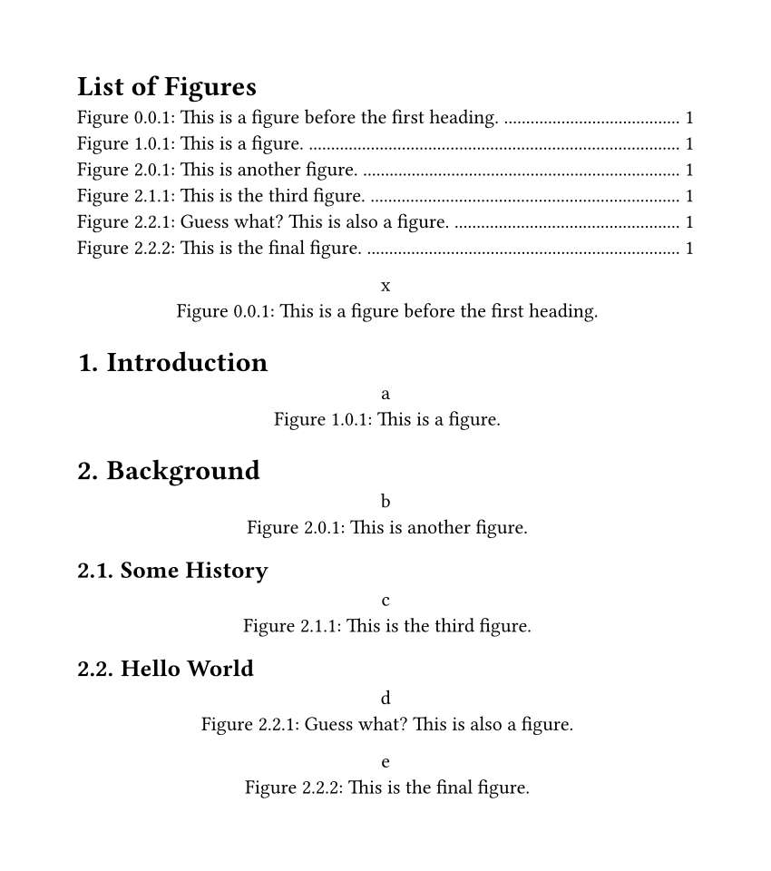

# I figured

Configurable figure numbering per section.

## Examples

### Basic

Have a look at the source [here](./examples/basic.typ).



### Two levels deep

Have a look at the source [here](./examples/level-two.typ).



## Usage

The package mainly consists of two customizable show rules, which set up all the
numbering. There is also an additional function to make showing an outline of
figures easier.

Because the [`show-figure()`](#show-figure) function must internally create
another figure element, attached labels cannot directly be used for references.
To circumvent this, a new label is attached to the internal figure, with the
same name but prefixed with `fig:`, `tbl:`, or `lst:` for images (and all other
types of generic figures), tables, and raw code figures (aka listings)
respectively. These new labels can be used for referencing without problems.

```typ
// import the package
#import "@preview/i-figured:0.2.4"

// make sure you have some heading numbering set
#set heading(numbering: "1.")

// apply the show rules (these can be customized)
#show heading: i-figured.reset-counters
#show figure: i-figured.show-figure

// show an outline
#i-figured.outline()

= Hello World

#figure([hi], caption: [Bye World.]) <bye>

// when referencing, the label names must be prefixed with `fig:`, `tbl:`,
// or `lst:` depending on the figure kind.
@fig:bye displays the text "hi".
```

## Reference

### `reset-counters`

Reset all figure counters. To be used in a heading show rule like
`#show heading: i-figured.reset-counters`.

```typ
#let reset-counters(
  it,
  level: 1,
  extra-kinds: (),
  equations: true,
  return-orig-heading: true,
) = { .. }
```

**Arguments:**

- `it`: [`content`] &mdash; The heading element from the show rule.
- `level`: [`int`] &mdash; At which heading level to reset the counters. A value
  of `2` will cause the counters to be reset at level two _and_ level one
  headings.
- `extra-kinds`: [`array`] of ([`str`] or [`function`]) &mdash; Additional
  custom figure kinds. If you have any figures with a `kind` other than `image`,
  `table`, or `raw`, you must add the `kind` here for its counter to be reset.
- `equations`: [`bool`] &mdash; Whether the counter for math equations should be
  reset.
- `return-orig-heading`: [`bool`] &mdash; Whether the original heading element
  should be included in the returned content. Set this to false if you manually
  want to construct a heading instead of using the default.

**Returns:** [`content`] &mdash; The unmodified heading.

### `show-figure`

Show a figure with per-section numbering. To be used in a figure show rule like
`#show figure: i-figured.show-figure`.

```typ
#let show-figure(
  it,
  level: 1,
  zero-fill: true,
  leading-zero: true,
  numbering: "1.1",
  extra-prefixes: (:),
  fallback-prefix: "fig:",
) = { .. }
```

**Arguments:**

- `it`: [`content`] &mdash; The figure element from the show rule.
- `level`: [`int`] &mdash; How many levels of the current heading counter should
  be added in front. Note that you can control this individually from the
  `level` parameter on [`reset-counters()`](#reset-counters).
- `zero-fill`: [`bool`] &mdash; If `true` and assuming a `level` of `2`, a
  figure after a `1.` heading but before a `1.1.` heading will show `1.0.1` as
  numbering, else the middle zero is excluded. Note that if set to `false`, not
  all figure numberings are guaranteed to have the same length.
- `leading-zero`: [`bool`] &mdash; Whether figures before the first top-level
  heading should have a leading `0`. Note that if set to `false`, not all figure
  numberings are guaranteed to have the same length.
- `numbering`: [`str`] or [`function`] &mdash; The actual numbering pattern to
  use for the figures.
- `extra-prefixes`: [`dictionary`] of [`str`] to [`str`] pairs &mdash;
  Additional label prefixes. This can optionally be used to specify prefixes for
  custom figure kinds, otherwise they will also use the fallback prefix.
- `fallback-prefix`: [`str`] &mdash; The label prefix to use for figure kinds
  which don't have another prefix set.

**Returns:** [`content`] &mdash; The modified figure.

### `show-equation`

Show a math equation with per-section numbering. To be used in a show rule like
`#show math.equation: i-figured.show-equation`.

```typ
#let show-equation(
  it,
  level: 1,
  zero-fill: true,
  leading-zero: true,
  numbering: "(1.1)",
  prefix: "eqt:",
  only-labeled: false,
  unnumbered-label: "-",
) = { .. }
```

**Arguments:**

For the arguments `level`, `zero-fill`, `leading-zero`, and `numbering` refer to
[`show-figure()`](#show-figure).

- `it`: [`content`] &mdash; The equation element from the show rule.
- `prefix`: [`str`] &mdash; The label prefix to use for all equations.
- `only-labeled`: [`bool`] &mdash; Whether only equations with labels should be
  numbered.
- `unnumbered-label`: [`str`] &mdash; A label to explicitly disable numbering
  for an equation.

**Returns:** [`content`] &mdash; The modified equation.

### `outline`

Show the outline for a kind of figure. This is just the same as calling
`outline(target: figure.where(kind: i-figured._prefix + repr(target-kind)), ..)`,
the function just exists for convenience and clarity.

```typ
#let outline(target-kind: image, title: [List of Figures], ..args) = { .. }
```

**Arguments:**

- `target-kind`: [`str`] or [`function`] &mdash; Which kind of figure to list.
- `title`: [`content`] or `none` &mdash; The title of the outline.
- `..args` &mdash; Other arguments to pass to the underlying
  [`outline()`](https://typst.app/docs/reference/meta/outline/) call.

**Returns:** [`content`] &mdash; The outline element.

[`str`]: https://typst.app/docs/reference/foundations/str/
[`int`]: https://typst.app/docs/reference/foundations/int/
[`bool`]: https://typst.app/docs/reference/foundations/bool/
[`content`]: https://typst.app/docs/reference/foundations/content/
[`function`]: https://typst.app/docs/reference/foundations/function/
[`array`]: https://typst.app/docs/reference/foundations/array/
[`dictionary`]: https://typst.app/docs/reference/foundations/dictionary/

## Acknowledgements

The core code is based off code from [@PgBiel](https://github.com/PgBiel)
(`@PgSuper` on Discord) and [@aagolovanov](https://github.com/aagolovanov)
(`@aag.` on Discord). Specifically from
[this message](https://discord.com/channels/1054443721975922748/1088371919725793360/1158534418760224809)
and the conversation around
[here](https://discord.com/channels/1054443721975922748/1088371919725793360/1159172567282749561).
