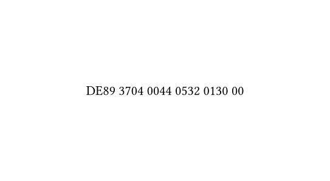

# typst-iban-formatter

> Validate and format IBAN numbers according to ISO 13616-1.

## Usage

```typ
#import "@preview/ibanator:0.1.0": iban

#iban("DE89370400440532013000")
```



To disable validation, set the `validate` flag to false:

```typ
#iban("DE89370400440532013000", validate: false)
```
