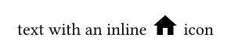
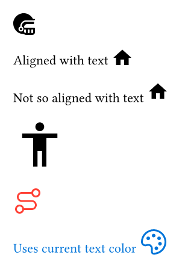

<picture>
  <source media="(prefers-color-scheme: dark)" srcset="./thumbnail-dark.svg">
  
</picture>

Use all of Iconify icons. Browse all the icons at [icones.js.org](https://icones.js.org). Supports Typst 0.13 and above.

## Overview

`iconify` loads icons from Iconify JSON collections and gives you back an icon image.

```typ
#import "@preview/iconify:0.5.3": icon, provide-icons

#provide-icons(json("assets/mdi.json"))

text with an inline #icon("mdi:home", y: -0.3em) icon
```

Result:



## Usage

### `provide-icons`

Make icons available for the `icon` function. Accepts one or more Iconify JSON collections. You can download the collections you want from https://ecstrema.github.io/iconify-typst.

```typ
#provide-icons(
  json("assets/streamline-ultimate.json"),
  json("assets/carbon.json"),
  json("assets/mdi.json"),
  json("assets/bx.json"),
)
```

### `icon`

Once you have provided the icons, you can use the `icon` function to get an icon image. The first argument is the name of the icon, in the format `collection:icon-name`. The other arguments are passed to the image, so you can adjust the size or other parameters of the image.

The icon's color follows the current text color, so you can set the color of the icon with `text(fill: ...)` or with a standard `#set text(fill: ...)` rule.

Note that in order to be inline, the `image` is put in a `box`.

```typ
// Basic usage
#icon("streamline-ultimate:american-football-helmet-bold")

// you can adjust the vertical position of the icon with the `y` parameter, for example to align it better with the text baseline:
Aligned with text #icon("mdi:home", y: -0.3em)

Not so aligned with text #icon("mdi:home")

// The other parameters are passed to the image, so you can adjust the size of the icon with `width` and/or `height`:
#icon("bx:body", width: 4em)

// With color
#text(fill: red)[#icon("carbon:3d-curve-auto-colon")]

#set text(fill: blue)
Uses current text color #icon("carbon:color-palette", y: -0.3em)
```

Result:



## Attributions

All of these icons are free, but some require attribution. Please check the license of the icons you use on [icones.js.org](https://icones.js.org) and give proper attribution if required.

## Thanks

This project is a small wrapper on the shoulder of these giants:

- [Iconify](https://iconify.design/) for the icons and the JSON format.
- [icones.js.org](https://icones.js.org/) for the search engine.

## Development

You'll need the [Just](https://just.systems/) test runner. See the `Justfile` or run `just` without arguments for the available commands.

# License

MIT License. See [LICENSE.MIT](./LICENSE.MIT) for more details.
