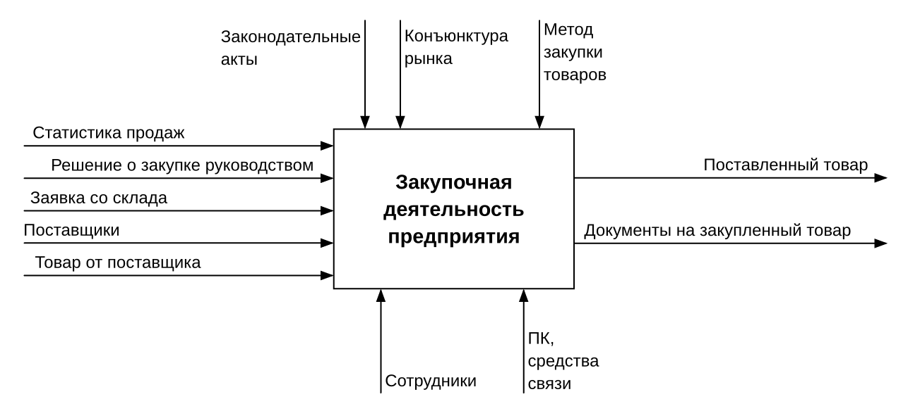
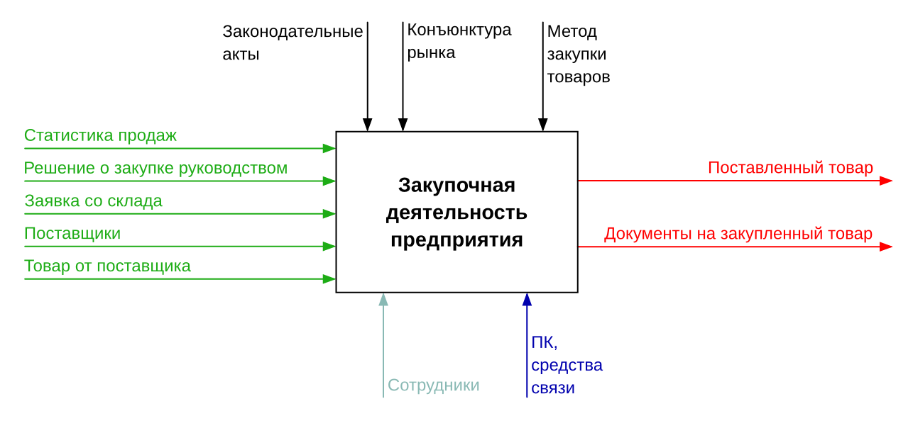
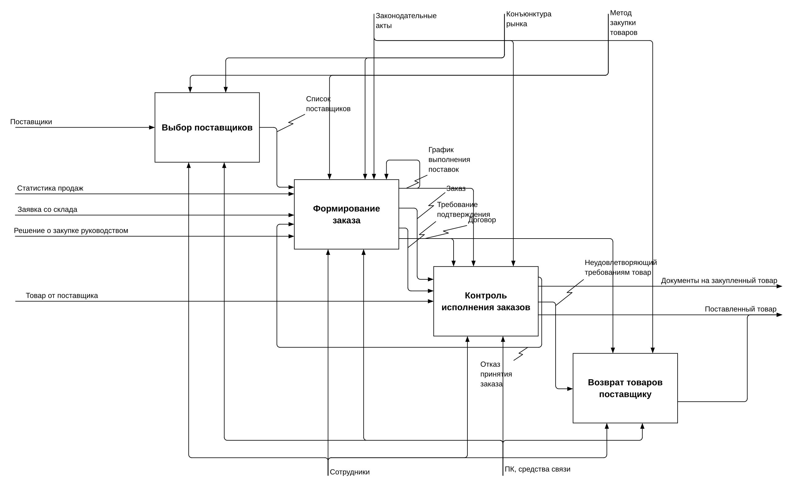
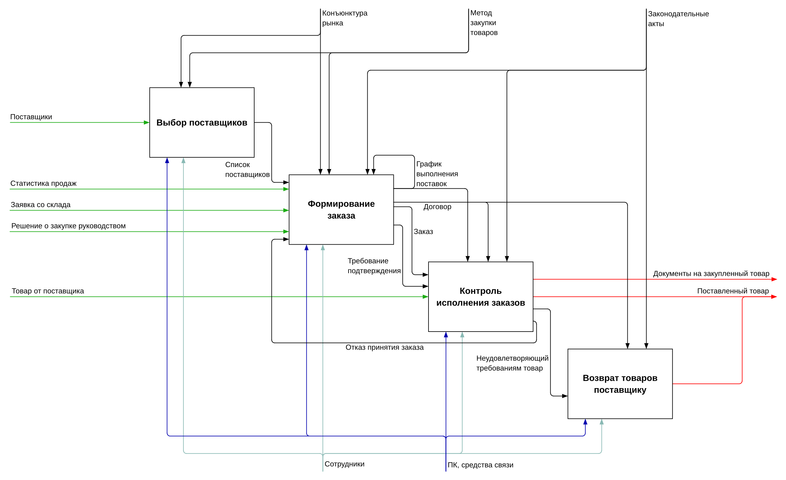

# [Identified] (Typst package)

[Identified] (IDEntiFied) is a package that allows you to create IDEF diagrams
in seconds! No, seriously. No need for a paid proprietary software that
requires installation on specific platforms, no need for a random website with
its own quirks. The IDEF diagrams produced by Identified are vector graphics,
right there in your document! And if you want to fine-tune some parts to make
it even more beautiful, well, you can do this too!

**Note:** Currently, only IDEF0 diagrams are supported (context and
decomposition).

For an IDEF0 context diagram all you need to do, is write the name of the
function/process (block/node), and the necessary names for its `input`,
`output`, `control`, and `mechanism`. That's it! The package will try to
generate a readable diagram:

```typ
#import "@preview/identified:0.1.0": IDEF0
#import IDEF0: *

#set page(width: auto, height: auto, margin: 5mm)
#set text(12pt)
#set text(font: "Liberation Sans")

#context-diagram(
  [Закупочная деятельность предприятия],
  input: (
    [Статистика продаж],
    [Решение о закупке руководством],
    [Заявка со склада],
    [Поставщики],
    [Товар от поставщика],
  ),
  output: (
    [Поставленный товар],
    [Документы на закупленный товар],
  ),
  control: (
    [Законодательные акты],
    [Конъюнктура рынка],
    [Метод закупки товаров],
  ),
  mechanism: (
    [Сотрудники],
    [ПК, средства связи],
  ),
)
```



Now, after you're done with the content of the diagram, you can fix the rough
edges with some styling and overrides (overrides are mainly just
[`fletcher.edge`][Fletcher] parameters):

```typ
#import "@preview/identified:0.1.0": IDEF0
#import IDEF0: *

#set page(width: auto, height: auto, margin: 5mm)
#set text(12pt)
#set text(font: "Liberation Sans")

#context-diagram(
  input-stroke: rgb("#1dac15"),
  output-stroke: rgb("#ff0000"),
  mechanism-stroke: (rgb("#89b9b4"), rgb("#0101ae")),
  [Закупочная деятельность предприятия],
  input: (
    ([Статистика продаж], (label-pos: 24.2%)),
    ([Решение о закупке руководством], (label-pos: 42%)),
    ([Заявка со склада], (label-pos: 22%)),
    [Поставщики],
    ([Товар от поставщика], (label-pos: 26.5%)),
  ),
  output: (
    [Поставленный товар],
    ([Документы на закупленный товар], (label-pos: 51%)),
  ),
  control: (
    ([Законодательные акты], (label-pos: 20%)),
    ([Конъюнктура рынка], (label-pos: 20%)),
    [Метод закупки товаров],
  ),
  mechanism: (
    [Сотрудники],
    [ПК, средства связи],
  ),
)
```



Colorful and tidy!

The same workflow applies to the IDEF0 decomposition diagram. However, since
it's much more complex than the top-level diagram, instead of just a process
name, it requires a dictionary of `blocks`, that is, a short key for
convenience of referring to it later, and a name of the process. Same applies
to `input`, `output`, `control`, and `mechanism`, although they are not
"blocks". Lastly, the created keys for everything mentioned before are used in
`connections`, to create a connection/arrow between
`input`/`output`/`control`/`mechanism` and a block, or between blocks. Even
though it might sound complicated, it's actually the bare minimum information
that allows to generate the diagram. Here is how it looks:

```typ
#import "@preview/identified:0.1.0": IDEF0
#import IDEF0: *

#set page(width: auto, height: auto, margin: 5mm)
#set text(12pt)
#set text(font: "Liberation Sans")

#decomposition-diagram(
  blocks: (
    "choice": [Выбор поставщиков],
    "order": [Формирование заказа],
    "control": [Контроль исполнения заказов],
    "return": [Возврат товаров поставщику],
  ),
  input: (
    "suppliers": [Поставщики],
    "stats": [Статистика продаж],
    "warehouse": [Заявка со склада],
    "decision": [Решение о закупке руководством],
    "goods": [Товар от поставщика],
  ),
  output: (
    "certs": [Документы на закупленный товар],
    "shipped": [Поставленный товар],
  ),
  control: (
    "law": [Законодательные акты],
    "market": [Конъюнктура рынка],
    "method": [Метод закупки товаров],
  ),
  mechanism: (
    "employees": [Сотрудники],
    "comm": [ПК, средства связи],
  ),
  connections: (
    // Input
    ("suppliers", "choice"),
    ("stats", "order"),
    ("warehouse", "order"),
    ("decision", "order"),
    ("goods", "control"),
    // Output
    ("control", "certs"),
    ("control", "shipped"),
    ("return", "shipped"),
    // Control
    ("law", "order"),
    ("law", "control"),
    ("law", "return"),
    ("market", "choice"),
    ("market", "order"),
    ("method", "choice"),
    ("method", "order"),
    // Mechanism
    ("employees", "choice"),
    ("employees", "order"),
    ("employees", "control"),
    ("employees", "return"),
    ("comm", "choice"),
    ("comm", "order"),
    ("comm", "control"),
    ("comm", "return"),
    // Block
    ("choice", "order", [Список поставщиков]),
    ("order", "order", TYPE.CONTROL, [График выполнения поставок]),
    ("order", "control", TYPE.CONTROL, [График выполнения поставок]),
    ("order", "control", TYPE.CONTROL, [Договор]),
    ("order", "return", TYPE.CONTROL, [Договор]),
    ("order", "control", [Заказ]),
    ("order", "control", [Требование подтверждения]),
    ("control", "order", [Отказ принятия заказа]),
    ("control", "return", [Неудовлетворяющий требованиям товар]),
  ),
)
```



Not too bad! It is readable, but we can make it even better with overrides and
styling:

```typ
#import "@preview/identified:0.1.0": IDEF0
#import IDEF0: *

#set page(width: auto, height: auto, margin: 5mm)
#set text(12pt)
#set text(font: "Liberation Sans")

#decomposition-diagram(
  input-stroke: rgb("#1dac15"),
  output-stroke: rgb("#ff0000"),
  mechanism-stroke: (rgb("#89b9b4"), rgb("#0101ae")),
  blocks: (
    "choice": [Выбор поставщиков],
    "order": [Формирование заказа],
    "control": [Контроль исполнения заказов],
    "return": [Возврат товаров поставщику],
  ),
  input: (
    "suppliers": [Поставщики],
    "stats": [Статистика продаж],
    "warehouse": [Заявка со склада],
    "decision": [Решение о закупке руководством],
    "goods": [Товар от поставщика],
  ),
  output: (
    "certs": [Документы на закупленный товар],
    "shipped": [Поставленный товар],
  ),
  control: (
    // Swapping things around can drastically improve readability!
    "market": [Конъюнктура рынка],
    "method": [Метод закупки товаров],
    "law": [Законодательные акты],
  ),
  mechanism: (
    "employees": [Сотрудники],
    "comm": [ПК, средства связи],
  ),
  connections: (
    // Input
    ("suppliers", "choice", (label-pos: 15%)),
    ("stats", "order", (label-pos: 12%)),
    ("warehouse", "order", (label-pos: 11%)),
    ("decision", "order", (label-pos: 21%)),
    ("goods", "control", (label-pos: 9%)),
    // Output
    ("control", "certs", (label-pos: 73%, shift: 1cm)),
    ("control", "shipped"),
    ("return", "shipped", (label-pos: 82%, shift: 0pt)),
    // Control
    ("law", "order", (label-pos: 6%, shift: -1.5cm)),
    ("law", "control"),
    ("law", "return"),
    ("market", "choice"),
    ("market", "order", (label-pos: 15%, shift: 12mm)),
    ("method", "choice"),
    ("method", "order", (label-pos: 13%, shift: 7mm)),
    // Mechanism
    ("employees", "choice", (label-pos: 15%)),
    ("employees", "order"),
    ("employees", "control"),
    ("employees", "return"),
    ("comm", "choice", (shift: -2cm)),
    ("comm", "order"),
    ("comm", "control"),
    ("comm", "return"),
    // Block
    ("choice", "order", [Список поставщиков], (
      detached: false,
      label-pos: 61%,
    )),
    ("order", "order", TYPE.CONTROL, [График выполнения поставок]),
    ("order", "control", TYPE.CONTROL, [График выполнения поставок], (
      detached: false,
      label-pos: 35%,
    )),
    ("order", "control", TYPE.CONTROL, [Договор], (
      label-side: right,
      detached: false,
      label-pos: 24%,
      shift: -1em,
    )),
    ("order", "return", TYPE.CONTROL, [Договор]),
    ("order", "control", [Заказ], (
      detached: false,
      label-pos: 45%,
      label-side: left,
    )),
    ("order", "control", [Требование подтверждения], (
      detached: false,
      label-pos: 57%,
    )),
    ("control", "order", [Отказ принятия заказа], (
      detached: false,
      min-width: false,
      label-pos: 51.5%,
      label-side: left,
      shift: (14mm, 17mm),
    )),
    ("control", "return", [Неудовлетворяющий требованиям товар], (
      detached: false,
      label-pos: 55%,
      shift: 7mm,
    )),
  ),
)
```



Sharp and clean!

To learn more about the syntax, refer to the next section.

## API

Here are the main parts of the API. Some other things are exported too, though
it's just how the codebase is structured now. As with any internal/undocumented
API, things can change.

### `context-diagram`

```typ
/// Top-level (context) IDEF0 diagram.
///
/// - input (array, str, content): A single input or an array of them. An input
///     can be `str` or `content`, or 1-element array of that with optional
///     second overrides `dictionary` element:
///     - `"input" | [input]`
///     - `("input" | [input],)`
///     - `("input" | [input], (:))`
/// - output (array, str, content): Same as `input`.
/// - control (array, str, content): Same as `input`.
/// - mechanism (array, str, content): Same as `input`.
/// - body (str, content): Name/content of the block/node.
/// - width (length): Used for block/node width, and therefore for all related
///     calculations.
/// - height (length): Used for block/node height, and therefore for all related
///     calculations.
/// - spacing (length, array): Value passed to `fletcher.diagram.spacing`.
/// - input-stroke (stroke): Stroke for `input` items.
/// - output-stroke (stroke): Stroke for `output` items.
/// - control-stroke (stroke): Stroke for `control` items.
/// - mechanism-stroke (stroke, array): Stroke for `mechanism` items. Can be
///     set per-mechanism defined (array).
/// - node-stroke (stroke, none): Value passed to
///     `fletcher.diagram.node-stroke`.
/// - edge-stroke (stroke, none): Value passed to
///     `fletcher.diagram.edge-stroke`.
/// - edge-corner-radius (length, none): Value passed to
///     `fletcher.diagram.edge-corner-radius`.
/// - label-sep (length): Value passed to `fletcher.diagram.debug` (with some
///     adjustments).
/// - debug (bool): Value passed to `fletcher.diagram.debug`.
/// - diagram (function): `fletcher.diagram` that is modified and used.
/// - node (function): `fletcher.node` that is modified (width/height) and used.
/// - node-styling (function): Styling to apply to the body of the block/node.
/// - edge (function): `fletcher.edge`.
/// - edge-rev (function): `fletcher.edge` that point the opposite direction.
#let context-diagram(
  input: (),
  output: (),
  control: (),
  mechanism: (),
  body,
  width: 6cm,
  height: 4cm,
  spacing: (2cm, 2cm),
  input-stroke: 1pt,
  output-stroke: 1pt,
  control-stroke: 1pt,
  mechanism-stroke: (),
  node-stroke: 1pt,
  edge-stroke: 1pt,
  edge-corner-radius: 5pt,
  label-sep: 0.2em,
  debug: false,
  diagram: fletcher.diagram,
  node: node,
  node-styling: body => text(1.2em, strong(body)),
  edge: edge,
  edge-rev: edge-rev,
)
```

---

### `decomposition-diagram`

```typ
/// IDEF0 decomposition diagram.
///
/// - input (dictionary): A dictionary of keys (used in `connections`) and
///     input names/labels (`str` or `content`).
/// - output (dictionary): A dictionary of keys (used in `connections`) and
///     output names/labels (`str` or `content`).
/// - control (dictionary): A dictionary of keys (used in `connections`) and
///     control names/labels (`str` or `content`).
/// - mechanism (dictionary): A dictionary of keys (used in `connections`) and
///     mechanism names/labels (`str` or `content`).
/// - blocks (dictionary):A dictionary of keys (used in `connections`) and
///     block/node names (`str` or `content`).
/// - connections (array): An array of connections, that consist of 2 keys
///     between which a connection/arrows must be created, and 3 optional
///     elements (connection type, label, overrides):
///     1. Between input/output/control/mechanism and block:
///        - `("key1", "key2")`
///        - `("key1", "key2", (:))`
///     2. Between blocks:
///        - `("key1", "key2", "label" | [label])`
///        - `("key1", "key2", "label" | [label], (:))`
///        - `("key1", "key2", TYPE.<any>, "label" | [label])`
///        - `("key1", "key2", TYPE.<any>, "label" | [label], (:))`
///        - `("key1", "key2", "label" | [label], TYPE.<any>)`
///        - `("key1", "key2", "label" | [label], TYPE.<any>, (:))`
///     - Default type between blocks is `TYPE.INPUT`.
///     - Default overrides for the first group: `(detached: false)`.
///     - Default overrides for the second group:
///       `(detached: true, min-width: true)`.
///     - Connections with the same label share not only their label (shown only
///       once), but also their overrides (can/should be defined for only one).
///     - Overrides are passed to `fletcher.edge`.
///     - `label-pos` override for `(detached: true)` in addition to default
///       types, can be `(coords, shift) => ()`. `coords` is array of
///       connection's coordinate points, `shift` is `fletcher.edge.shift`.
///     - `shift` override in addition to default types, can be
///       `old-shift => <new-shift>`. `old-shift` and `<new-shift>` are
///       `fletcher.edge.shift`.
/// - width (length): Used for block/node width, and therefore for all related
///     calculations.
/// - height (length): Used for block/node height, and therefore for all related
///     calculations.
/// - spacing (length, array): Value passed to `fletcher.diagram.spacing`.
/// - input-stroke (stroke): Stroke for `input` items.
/// - output-stroke (stroke): Stroke for `output` items.
/// - control-stroke (stroke): Stroke for `control` items.
/// - mechanism-stroke (stroke, array): Stroke for `mechanism` items. Can be
///     set per-mechanism defined (array).
/// - node-stroke (stroke, none): Value passed to
///     `fletcher.diagram.node-stroke`.
/// - edge-stroke (stroke, none): Value passed to
///     `fletcher.diagram.edge-stroke`.
/// - edge-corner-radius (length, none): Value passed to
///     `fletcher.diagram.edge-corner-radius`.
/// - label-sep (length): Value passed to `fletcher.diagram.debug` (with some
///     adjustments).
/// - debug (bool): Value passed to `fletcher.diagram.debug`.
/// - diagram (function): `fletcher.diagram` that is modified and used.
/// - node (function): `fletcher.node` that is modified (width/height) and used.
/// - node-styling (function): Styling to apply to the body of the block/node.
/// - edge (function): `fletcher.edge`.
/// - edge-rev (function): `fletcher.edge` that point the opposite direction.
#let decomposition-diagram(
  input: (:),
  output: (:),
  control: (:),
  mechanism: (:),
  blocks: (:),
  connections: (),
  height: 4cm,
  width: 6cm,
  spacing: (2cm, 1cm),
  input-stroke: 1pt,
  output-stroke: 1pt,
  control-stroke: 1pt,
  mechanism-stroke: (),
  node-stroke: 1pt,
  edge-stroke: 1pt,
  edge-corner-radius: 5pt,
  label-sep: 0.2em,
  debug: false,
  diagram: fletcher.diagram,
  node: node,
  node-styling: body => text(1.2em, strong(body)),
  edge: edge,
  edge-rev: edge-rev,
)
```

---

### `TYPE`

```typ
/// Block attachment type. Can be used in `decomposition-diagram` definition.
#let TYPE = (
  INPUT: ...,
  CONTROL: ...,
)
```

## Ideas and issues

- Add English examples.
- Try/add more different examples to test/improve default behavior/placement.
- `input-stroke`, `output-stroke`, `control-stroke`, `mechanism-stroke` should
  be `auto` by default and inherit `edge-stroke`'s value.
- Make all possible values for all parameters work and not cause errors (e.g.,
  `none` for a stroke).
- Make label overrides go to `input`/`output`/`control`/`mechanism`/`blocks`,
  and leave non-label connection overrides in `connections`.
- Maybe integrate `set par(leading: 0.4em)` somehow.
- Allow to disable min-width in context diagram.
- Allow specifying order number and cost for blocks in decomposition diagram.
- Refactor and optimize code.
- Come up with more sophisticated algorithms for better default results.
- Maybe use CeTZ directly for maximum control and precision (need to
  re-implement a few Fletcher things).
- Maybe add other IDEF diagrams.
- Should or should not overrides affect the environment (e.g., `shift`)?
- Style line intersections to make line tracing more readable.
- Non-zero `output`'s `shift` doesn't work correctly.

## Tests

For tests Tytanic v0.3.0 is used. Run `just` to run all tests. For details see
[`.justfile`].

## Acknowledgment

[Jeremy Gao] came up with the package name. The ones I was considering are not
quite as nice.

## License

This Typst package is licensed under AGPL-3.0-only license. You can view the
license in the [`LICENSE`] file in the root of the project or at
<https://www.gnu.org/licenses/agpl-3.0.txt>.

[Identified]: https://codeberg.org/Andrew15-5/identified
[Fletcher]: https://github.com/Jollywatt/typst-fletcher
[`.justfile`]: https://codeberg.org/Andrew15-5/identified/src/branch/main/.justfile
[Jeremy Gao]: https://wensimehrp.github.io/about/
[`LICENSE`]: ./LICENSE
