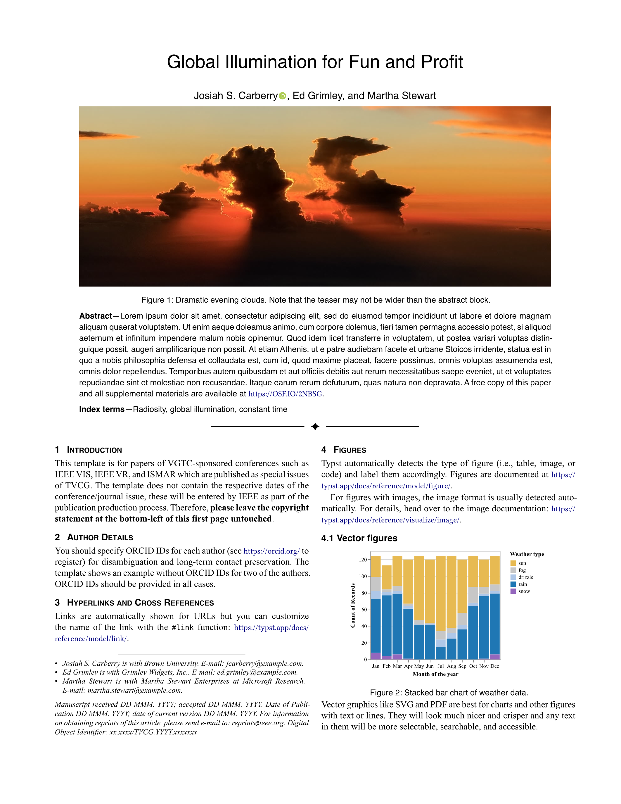

# ieee-vgtc

A [Typst](https://typst.app) template for IEEE VGTC (Visualization and Graphics Technical Community) conferences and TVCG (Transactions on Visualization and Computer Graphics) journal papers. This includes IEEE VIS, IEEE VR, and ISMAR conferences. We aim to closely mirror the LaTeX templates: [journal template](https://github.com/ieeevgtc/tvcg-journal-latex) and [conference template](https://github.com/ieeevgtc/vgtc_conference_latex). We appreciate feedback and contributions to improve the template.

**While the template is work in progress, you are encouraged to use it. Please ensure that the results adhere to the [journal](https://tc.computer.org/vgtc/publications/journal/) and [conference](https://tc.computer.org/vgtc/publications/conference/) publications guidelines.**

## Usage

You can use this template in the Typst web app by clicking "Start from template" on the dashboard and searching for ieee-vgtc. You can also [create a project from the package from the Typst Universe](https://typst.app/universe/package/ieee-vgtc/).

Alternatively, you can use the CLI to kick this project off using the command

```bash
typst init @preview/ieee-vgtc
```

Typst will create a new directory with all the files needed to get you started.

The template will be imported like this:

```typst
#import "@preview/ieee-vgtc:0.0.1": journal, conference
```

## Templates

The package provides two templates:

- **Journal template** (`template/journal.typ`): For papers published in TVCG journal or as special issues (e.g., IEEE VIS, IEEE VR, ISMAR)
- **Conference template** (`template/conference.typ`): For VGTC-sponsored conference papers that are NOT published in a special issue of TVCG

## Configuration

The template exports two functions: `journal` for TVCG journal papers and `conference` for conference papers that are not published in a special issue of TVCG.

### Journal Template

The `journal` function has the following named arguments:

- `title`: The paper's title.
- `authors`: An array of authors. For each author you can specify `name` (required), `department`, `organization`, `location`, `email`, and `orcid`. The `orcid` field should contain just the [ORCID identifier](https://orcid.org) of the author.
- `abstract`: The content of a brief summary of the paper.
- `teaser`: A dictionary with `image` and `caption` keys for a teaser figure that appears before the abstract. Your image should have an alt text.
- `index-terms`: An array of index terms to display after the abstract.
- `paper-size`: The article's paper size. Also affects the margins. Defaults to `"us-letter"`.
- `bibliography`: The result of a call to the `bibliography` function or `none`. When provided, the references will be displayed with IEEE style formatting.
- `review`: Review mode flag. When set to `true`, hides author information and displays submission details instead. Defaults to `false`.
- `submission-id`: Submission ID number displayed in the header when `review` is `true`.
- `category`: Category displayed in place of authors when `review` is `true`.
- `paper-type`: Paper type displayed in place of authors when `review` is `true`.
- `manuscript-note`: Custom manuscript note that appears in the footer of the first page. If `none`, a standard IEEE manuscript template note is shown.
- `body`: The paper's content.

### Conference Template

The `conference` function has the following named arguments:

- `title`: The paper's title.
- `authors`: An array of authors. For each author you can specify `name` (required), `organization`, `email`, and `orcid`. The `orcid` field should contain just the [ORCID identifier](https://orcid.org) of the author.
- `abstract`: The content of a brief summary of the paper.
- `teaser`: A dictionary with `image` and `caption` keys for a teaser figure that appears before the abstract. Your image should have an alt text.
- `index-terms`: An array of index terms to display after the abstract.
- `paper-size`: The article's paper size. Also affects the margins. Defaults to `"us-letter"`.
- `bibliography`: The result of a call to the `bibliography` function or `none`. When provided, the references will be displayed with IEEE style formatting.
- `review`: Review mode flag. When set to `true`, hides author information and displays submission details instead. Defaults to `false`.
- `submission-id`: Submission ID number displayed in the header when `review` is `true`.
- `category`: Category displayed in place of authors when `review` is `true`.
- `paper-type`: Paper type displayed in place of authors when `review` is `true`. Options include: `"algorithm/technique"`, `"application/design study"`, `"evaluation"`, `"system"`, `"theory/model"`.
- `manuscript-note`: Custom manuscript note (not typically used for conference papers).
- `body`: The paper's content.

## Previews

<p align="center"></p>

Live [preview of the PDF template](preview.pdf).

## Image credits for the images in the template

The cloud image is by Dominik Moritz licensed under [CC0](https://creativecommons.org/public-domain/cc0/).
The visualization is generated from [Vega-Lite](https://vega.github.io/vega-lite/) example [Weather Types by Month](https://vega.github.io/editor/#/examples/vega-lite/stacked_bar_weather) under [CC BY](https://creativecommons.org/licenses/by/4.0/).
