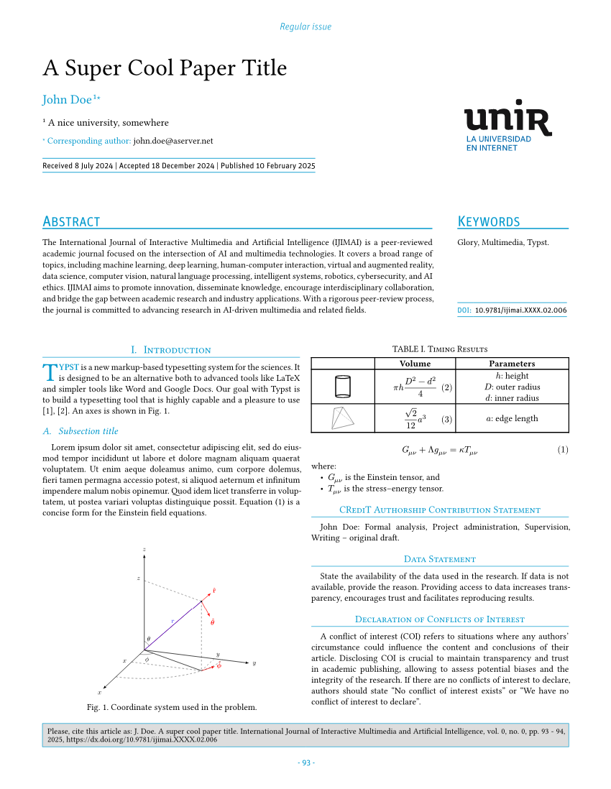

# Template for the _International Journal of Interactive Multimedia and Artificial Intelligence_ (IJIMAI)

The _International Journal of Interactive Multimedia and Artificial
Intelligence_ ([IJIMAI]) is a quarterly journal which provides an
interdisciplinary forum in which scientists and professionals can share their
research results and report new advances on artificial intelligence tools,
theory, methodologies, systems, architectures integrating multiple
technologies, problems including demonstrations of effectiveness, or tools that
use AI with interactive multimedia techniques.

[This template][repository] allows researchers to write and send papers to
IJIMAI, directly written in Typst! IJIMAI is the first journal ever to accept
contributions authored in Typst.

## Quick start

To use it in [the web application][web app], find the `ijimai` template when
creating a project. To learn about creating a project, see
[documentation][creating project].

To use it with [the CLI][CLI], run `typst init @preview/ijimai:1.0.0` in a
terminal.

The project example and structure can also be found in the [`template`]
directory.

The template requires providing configuration, bibliography, and authors'
photos. Additionally, the project must include 5 required headings and a first
paragraph (at least one word):

```typ
#import "@preview/ijimai:1.0.0": *
#show: ijimai.with(
  config: toml("paper.toml"),
  bibliography: "bibliography.yaml", // or .bib file
  read: path => read-raw(path),
)

= Introduction
Typst is a new markup-based typesetting system for the sciences. It is designed
to be an alternative both to advanced tools like LaTeX and simpler tools like
Word and Google Docs.

= CRediT authorship contribution statement
// Content for this section is generated automatically (this comment can be
// removed).

= Data statement
= Declaration of conflicts of interest
= Acknowledgment
```

All the needed information is written in a [TOML] configuration file.

If you do not have the Unit OT font, you can download it from the [repository].
Once done, upload the [`UnitOT-Regular.otf`] and [`UnitOT-LightItalic.otf`]
files to your project directory in the [Typst web application][web app]. If you
are using Typst locally, install font files in your operating system so that
they are available to any program, alternatively use `--font-path` (paired with
`--ignore-system-fonts`) flag and pass the directory with the downloaded fonts
(see `typst compile --help`).

## Documentation

This section describes the usage/features of the template with an accent on
common issues.

The template includes a lot of automations that have different degrees of
_potentially_ causing some issues (due to human error or nature of automations'
implementation). This is why this documentation tries to thoroughly go through
all the special features and be transparent about how they work (or might not
work).

> [!NOTE]
> If you find any discrepancy in the behavior described below and the actual
> behavior when using the template, please, open an [issue][issues] in the
> [repository] with the problematic example attached. If you are getting
> compilation errors, **please, make sure to read the documentation carefully
> and fully** before creating an issue.

### Heading names

The template uses [`titleize`] package to format all headings in title case.
This means that manually recreating title case is unnecessary. Look inside the
[template][Simple] or at the snippet in the [Quick start] for proffered (but
not enforced) way of writing heading names.

### Required sections

Each paper must contain next sections (in the order of listing):

- Introduction
- CRediT Authorship Contribution Statement
- Data Statement
- Declaration of Conflicts of Interest
- Acknowledgment

The title case used for headings is not necessary in the source file. Refer to
[Heading names] above for details.

The "Introduction" section is the very first section in a paper, while the
other 4 sections are the very last ones. Additionally, the "Acknowledgment"
section allows for next alternative spellings (but prefer the one above):

- Acknowledgments
- Acknowledgement
- Acknowledgements

To see description for the (last 4) sections, refer to the [documentation] test.

### Introduction section and first paragraph

The template treats the very first paragraph (below Introduction heading)
specially. The first word is being heavily styled. It is uppercased, its color
and weight are modified, and on top of that a `dropcap` function from the
[`droplet`] package is applied to it. However, in order for `dropcap` to work
correctly (span multiple lines down), it needs access to the whole paragraph.

For this reason, `first-paragraph` function exists. But unlike previous
versions, it is no longer required. One reason being interchangeability: to use
this or another template simply change the template function, while keeping the
document content completely unchanged. Another reason, is a newly developed
algorithm (`par` show rule) that can automatically detect and modify only the
very first paragraph. Due to shear complexity of the algorithm, there are some
caveats laid out below.

The `par` show rule's first paragraph detection is based on the concept of
location proximity, examples of which can be found in
https://github.com/typst/typst/issues/2953. The anchor, that help find the
paragraph is the "Introduction" heading element. It can be safely used as an
anchor due to being a required heading (see [Required sections]). Because
spacing between the heading and the paragraph (as well as heading/paragraph
font size) is controlled by the template, this approach becomes more reliable,
enabling the use of a fixed value for proximity detection.

If a paragraph is modified through a `par` show rule, the new value will create
a uniquely new paragraph, causing the show rule to be applied to it as well
(despite it being the result of modifications). To detect that the first
paragraph styling was already applied (or not applied at all, more on this
later), a state (`counter`) is used. This in turn means `context` must be
utilized inside of the show rule. At present, Typst's context + state behavior
can quickly get out of hand if not handled with care. Still, because of context
requiring at least 2 consecutive compilations to converge, some behavior can
become impossible to achieve, or it can be very finicky. And the first
paragraph show rule indeed behaves a bit strangely (but not for the user). For
example, due to some strange context behavior it is impossible (?) to detect
whether the first letter uses uppercase or lowercase. Having said that, the
`par` show rule in [its current implementation][par show rule] behaves as
excepted, passing all the [tests].

By default, the first paragraph should be added normally, without using the
`first-paragraph` function. However, in the case when the `The
"first-paragraph" function must be used exactly once` error appears in the
presence of the first paragraph, as a fallback method, `first-paragraph`
function must be used. Because of the aforementioned use of state, explicitly
using this function increases the counter, automatically disabling the internal
automatic use of this function (i.e., implicit use of the function). By using
the function explicitly, any issue with paragraph parsing is eliminated.

If this or another related error is still present, completely disabling the
show rule might help, especially if the document uses its own `par` show rule
(which might break because of the template also overriding this element's
behavior). To disable it, set `auto-first-paragraph` parameter of the `ijimai`
function to `false` (set to `true` by default).

### CRediT section and roles

The "CRediT Authorship Contribution Statement" section needs to have a specific
content with a specific formatting. To further remove the manual labor and
human error, this section is entirely automated, which is why it must be left
empty in the source file (only the heading is added).

The section's content is entirely generated from the configuration file. Each
author must have the `credit` key the value for which is an array of strings.
Each string element represent a single contributor role, which are defined in
[ANSI/NISO Z39.104-2022]. The configuration must use specific (simplified)
aliases to the official roles, which are as follows:

```typ
#(
  conceptualization: [Conceptualization],
  data-curation: [Data curation],
  formal-analysis: [Formal analysis],
  funding-acquisition: [Funding acquisition],
  investigation: [Investigation],
  methodology: [Methodology],
  project-administration: [Project administration],
  resources: [Resources],
  software: [Software],
  supervision: [Supervision],
  validation: [Validation],
  visualization: [Visualization],
  writing-original-draft: [Writing -- original draft],
  writing-review-editing: [Writing -- review & editing],
)
```

An example of a valid list of roles for an author:

```toml
credit = ["conceptualization", "methodology", "resources", "validation"]
```

Each author should have at least 1 role specified. If an invalid name is
provided, the template will give a corresponding error with a list of allowed
string values (roles).

Even though this automation is achieved by creating the section content from
within the heading show rule, both Typst's [`outline`] (not used in the
template) and PDF's [Document Outline] are not affected. Which means neither of
them will contain content of the section.

### Short author list

The short author list is a short piece of text used in the citation box at the
bottom of the first page.

By default, the template will prioritize the `paper.short-author-list` value in
the configuration TOML file, if present. If the `short-author-list` key is
absent, the template will try to generate its value automatically. Generally
speaking, no action from authors is needed, however one can face some issues.

It will succeed if all authors have exactly two words in their `name` value:
first name and last name (i.e., surname). It will use the first letter
(grapheme cluster, to be exact) from the first name (then put `. `), and the
whole last name (for each author). Then these pieces of text are joined
together with `, ` between each but last pair, last 2 names will have ` and `
between them. Even though this is automated, **make sure** to double check the
output in the citation box to avoid any mistakes.

For example, for authors `"John Doe"` and `"Jane Smith"`, it will generate "J.
Doe" and "J. Smith", and the result will be "J. Doe and J. Smith".

It will fail with an error message `Failed to generate short author list` if
it fails to split the name string into exactly 2 parts. This can happen either

- due to human error of having more than 1 whitespace in the string,
- or due to the name naturally having more than 2 parts (or less than 2).

This can happen when an author has prefix(es) and/or other additional parts in
their name, as is the case with "Johannes Diderik van der Waals". See
https://en.wikipedia.org/wiki/Van_(Dutch) and
https://academia.stackexchange.com/a/46500 for some context and more examples.

If one or more authors are affected by this, the template will give the error
mentioned above and the document will not compile. To fix this,
`paper.short-author-list` must be added with correct value to the configuration
file.

### Keywords

The `paper.keywords` key contains a list of keywords for the a paper. However,
the list must be sorted in lexographical order. This manual task is also
automated, an therefore is not a concern for the author. This is outlined to
remove potential confusion in case initial order and sorted order are
different.

### Figure caption

The figure caption (`figure.caption.where(kind: image)`) must always include a
period at the end. While the table caption (figure.caption.where(kind: table))
must omit it. This requirement is automatically handled by the template and is
extensively [tested][tests].

Although the implementation handles every element/type separately, which makes
it prone to error of not handling all possible (or rather practical) use cases.
If the `<content type> was not handled properly` error is encountered, please
open an [issue][issues] with the error message included. This is a bug (and a
shortcoming of the way the implementation was designed).

## API reference

### `ijimai`

````typ
/// The template function.
///
/// ```typ
/// #show: ijimai.with(
///   config: toml("paper.toml"),
///   bibliography: "bibliography.yaml",
///   read: path => read-raw(path),
/// )
/// ```
///
/// - config (dictionary): Configuration that defines paper and author metadata.
/// - photos (str, array): Path to directory with authors' photos or an array
///     of raw photos data (bytes of images).
/// - bibliography (str, bytes): Path to the bibliography file or raw content of
///     the file (bytes).
/// - read (function): A special function that allows passing path strings to
///     the other parameters. Should be set to `path => read-raw(path)`.
/// - auto-first-paragraph (bool): Whether to automatically detect and style the
///     first paragraph. Normally this parameter should be ignored.
/// - body (content): Content passed to the template function when it is
///     applied.
#let ijimai(
  config: none,
  photos: "photos/",
  bibliography: none,
  read: none,
  auto-first-paragraph: true,
  body,
)
````

The `config` parameter is a dictionary with various required metadata that can
be found in [`./template/paper.toml`]. Technically, the configuration can be
stored in any form, but it's better to use TOML, to remove possibility of a
human error when converting to a different file format, etc.

The `photos` parameter can be, e.g., `"author/"` or
`("path/to/photo1.jpg", "path/photo2.png").map(read-raw)`.

The `bibliography` parameter can be, e.g., `"bibliography.yaml"` or
`read-raw("bibliography.yaml")`.

The `read` parameter makes use of a [special path treatment][read hack] when
creating an unnamed function.

For the `auto-first-paragraph` parameter, see
[Introduction section and first paragraph] section for more details.

### `read-raw`

```typ
/// An alias to `read.with(encoding: none)`. Intended to be used with
/// `ijimai.read` (also `ijimai.photos`, or `ijimai.bibliography`).
#let read-raw
```

### `first-paragraph`

```typ
/// Function that styles the first paragraph of the Introduction section.
///
/// - first-word (str, content): First word that will be styled.
/// - body (str, content): The rest of the first paragraph that is needed to
///     properly style the first word.
#let first-paragraph(first-word, body)
```

See [Introduction section and first paragraph] section for more details.

### `no-indent`

```typ
/// Remove indentation for a specific paragraph. This is useful when using
/// "where" paragraph right after an equation that must not be indented.
///
/// - body: (content): Paragraph that needs to be unindented.
#let no-indent(body)
```

See [`./template/paper.typ`] for a use case example.

### `Eq`

````typ
/// Add "Equation" supplement before the equation reference.
///
/// Intended to be used only for equations that are referenced immediately at
/// the start of a sentence, as per IJIMAI requirements. In any other
///
/// Named with a capital letter to avoid shadowing `math.eq` that is directly
/// accessible in the math mode. As a consequence, it also reminds that it must
/// be used at the start of a sentence.
/// situations, reference equations as usual (directly).
///
/// ```typ
/// Usage: #Eq[@pythagorean], #Eq(<pythagorean>), #Eq(ref(<pythagorean>))
/// ```
///
/// - reference: (ref, label): equation's label or reference to it.
#let Eq(reference)
````

See [`./template/paper.typ`] for a use case example.

## Examples

### [Simple]

| [][Simple] | [][Simple] |
| ----------------------------------------- | ----------------------------------------- |

---

### [2 authors]

| [][2 authors] | [][2 authors] |
| ------------------------------------------------------ | ------------------------------------------------------ |

---

### [Special issue]

| [][Special issue] | [][Special issue] |
| -------------------------------------------------------------- | -------------------------------------------------------------- |

## In case of doubts

Please, bear in mind this template is continuously been bettered. In case of
doubts, please, send an email to alberto.corbi@unir.net.

[IJIMAI]: https://www.ijimai.org
[TOML]: https://toml.io
[repository]: https://github.com/pammacdotnet/IJIMAI
[typst.app]: http://typst.app
[web app]: http://typst.app/signin
[CLI]: https://typst.app/open-source/#download
[creating project]: https://typst.app/docs/web-app/creating-a-project/#creating-a-project-from-a-template
[`template`]: ./template
[`UnitOT-Regular.otf`]: https://github.com/pammacdotnet/IJIMAI/raw/4ca0ac4024eeedfb3fcd5c4600adffe1f1034df5/fonts/Unit%20OT/UnitOT-Regular.otf
[`UnitOT-LightItalic.otf`]: https://github.com/pammacdotnet/IJIMAI/raw/4ca0ac4024eeedfb3fcd5c4600adffe1f1034df5/fonts/Unit%20OT/UnitOT-LightItalic.otf
[`titleize`]: https://typst.app/universe/package/titleize
[`droplet`]: https://typst.app/universe/package/droplet
[issues]: https://github.com/pammacdotnet/IJIMAI/issues
[Quick start]: #quick-start
[Heading names]: #heading-names
[documentation]: ./tests/documentation/test.typ
[Required sections]: #required-sections
[par show rule]: https://github.com/pammacdotnet/IJIMAI/blob/4ca0ac4024eeedfb3fcd5c4600adffe1f1034df5/ijimai.typ?plain=1#L579
[tests]: https://github.com/pammacdotnet/IJIMAI/tree/4ca0ac4024eeedfb3fcd5c4600adffe1f1034df5/tests
[ANSI/NISO Z39.104-2022]: https://www.niso.org/publications/z39104-2022-credit
[`outline`]: https://typst.app/docs/reference/model/outline
[Document Outline]: https://pdfa.org/glossary-of-pdf-terms/#:~:text=Document%20Outline
[Introduction section and first paragraph]: #introduction-section-and-first-paragraph
[`./template/paper.typ`]: ./template/paper.typ
[`./template/paper.toml`]: ./template/paper.toml
[read hack]: https://github.com/SillyFreak/typst-alexandria/blob/f750ddbdb27c4dfeb5c6705c2a9d43fdf7e71b92/src/lib.typ#L40-L44
[Simple]: ./tests/template/test.typ
[2 authors]: ./tests/template-2-authors/test.typ
[Special issue]: ./tests/template-special-issue/test.typ
