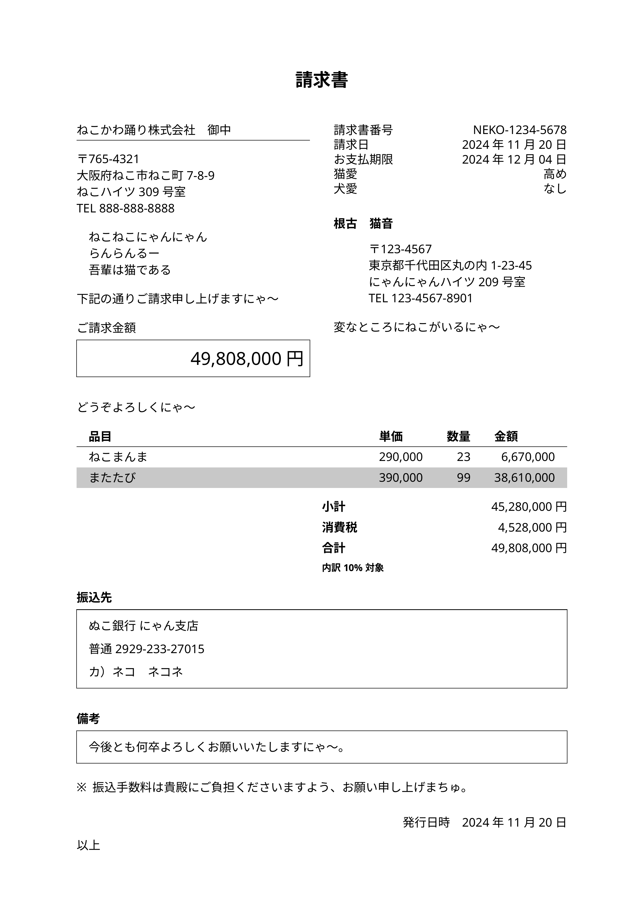

# `inboisu`

日本語の請求書を作成するための Typst テンプレートです。

Inboisu is a Typst template for creating Japanese invoices.

## 使い方 / Usage

```typst
#include "@preview/inboisu:0.1.0": doc

#show: doc(
    ... // ドキュメントを参照
)
```

## ドキュメント / Documentation

- [docs/documentation.pdf](./docs/documentation.pdf) ([Source](./docs/docs.typ))

## テンプレート / Templates

### 請求書 / Invoice



- [invoice.typ](./template/invoice.typ)

### 領収書 / Receipt


- [receipt.typ](./template/receipt.typ)
