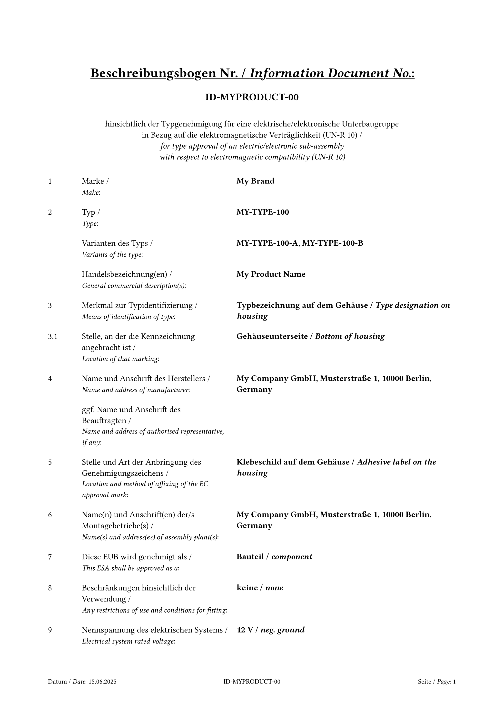
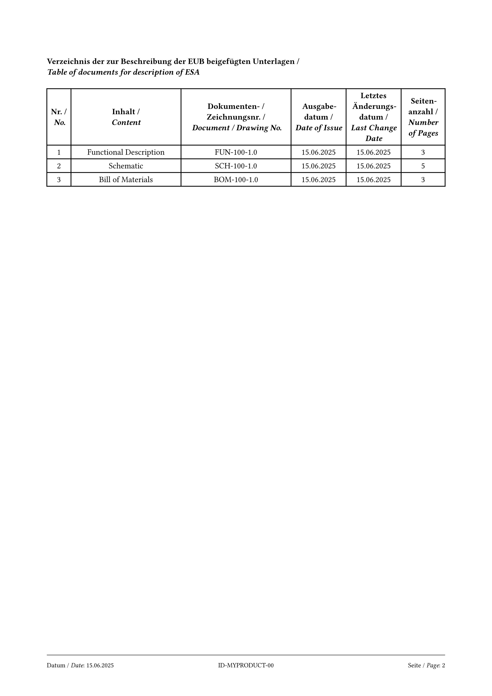

# infodoc-unr10

Bilingual (German/English) **Beschreibungsbogen** (Information Document) for ECE/UN Regulation No. 10 EMC type approval of electric/electronic sub-assemblies (EUB/ESA).

The layout and field numbering follow the official RTF template published by the Kraftfahrt-Bundesamt (KBA) for UN-R 10 submissions.

## Preview

<picture>
  
</picture>

<picture>
  
</picture>

## Usage

```typst
#import "@preview/infodoc-unr10:0.1.0": kba-document

#show: kba-document.with(
  date: "15.06.2025",
  doc-number: "ID-MYPRODUCT-00",
  marke: "My Brand",
  typ: "MY-TYPE-100",
  varianten: ("MY-TYPE-100-A", "MY-TYPE-100-B"),
  handelsbezeichnung: "My Product Name",
  ident-merkmal: ("Typbezeichnung auf dem Gehäuse", "Type designation on housing"),
  ident-stelle: ("Gehäuseunterseite", "Bottom of housing"),
  hersteller-name-anschrift: "My Company GmbH, Street 1, 10000 City, Germany",
  genehmigung-stelle-art: ("Klebeschild auf dem Gehäuse", "Adhesive label on the housing"),
  montagebetriebe: ("My Company GmbH, Street 1, 10000 City, Germany",),
  nennspannung: ("12 V", "neg. ground"),
  anlagen: (
    (nr: "1", inhalt: "Functional Description", doc-nr: "FUN-100-1.0",
     datum: "15.06.2025", rev: "15.06.2025", seiten: "3"),
  ),
)
```

## Parameters

### Required

| Parameter | Type | Description |
|---|---|---|
| `date` | string | Document date. Use current date even for amendments. |
| `doc-number` | string | Document number. Keep unchanged for amendments. |
| `marke` | string | Brand / Make (item 1) |
| `typ` | string | **CRITICAL:** Type designation (item 2) — must be character-for-character identical across the application, test report, and this document. Keep it simple to avoid errors. |
| `varianten` | array | All approved variants. List completely, even for amendments. |
| `handelsbezeichnung` | string | General commercial description(s) |
| `ident-merkmal` | string or 2-tuple | Means of type identification (item 3) |
| `ident-stelle` | string or 2-tuple | Location of marking (item 3.1) |
| `hersteller-name-anschrift` | string | Full name and address of manufacturer (item 4) |
| `genehmigung-stelle-art` | string or 2-tuple | Location and method of affixing the approval mark (item 5) |
| `montagebetriebe` | array | Assembly plant(s) — entity performing the last approval-relevant manufacturing step (item 6) |
| `nennspannung` | string or 2-tuple | Rated voltage (item 9). Nominal value only, not a range. |
| `anlagen` | array of records | Annex table — see below |

### Optional

| Parameter | Type | Default | Description |
|---|---|---|---|
| `beauftragter` | string | `""` | Authorised representative (item 4). Leave empty if none. |
| `genehmigt-als` | 2-tuple | `("Bauteil", "component")` | Approval category (item 7). Use `("Selbstständige technische Einheit", "separate technical unit")` for STEs. |
| `beschraenkungen` | 2-tuple | `("keine", "none")` | Restrictions on use (item 8). For components typically `("keine", "none")`; for STEs list applicable vehicle types. |
| `is-charging-system` | bool | `false` | Set to `true` only for REESS charging systems — enables items 10–15. |

### Bilingual values

Parameters that accept a **2-tuple** render as `German / *italic English*`:

```typst
ident-stelle: ("Auf dem Gehäuse", "On the housing")
// renders as: Auf dem Gehäuse / On the housing
```

### Annex table (`anlagen`)

Each entry is a dictionary with the following keys:

| Key | Description |
|---|---|
| `nr` | Annex number |
| `inhalt` | Content description |
| `doc-nr` | Document / drawing number |
| `datum` | Date of issue |
| `rev` | Last change date |
| `seiten` | Number of pages |

```typst
anlagen: (
  (
    nr: "1",
    inhalt: "Functional Description",
    doc-nr: "FUN-MYPRODUCT-1.0",
    datum: "15.06.2025",
    rev: "15.06.2025",
    seiten: "3",
  ),
)
```

### Charging system parameters (items 10–15)

Enabled when `is-charging-system: true`. Only applicable for REESS charging systems.

| Parameter | Description |
|---|---|
| `ladegeraet` | Charger type |
| `ladestrom` | Charging current type (AC/DC) |
| `phasen` | Number of phases (AC only) |
| `frequenz` | Frequency (AC only) |
| `max-nennstrom` | Maximum nominal current |
| `nenn-ladespannung` | Nominal charging voltage |
| `schnittstellen` | Basic ESA interface functions |
| `rsce-wert` | Minimum Rsce value |

## Notes on correct completion

**Type designation** is the most important identifier. It must appear character-for-character identically in the application form, the test report, and this document. Keep it simple to avoid transcription errors.

**Variants** are configurations sharing the same function and basic arrangement. The distinction must be apparent (use a variant key). Always list all variants in full, including for amendments.

**Amendments** require a new date but the same document number. Always describe the complete type with all variants.

**Annexes** must cover: functional description, drawings, schematics, assembly plans, and BOM. Identify documents by their document number, not by filename. Do not submit lists as Excel files.

**Submission format**: deliver the complete document as a single PDF without write protection to the Technical Service.

## License

MIT-0 — free to use, modify, and distribute without attribution.
