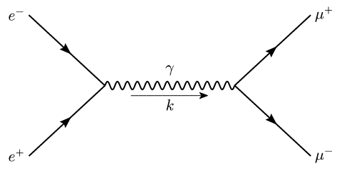
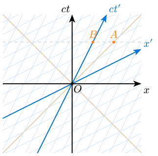
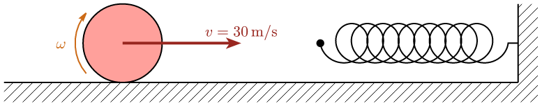

# Inknertia

**Inknertia** is a [Typst](https://typst.app/) package for drawing physics diagrams. It is built on top of [CetZ](https://github.com/johannes-wolf/cetz) and provides high-level abstractions for common physics visualization tasks.

## Features

- **Feynman Diagrams**: Automatic layout using a spring-electrical algorithm. Support for all standard edge types (fermions, photons, gluons, etc.) and vertex shapes. 
- **Spacetime Diagrams**: Minkowski diagrams with support for worldlines, light cones, events, and Lorentz-boosted reference frames.
- **Newtonian Mechanics**: Utilities for drawing free-body diagrams, including blocks, ramps, pulleys, ropes, springs, and vectors.

Please look at the [manual](manual.pdf) for more details.

## Examples

### Feynman Diagrams

```typst
#import "@preview/inknertia:0.1.0": feynman
#import feynman: *

#set page(width: auto, height: auto, margin: 0.1cm)

#feynman(
  (
    vertex("i1", label: $e^+$),
    vertex("i2", label: $e^-$),
    vertex("a"),
    vertex("b"),
    vertex("f1", label: $mu^-$),
    vertex("f2", label: $mu^+$),
    edge("i1", "a", type: "fermion"),
    edge("i2", "a", type: "fermion"),
    edge("a", "b", type: "photon", label: $gamma$, momentum: $k$),
    edge("b", "f1", type: "fermion"), 
    edge("b", "f2", type: "fermion"),
  ),
)
```



### Spacetime Diagrams

```typst
#import "@preview/inknertia:0.1.0": spacetime
#import spacetime: *

#let x = 1.5
#set page(width: auto, height: auto, margin: 0.1cm)

#spacetime(
  natural_units: false,
  grid_step: 1,
  (
    frame(beta: 0.5, grid_stroke: (paint: blue.lighten(80%), thickness: 0.5pt), grid_spacing: 1),
    event("O", (0, 0), label: $O$, anchor: "north-west", padding: 0.1),
    event("A", (3, 2 * x), label: $A$, color: orange, anchor: "south", padding: 0.3),
    event("B", (x, 2 * x), label: $B$, color: orange, anchor: "south", padding: 0.3),
    simultaneity(2 * x, color: gray.lighten(30%)),
    lightcone((0, 0)),
  ),
)
```



### Newtonian Mechanics

```typst
#import "@preview/cetz:0.4.2"
#import "@preview/inknertia:0.1.0": newtonian
#import newtonian: *

#set page(width: auto, height: auto, margin: 0.1cm)

#cetz.canvas(length: 1cm, {
  import cetz.draw: *

  wall(((-3, 0), (10, 0), (10, 2), (10.5, 2), (10.5, -0.5), (-3, -0.5)), stroke_style: 1pt + black, sides: (0, 1))
  spring((5, 1), (10, 1), 0.5, 10, startcircle: true, endhook: 5%)
  circle((0, 1), radius: 1, fill: red.lighten(50%))
  curved_arrow((0, 1), radius: 1.2, start_angle: 220deg, end_angle: 140deg, color: orange.darken(20%), label: $omega$)
  vector((0, 1), (3, 1), label: $v = 30 thin "m/s"$, stroke_style: 2pt + red.darken(40%), fill_paint: red.darken(40%))
})
```




## Installation

You can import it directly from Typst Universe:

```typst
#import "@preview/inknertia:0.1.0": *
```

## Documentation

The detailed manual is located in `docs/manual.typ`. You can compile it to PDF using Typst:

```bash
typst compile docs/manual.typ --root .
```

## Project Structure

- **`package/`**: The source code of the package (`typst.toml`, `lib.typ`, formatting modules).
- **`docs/`**: Documentation and the user manual.
- **`examples/`**: Example typst files demonstrating various features.

## Disclaimer

This package has been hastily programmed. Many implementations, especially for Feynman diagrams, are expected to break down for more complex use cases. Please feel free to contribute in any way to make this project better.

## License

This project is licensed under the MIT License - see the [LICENSE](LICENSE) file for details.
