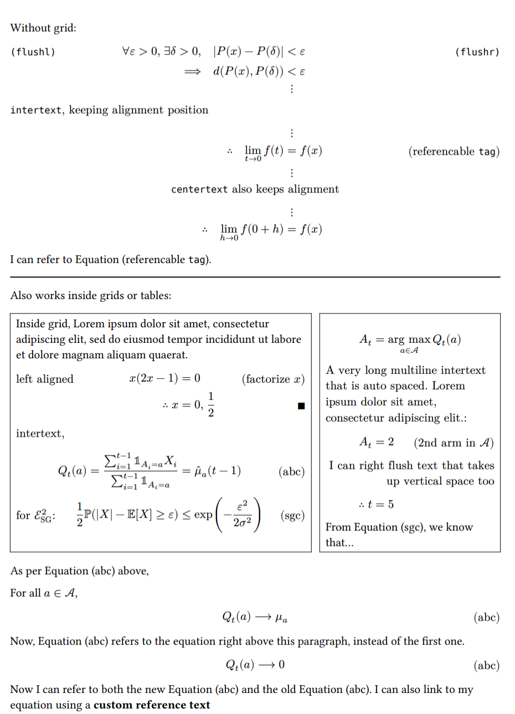

# intextual

For interspersing equations with flushed left/right text while preserving alignment.

For use inside a block math equation only.

## Quick start

Put this at the top of your Typst document:

```typst
#import "@preview/intextual:0.1.1": *

// intertext-rule show rule is required for elements to display properly.
#show: intertext-rule
```

Use these commands inside an **equation block**:

- `#intertext[content here]`
- `#flushl[left-flushed content on the same line]`
- `#flushr[right-flushed content on the same line]`
- `#centertext[Like intertext but center-aligned]`
- `#tag[(auto-tag)]` reference with `#eqref(<eq-auto-tag>)` or `@eq-auto-tag`
- `#tag(<custom-label>)[(custom tag)]` reference with `#eqref(<custom-label>)` or `@custom-label`

### Side Effects ⚠️

The `show: intertext-rule` rule will draw an invisible 100% width line above each `math.equation.where(block: true)` to determine the boundaries of the container. This affects standard equation alignment in enums/lists and grids/tables with `auto` width.

In default Typst, block equations in enums/lists will be centered according to the maximum horizontal space required by any enum/list item, however, with the `intertext-rule` applied, the maximum available width will always be used.

## Methods

### `flushl`, `flushr`

Places floating text/content to the left or right of the equation for annotation purposes.

- `body` (`str` | `content`): the content to display
- `dx` (`length`): (default: 0em) Extra offset towards the right
- `overlap` (`bool`): (default: true) If `overlap` is `false`, creates vertical space for the text
  to not overlap vertically. A new line must still be placed after the equation before
  `flushl`/`flushr`.
- `above` (`length`): If `overlap == true`, how much additional vertical space to give above the text.
- `below` (`length`): If `overlap == true`, how much additional vertical space to give below the text.

E.g.,

```typst
$
  a^(p-1) &equiv 1 (mod(p)). #flushr[(By F$ell$T)]
$
```

### `intertext`

Similar to LaTeX's `\intertext`, this method allows for the insertion of text between lines of an equation while maintaining `&` alignment. This function is implemented as a special case of `flushl` with `overlap = false`.

A new line must still be used after the equation preceding `intertext`, but is not required after `intertext` itself.

E.g.,

```typst
$
  sum_(n thick (mod p)) ((n(n+1)(n+2))/p) &= sum_(n thick (mod p)) (((n-1) n (n+1))/p), \
  #intertext[since we can reindex via the bijection $n |-> n-1$ over all residues. Thus, expressing in terms of the Jacobsthal sum,]
  &= sum_(n thick (mod p)) ((n (n^2 - 1))/p) \
  &= phi_2 (-1).
$
```

### `centertext`

Like `intertext` but aligned to the center of the container's available horizontal space. Does not affect equation `&` alignments.

### `tag`

Tag a particular line of a multi-line block equation and automatically generate a label
for referencing.

Example:

```typst
$
  a &= 1 #tag(<eq-tag>)[(custom `tag`)] \ // manually specified label
  b &= 2 #tag[(1)]                        // auto-generated label
$

#eqref(<eq-tag>) // (recommended)

@eq-1 // Only works if the label is unique.
```

Unlike LaTeX's \tag, it doesn't automatically surround the contents with parentheses.

If `label-str` is not given, it automatically creates a label for referencing, based on the
`label-prefix` and `body`. Only alphanumeric characters, period, hyphen and underscore are
kept in the label name. Whitespaces are replaced by hyphens. Set `label-str: none` to not
create a label.

When referencing the equation tag, the `supplement` denotes how to refer to the equation.

Use the `eqref` method to reference an equation by its tag. If multiple tags with the same
label exist, it will automatically link to the most recent occurrence of the label.

It is also possible to use the built-in `ref` or `@` syntax to reference equations, but only
if this label is unique in the document.

- `body` (`str` | `content`): The content to display in the tag.
- `supplement` (`str` | `content`): (default: "Equation") Supplementary text to display when referencing the equation.
- `right` (`bool`): (default: true) Whether to display the tag on the right. If `false`, flushes left instead.
- `dx` (`length`): (default: 0em) Extra rightwards offset to apply to the tag position.
- `label-prefix` (`str`): (default: "eq") Prefix to use for autogenerated labels. Only applicable if `label-str` is `auto`.
- `label-str` (`auto` | `str` | `none`): (default: "auto") The name of the label to use for referencing the equation.
  - If `auto`, generates labels based on body text. Only alphanumeric characters, period,
    hyphen and underscores are kept in the label name. Whitespaces are replaced by hyphens.
  - If `none`, no referencable label is created. Though, `flushl` and `flushr` should be used instead if no label is needed.

### `eqref`

Similar to LaTeX's `\eqref`, creates a link to an equation created by `tag`.

- `label-str` (`str` | `label` | `int`): The label (or label name string) to reference. If the referenced equation has a label of the form `<eq-N>` for some integer N, e.g., if it was tagged with `#tag[(N)]` then just passing the integer N would also work.
- `args` (`content`): Pass a `content` body to modify the displayed reference text.

## Example

```typst
#import "@preview/intextual:0.1.1": flushl, flushr, intertext, centertext, tag, eqref, intertext-rule

// intertext-rule show-set rule is required to display properly.
#show: intertext-rule

Without grid:
$
  #flushl[`(flushl)`] forall epsilon > 0, thick exists delta > 0, quad abs(P(x) - P(delta)) &< epsilon #h(7em) #flushr[`(flushr)`] \
  ==> quad d(P(x), P(delta)) &< epsilon \
  & thick dots.v \
  #intertext[`intertext`, keeping alignment position]
  & thick dots.v \
  therefore quad lim_(t -> 0) f(t) &= f(x) #tag(<eq-tag>)[(referencable `tag`)] \
  & thick dots.v \
  #centertext[`centertext` also keeps alignment]
  & thick dots.v \
  therefore quad lim_(h -> 0) f(0 + h) &= f(x)
$

I can refer to #eqref(<eq-tag>).

#line(length: 100%)

Also works inside grids or tables:

#grid(columns: (1fr, 0.6fr), column-gutter: 0.7em, stroke: 0.5pt, inset: 0.5em)[
  Inside grid, #lorem(20)
  $
    #flushl[left aligned] x(2x - 1) &= 0 #flushr[(factorize $x$)] \
    therefore x &= 0, thick 1/2 #flushr[$qed$] \
    #intertext[intertext,]
    Q_t (a) = (sum_(i=1)^(t-1) bb(1)_(A_i = a) X_i) / (sum_(i=1)^(t-1) bb(1)_(A_i = a)) &= hat(mu)_a (t-1) #tag[(abc)] \
    #flushl[for $cal(E)_"SG"^2$:] 1/2 PP(abs(X) - EE[X] >= epsilon) &<= exp(-epsilon^2/(2 sigma^2)) #flushr[#tag[(sgc)]] \
  $
][
  $
    A_t &= op("arg max", limits: #true)_(a in cal(A)) Q_t (a) \
    #intertext[A very long multiline intertext that is auto spaced. #lorem(8):]
    A_t &= 2 #flushr[(2nd arm in $cal(A)$)] \
    #flushr(overlap: false)[I can right flush text that takes up vertical space too]
    therefore t &= 5
  $

  From @eq-sgc, we know that...
]

As per #eqref(<eq-abc>) above,

For all $a in cal(A)$,
$
  Q_t (a) --> mu_a #tag[(abc)]
$
Now, #eqref(<eq-abc>) refers to the equation right above this paragraph, instead of the first one.
$
  Q_t (a) --> 0 #tag(label-str: "eq-abc-new")[(abc)]
$
Now I can refer to both the new #eqref(<eq-abc-new>) and the old #eqref(<eq-abc>). I can also link to my equation using a #eqref(<eq-abc-new>)[*custom reference text*]
```

[](./example.pdf)
